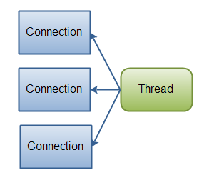

#                                                                    分布式

## SOA架构模型

SOA 全称（Service Oriented Architecture），中文意思为 “面向服务的架构”，他是一种设计方法，其中包含多个服务， 服务之间通过相互依赖最终提供一系列的功能。一个服务 通常以独立的形式存在与操作系统进程中。各个服务之间 通过网络调用 

1.  系统集成：站在系统的角度，解决企业系统间的通信问 题，把原先散乱、无规划的系统间的网状结构，梳理成 规整、可治理的系统间星形结构，这一步往往需要引入 一些产品，比如 ESB、以及技术规范、服务管理规范； 这一步解决的核心问题是【有序】 

2. 系统的服务化：站在功能的角度，把业务逻辑抽象成 可复用、可组装的服务，通过服务的编排实现业务的 快速再生，目的：把原先固有的业务功能转变为通用 的业务服务，实现业务逻辑的快速复用；这一步解决 的核心问题是【复用】

3. 业务的服务化：站在企业的角度，把企业职能抽象成 

   可复用、可组装的服务；把原先职能化的企业架构转变为服务化的企业架构，进一步提升企业的对外服务能力；“前面两步都是从技术层面来解决系统调用、系统功能复用的问题”。第三步，则是以业务驱动把一个业务单元封装成一项服务。这一步解决的核心问题是【高效】 


## ESB企业服务总线

简单来说 ESB 就是一根管道，用来连接各个服务节点。为了集 成不同系统，不同协议的服务，ESB 做了消息的转化解释和路由工作，让不同的服务互联互通；

**使用SAO架构，利用ESB提供服务**


## 微服务架构

微服务架构其实和 SOA 架构类似,微服务是在 SOA 上做 的升华，微服务架构强调的一个重点是**业务需要彻底的组件化和服务化**，原有的单个业务系统会拆分为多个可 以独立开发、设计、运行的小应用。这些小应用之间通过服务完成交互和集成。 

组件表示一个可以独立更换和升级的单元，就像 PC 中的 CPU、内存、显卡、硬盘一样，独立且可以更换升级而不 影响其他单元。如果我们把 PC 作为组件以服务的方式构 建，那么这台 PC 只需要维护主板和一些必要的外部设 备。CPU、内存、硬盘都是以组件方式提供服务，PC 需 要调用 CPU 做计算处理，只需要知道 CPU 这个组件的地址即可。 

微服务的特征 ：

- 通过服务实现组件化 
- 按业务能力来划分服务和开发团队
- 去中心化 
- 基础设施自动化（devops、自动化部署） 

## SOA 和微服务架构的差别 

1. 微服务不再强调传统 SOA 架构里面比较重的 ESB 企业服务总线，同时 SOA 的思想进入到单个业务系统内部实现真正的组件化 
2. Docker 容器技术的出现，为微服务提供了更便利的条件，比如更小的部署单元，每个服务可以通过类似Node 或者 Spring Boot 等技术跑在自己的进程中。 
3. SOA 注重的是系统集成方面，而微服务关注的是完全分离 
4. 基础设施的自动化：持续集成 部署 运维等

## CAP理论

CAP理论的核心是：**一个分布式系统不可能同时很好的满足一致性，可用性和分区容错性这三个需求，最多只能同时较好的满足两个**。
2.CAP定义
**(1)C: Consistency 一致性**
一致性又称为原子性或者事务性。表示一个事务的操作是不可分割的，要不然这个事务完成，要不然这个事务不完成，不会出现这个事务完成了一半这样的情况。这种事务的原子性使得数据具有一致性。
我们通常情况下在数据库中存在的脏数据就属于数据没有具有一致性的表现。而在分布式系统中，经常出现的一个数据不具有一致性的情况是读写数据时缺乏一致性。比如两个节点数据冗余，第一个节点有一个写操作，数据更新以后没有有效的使得第二个节点更新数据，在读取第二个节点的时候就会出现不一致的问题出现。
传统的ACID数据库是很少存在一致性问题的，因为数据的单点原因，数据的存取又具有良好的事务性，不会出现读写的不一致。
**(2)A: Availability 可用性**
好的可用性主要是指系统能够很好的为用户服务，不出现用户操作失败或者访问超时等用户体验不好的情况。可用性通常情况下可用性和分布式数据冗余，负载均衡等有着很大的关联。
**(3)P:Partition Tolerance分区容错性**
分区容错性和扩展性紧密相关。在分布式应用中，可能因为一些分布式的原因导致系统无法正常运转。好的分区容错性要求能够使应用虽然是一个分布式系统，而看上去却好像是在一个可以运转正常的整体。比如现在的分布式系统中有某一个或者几个机器宕掉了，其他剩下的机器还能够正常运转满足系统需求，这样就具有好的分区容错性。
3.CAP理论的意义
随着互联网应用的飞速发展，数据量与日俱增，传统的ACID数据库已经不能满足如此大的海量数据存储了。这个时候需要设计出好的分布式数据存储方式。而这些分布式数据存储方式受到CAP理论的约束，不可能达到高一致性，高可用性，高分区容错性的完美设计。所以我们在设计的时候要懂得取舍，重点关注对应用需求来说比较重要的，而放弃不重要的，在CAP这三者之间进行取舍，设计出贴合应用的存储方案。目前众多的分布式数据系统通过降低一致性来换取可用性。

> ACID：
>
> Atomic（原子性）：指整个数据库事务是不可分割的工作单位。只有使据库中所有的操作执行成功，才算整个事务成功；事务中任何一个SQL语句执行失败，那么已经执行成功的SQL语句也必须撤销，数据库状态应该退回到执行事务前的状态。
>
> Consistency（一致性）：指数据库事务不能破坏关系数据的完整性以及业务逻辑上的一致性。例如对银行转帐事务，不管事务成功还是失败，应该保证事务结束后ACCOUNTS表中Tom和Jack的存款总额为2000元。
>
> Isolation（隔离性）：指的是在并发环境中，当不同的事务同时操纵相同的数据时，每个事务都有各自的完整数据空间。
>
> Durability（持久性）：指的是只要事务成功结束，它对数据库所做的更新就必须永久保存下来。即使发生系统崩溃，重新启动数据库系统后，数据库还能恢复到事务成功结束时的状态。

## BASE理论

> ASE：全称：Basically Available(基本可用)，Soft state（软状态）,和 Eventually consistent（最终一致性）三个短语的缩写，来自 ebay 的架构师提出。

Base 理论是对 CAP 中一致性和可用性权衡的结果，其来源于对大型互联网分布式实践的总结，是基于 CAP 定理逐步演化而来的。其核心思想是：

> 既是无法做到强一致性（Strong consistency），但每个应用都可以根据自身的业务特点，采用适当的方式来使系统达到最终一致性（Eventual consistency）。

**Basically Available(基本可用)**

什么是基本可用呢？假设系统，出现了不可预知的故障，但还是能用，相比较正常的系统而言：

1. 响应时间上的损失：正常情况下的搜索引擎 0.5 秒即返回给用户结果，而**基本可用**的搜索引擎可以在 1 秒作用返回结果。
2. 功能上的损失：在一个电商网站上，正常情况下，用户可以顺利完成每一笔订单，但是到了大促期间，为了保护购物系统的稳定性，部分消费者可能会被引导到一个降级页面。

**Soft state（软状态）**

什么是软状态呢？相对于原子性而言，要求多个节点的数据副本都是一致的，这是一种 “硬状态”。

软状态指的是：允许系统中的数据存在中间状态，并认为该状态不影响系统的整体可用性，即允许系统在多个不同节点的数据副本存在数据延时。

**Eventually consistent（最终一致性）**

上面说软状态，然后不可能一直是软状态，必须有个时间期限。在期限过后，应当保证所有副本保持数据一致性。从而达到数据的最终一致性。这个时间期限取决于网络延时，系统负载，数据复制方案设计等等因素。

稍微官方一点的说法就是：

> 系统能够保证在没有其他新的更新操作的情况下，数据最终一定能够达到一致的状态，因此所有客户端对系统的数据访问最终都能够获取到最新的值。

而在实际工程实践中，**最终一致性分为 5 种：**

**1. 因果一致性（Causal consistency）**

指的是：如果节点 A 在更新完某个数据后通知了节点 B，那么节点 B 之后对该数据的访问和修改都是基于 A 更新后的值。于此同时，和节点 A 无因果关系的节点 C 的数据访问则没有这样的限制。

**2. 读己之所写（Read your writes）**

这种就很简单了，节点 A 更新一个数据后，它自身总是能访问到自身更新过的最新值，而不会看到旧值。其实也算一种因果一致性。

**3. 会话一致性（Session consistency）**

会话一致性将对系统数据的访问过程框定在了一个会话当中：系统能保证在同一个有效的会话中实现 “读己之所写” 的一致性，也就是说，执行更新操作之后，客户端能够在同一个会话中始终读取到该数据项的最新值。

**4. 单调读一致性（Monotonic read consistency）**

单调读一致性是指如果一个节点从系统中读取出一个数据项的某个值后，那么系统对于该节点后续的任何数据访问都不应该返回更旧的值。

**5. 单调写一致性（Monotonic write consistency）**

指一个系统要能够保证来自同一个节点的写操作被顺序的执行。

然而，在实际的实践中，这 5 种系统往往会结合使用，以构建一个具有最终一致性的分布式系统。实际上，不只是分布式系统使用最终一致性，关系型数据库在某个功能上，也是使用最终一致性的，比如备份，数据库的复制过程是需要时间的，这个复制过程中，业务读取到的值就是旧的。当然，最终还是达成了数据一致性。这也算是一个最终一致性的经典案例。

**总结**

总的来说，BASE 理论面向的是大型高可用可扩展的分布式系统，和传统事务的 ACID 是**相反的**，它完全不同于 ACID 的强一致性模型，而是**通过牺牲强一致性**来获得可用性，并允许数据在一段时间是不一致的。

## 分布式架构下的高可用设计

1. 避免单点故障
   -  负载均衡技术（failover/选址/硬件负载/ 软件负载 /去中心化的 软件负载（ gossip(redis-cluster)）） 
   -  热备（linux HA）
   -  多机房（同城灾备、异地灾备） 
2. 应用的高可用性 
   - 故障监控（系统监控（cpu、内存）/链路监控/日志监控） 自动预警 
   - 应用的容错设计、（服务降级、限流）自我保护能力 
   - 数据量（数据分片、读写分离） 

## 分布式架构下的可伸缩设计

- **垂直伸缩** 提升硬件能力 
- **水平伸缩** 增加服务器 

## 加速静态内容访问速度的 CDN

CDN 是 Content Delivery Network 的缩写，表示的是内容 分发网络。CDN 的作用是把用户需要的内容分发到离用户 最近的地方，这样可以是用户能够快熟获取所需要的内容。 

CDN 其实就是一种网络缓存技术，能够把一些相对稳定的资源放到距离最终用户较近的地方，一方面可以节省整个广域网的带宽消耗，另外一方面可以提升用户的访问速度，改进用户体验。我们一般会把静态的文件（图片、脚本、静态页面）放到 CDN 中 

1.  当用户点击网站页面上的内容 URL，经过本地 DNS 系统解析，DNS 系统会最终将域名的解析权交给 CNAME 指向的 CDN 专用 DNS 服务器 
2.  CDN 的 DNS 服务器将 CDN 的全局负载均衡设备 IP 地址返回用户 
3.  用户向 CDN 的全局负载均衡设备发起内容 URL 访问请求 
4.  CDN全局负载均衡设备根据用户IP地址，以及用户请求的内容URL 选择一台用户所属区域的区域负载均衡设备，告诉用户向这台设备发起请求。
5.  区域负载均衡设备会为用户选择一台合适的缓存服务器提供服务，选择的依据包括：根据用户 IP 地址，判断哪一台服务器距用户最近；根据用户所请求的 URL 中携带的内容名称，判断哪一台服务器上有用户所需容；查询各个服务器当前的负载情况，判断哪一台服务器尚有服务能力。基于以上这些条件的综合分析之后，区域负载均衡设备会向全局负载均衡设备返回一台缓存服务器的 IP 地址 
6.  局负载均衡设备把服务器的 IP 地址返回给用户 用户向缓存服务器发起请求，缓存服务器响应用户请求，将用户所需内 容传送到用户终端。如果这台缓存服务器上并没有用户想要的内容，而区域均衡设备依然将它分配给了用户，那么这台服务器就要向它的上一 级缓存服务器请求内容，直至追溯到网站的源服务器将内容拉到本地。 

**什么情况下用 CDN**  

最适合的是那些不会经常变化的内容，比如图片，JS 文件， CSS 文件，图片文件包括程序模板中的，CSS 文件中用到的背景图片，还有就是作为网站内容组成部分的那些图片，都可以； 

## 灰度发布

我们的应用虽然经过了测试部门的测试，但是仍然很难全 面覆盖用户的使用场景，为了保证万无一失，我们在进行发布的时候一般会采用灰度发布，也就是会对新应用进行 分批发布，逐步扩大新应用在整个及群众的比例直到最后全部完成。

灰度发布是针对新应用在用户体验方面完全无感知。灰度发布系统的作用在于，可以根据自己的配置，来将用户的流量导到新上线的系统上，来快速验证新的功能修改，而一旦出问题，也可以马上的恢复，简单的说，就是一套 A/BTest 系统．

## 分部式通信基础AIO/BIO/NIO

- **Java BIO (blocking I/O)： 同步并阻塞**，服务器实现模式为一个连接一个线程，即客户端有连接请求时服务器端就需要启动一个线程进行处理，如果这个连接不做任何事情会造成不必要的线程开销，当然可以通过线程池机制改善。适用于连接数目比较小且固定的架构，这种方式对服务器资源要求比较高，并发局限于应用中，JDK1.4以前的唯一选择，但程序直观简单易理解
- **Java NIO (non-blocking I/O)： 同步非阻塞**，服务器实现模式为一个请求一个线程，即客户端发送的连接请求都会注册到多路复用器上，多路复用器轮询到连接有I/O请求时才启动一个线程进行处理。NIO方式适用于连接数目多且连接比较短（轻操作）的架构，比如聊天服务器，并发局限于应用中，编程比较复杂，JDK1.4开始支持。
- **Java AIO(NIO.2) (Asynchronous I/O) ： **异步非阻塞，服务器实现模式为一个有效请求一个线程，客户端的I/O请求都是由OS先完成了再通知服务器应用去启动线程进行处理，AIO方式使用于连接数目多且连接比较长（重操作）的架构，比如相册服务器，充分调用OS参与并发操作，编程比较复杂，JDK7开始支持。

## 序列化和反序列化

- serialVersionUID 用来验证版本，若序列化后修改ID，则不能再反序列化
- 静态变量不会参与序列化
- transient 修饰的属性不会参与序列化
- 父类实现了序列化接口，子类可不用实现
- 父类没有实现序列化接口，子类实现了序列化接口，子类序列化，再反序列化后无法获得父属性的值（父类不参与序列化）
- 一个对象A的实例变量引用了其他对象B，若两个类都实现序列化接口，在序列化A时自动序列化B
- 通过对对象的序列化+反序列化可以实现深克隆


**序列化方式**

​    java自带  xml  json hseeian Protobuf 

   选型标准：序列化和反序列化速度 压缩大小

## 分布式通信框架RMI

**RPC（Remote Procedure Call）远程过程调用**，一般用来 实现部署在不同机器上的系统之间的方法调用，使得程序能够像访问本地系统资源一样，通过网络传输去访问远端 系统资源；对于客户端来说，传输层使用什么协议，序列 化、反序列化都是透明的 

**RMI ( remote method invocation) 远程方法调用**， 一种用于远程过程调用的应用程序编程接口，是纯 java 的 网络分布式应用系统的核心解决方案之一:

RMI 目前使用 Java 远程消息交换协议 JRMP（Java Remote  Messageing Protocol）进行通信，由于 JRMP 是专为 Java对象制定的，是分布式应用系统的百分之百纯 java 解决方 案,用 Java RMI 开发的应用系统可以部署在任何支持 JRE 的平台上，缺点是，由于 JRMP 是专门为 java 对象指定的， 因此 RMI 对于非 JAVA 语言开发的应用系统的支持不足,不能与非 JAVA 语言书写的对象进行通信；**当前使用率并不多了**

## 分布式协调服务zookeeper

在分布式架构下，当服务越来越多，规模越来越大时，对应的机器数量也越来越大，单靠人工来管理和维护服务及 地址的配置信息会越来越困难，单点故障的问题也开始凸显出来，一旦服务路由或者负载均衡服务器宕机，依 赖他的所有服务均将失效。 此时，需要一个能够动态注册和获取服务信息的地方。来统一管理服务名称和其对应的服务器列表信息，称之为服务配置中心，服务提供者在启动时，将其提供的服务名 称、服务器地址注册到服务配置中心，服务消费者通过服务配置中心来获得需要调用的服务的机器列表。通过相应 的负载均衡算法，选取其中一台服务器进行调用。当服务 器宕机或者下线时，相应的机器需要能够动态地从服务配置中心里面移除，并通知相应的服务消费者，否则服务消费者就有可能因为调用到已经失效服务而发生错误，在这个过程中，服务消费者只有在第一次调用服务时需要查询 服务配置中心，然后将查询到的信息缓存到本地，后面的 调用直接使用本地缓存的服务地址列表信息，而不需要重新发起请求道服务配置中心去获取相应的服务地址列表，直到服务的地址列表有变更（机器上线或者下线）。这种无中心化的结构解决了之前负载均衡设备所导致的单点故障问题，并且大大减轻了服务配置中心的压力 

**功能：**

- 配置维护：发布/订阅         解决服务器集群的配置文件管理
- 域名服务：服务映射表      客户端不必再维护需求的资源的请求路径；由Zookeeper来管理根据服务名来分配服务器处理；**在与Dubbo架构分布式时主要就是利用的域名服务**
- 分布式同步：watcher监听   客户端的请求，需要多个不同的服务器来处理（同一资源）时,负责协调
- 集群管理：故障管理

### Zookeeper中的概念

- Session:  客户端会话  **此处是指在ZooKeeper注册的（负责业务的服务器）客户端**  SessionTimeout设置一个客户端的会话超时时间，当客户端因服务器压力大/网络故障/系统故障/主动断开等原因导致与ZooKeeper断开时，只要在超时时间内重新连上ZooKeeper集群中的任意一台服务，之间创建的会话会继续有效;ZooKeeper与客户端之间的连接是TCP长连接；存在心跳检测
- Znode： ZooKeeper文件系统采用树形层次化的目录结构，每一个Znode有一一个唯一的路径标识（名称）**可包含数据和子Zonode（临时节点不能包含子节点）**；Znode中的数据可有多个版本，因此查看时需要版本号，客户端可在Znode上设置监视器（Watcher）
- Watcher机制：Zookeeper通过Watcher机制实现了 发布/订阅者模式。Zookeeper允许客户端在其注册一个Watcher监听，当事件触发时，就会向这些客户端发送一个时间通知（通过Session）
- ACL: Access Control List（访问控制列表），控制Znode的访问权限;每个Znode的权限是独立控制的 ：授权策略（密码还是ip验证）/用户ID/用户权限

### Paxos算法

#### 1.paxos简单介绍

> Paxos算法是莱斯利·兰伯特（Leslie Lamport，就是 LaTeX 中的"La"，此人现在在微软研究院）于1990年提出的一种基于消息传递且具有高度容错特性的一致性算法，是目前公认的解决分布式一致性问题最有效的算法之一。

 

#### 2. paxos理论总结

2.1、两个操作

> 1、Proposal Value：提议的值；
> 2、Proposal Number：提议的编号，可理解为提议版本号，要求不能冲突；

2.2、三个角色

> 1、Proposer：提议发起者。Proposer 可以有多个，Proposer 提出议案（value）。所谓 value，可以是任何操作，比如“设置某个变量的值为value”。不同的 Proposer 可以提出不同的 value，例如某个Proposer 提议“将变量 X 设置为 1”，另一个 Proposer 提议“将变量 X 设置为 2”，但对同一轮 Paxos过程，最多只有一个 value 被批准。
> 2、Acceptor：提议接受者。Acceptor 有 N 个，Proposer 提出的 value 必须获得超过半数(N/2+1)的 Acceptor批准后才能通过。Acceptor 之间完全对等独立。
>
> ```
> 这里说明下Acceptor会维护一个信息表记录，(MaxN,AcceptN,AcceptV)
> MaxN是回复过prepare request的最高Number
> AcceptN是接受过accept request的最高Number
> AcceptV是接受过accept request的最高Number对应的Value
> ```
>
> 3、Learner：提议学习者。上面提到只要超过半数Acceptor通过即可获得通过，那么Learner角色的目的就是把通过的确定性取值同步给其他未确定的Acceptor。

2.3、协议过程

(pok[接受者标识Id],AcceptN[接收过的最大（新）的提案号],AcceptV[提案内容])

阶段一，准备阶段（prepare阶段）

```
(a)Proposer选择一个提议编号N，然后向所有的Acceptor发送编号为N的prepare request，来试探集群是否支持该编号的提议
(b)如果一个Acceptor收到一个编号为N的prepare request，会有以下三种处理场景：
    b.1、if MaxN 等于 null，设置MaxN=N，承诺保证不再接受任何编号小于N的request，回应(pok,null,null)
    b.2、if N 小于等于 MaxN，回应<pno>
    b.3、if N 大于 MaxN，设置MaxN=N，承诺保证不再接受任何编号小于N的request
        b.3.1、if AcceptN 等于 null，回应(pok,null,null)
        b.3.2、if AcceptN 不等于 null，回应(pok,AcceptN,AcceptV)
N不可能等于MaxN N(编号)        
需要大多数（n/2+1） 同意       
```

阶段二，接受阶段（accept阶段）

```
(a)Proposer接收到Acceptor对于prepare request的回应
    a.1、收到的pok回应未超过半数，重新发起prepare request请求，修改N值
    
    a.2、收到的pok回应超过半数，接下来它将给这些Acceptor发送一个Number为N，Value为V的proposal作为  accept request 即提交正式的提案内容
        
(b)Acceptor接收到accept request
    b.1、if N 小于 MaxN，回应<ano>
    b.2、if N 大于等于 MaxN，设置AcceptN=N，AcceptV=V，批准，回应<aok>
    此处的比较是因为提议者可能会有多个，acceptor可能回得到多个提案
```

阶段三、学习阶段（learn阶段）

```
1、if 收到的aok回应未超过半数，重新发起prepare request请求，修改N值
2、if 收到的aok回应超过半数，结束，将结果通知给learner负责广播：
     1.向接收该提案的accept广播执行信号
     2.向没接收该提案的其他所有accept广播提案内容和可执行信号
```

 **paxos算法在使用中要注意在有多个Proposer同时提议时多个Proposer没有选中时；会重复申请提案编号；会发生因某些原因一直没有给某个proposer新的提案编号；因而造成重复申请形成活锁；因此在实际应用中应保证这一点通常只能有一个提议者**

> 死锁：  多个线程（进程）在运行过程中因为资源的竞争而进入阻塞状态，没有第三方介入，死锁不会自动解开
>
> > 互斥条件：在一段时间内某资源只能由一个进程占用
> >
> > 请求和保持条件：进程已获取一个资源，但又有新的资源需求，而该资源已被其他进程占有，此时请求进程阻塞，已获取的资源保持不放
> >
> > 不剥夺条件：进程已占有的资源在未使用完毕之前，不能被剥夺
> >
> > 环路等待条件：发生死锁是，必然存在一个进程——资源的环形链,P0等待P1占用的资源==》P1等待P2占用的资源==》.....==》Pn等待P0占用的资源


> 活锁：指任务或执行者没有被阻塞，由于某些条件没有满足，导致一直重复尝试——失败——尝试——失败。处于活锁的实体是不断改变状态，可能会自行解开
>
> > 马路中间有条小桥，只能容纳一辆车经过，桥两头开来两辆车A和B，A比较礼貌，示意B先过，B也比较礼貌，示意A先过，结果两人一直谦让谁也过不去
>
> 


### ZAB协议

> 在由Zookeeper搭建的集群中，用户的请求需要通过Zookeeper来查询相应的service地址来真正去访问需要处理请求的Service；因此所有的Service都需要到Zookeeper中去注册，而且Zookeeper集群中的每一台都要同步存储这些服务的名称==地址信息
>
> > 对于查询来说即服务的发现，任意一个Zookeeper服务都可以接收和处理
> >
> > 对于Service的注册即服务的暴露（或是节电的修改/删除）等事物来说；是需要所有的Zookeeper都同步执行的，因此需要一台唯一的Leader来协调这些事物的操作和同步

 Zab协议 的全称是 **Zookeeper Atomic Broadcast** （Zookeeper原子广播）。是Paxos算法的一种工业实现；

#### zab 协议实现的作用

- **使用一个单一的主进程（Leader）来接收并处理客户端的事务请求**（也就是写请求），并采用了Zab的原子广播协议，将服务器数据的状态变更以 **事务proposal** （事务提议）的形式广播到所有的副本（Follower）进程上去。 

- **保证一个全局的变更序列被顺序引用**。
   Zookeeper是一个树形结构，很多操作都要先检查才能确定是否可以执行，比如P1的事务t1可能是创建节点"/a"，t2可能是创建节点"/a/bb"，只有先创建了父节点"/a"，才能创建子节点"/a/b"。

  为了保证这一点，Zab要保证同一个Leader发起的事务要按顺序被apply，同时还要保证只有先前Leader的事务被apply之后，新选举出来的Leader才能再次发起事务。

- **当主进程出现异常的时候，整个zk集群依旧能正常工作**。

#### zab协议中三类角色

- **Leader**:  Zookeeper集群中写请求（事务）的唯一处理者，负责投票的发起和决议，更新系统状态；所有的事务请求都会通过提议投票选举(n/2)+1通过才会执行

- **Follower**：接收客户端请求，处理读请求，并向客户端返回结果；将事务请求转发给Leader，参与投票

- **Observer**:  无投票权和事务处理权的Follower,主要是协助Follower处理；**在选举投票期间由Observer提供对外的服务**

  一些不同的叫法

   Learner（学习者） =Follower+Observer

  QuorumServer（法定服务器）=Leader+Follower

#### zab三种模式

- **恢复模式：** 在服务重启过程中，或Leader崩溃后，进入恢复模式，有两个阶段 Leader的选举阶段与初始化同步阶段。完成后进入正常状态
- **广播模式：** 初始化广播和更新广播。新Leader被选举出后，需要将自己拥有但其他Server可能没有的事务及自己的epoch广播给集群其他Zookeeper。正常状态下，事务的提案被大多同意够进行更新广播
- **同步模式：**与广播模式相对应，初始化同步，新leader被选举出来并进行广播时，所有learner将广播信息同步到本地，更新同步即将leader的更新广播同步到本地

#### zxid

  zxid为64位长度的Long类型，其中高32位标示纪元**epoch**，低32位表示事务标识**xid**，每个提案都有一个zxid

  **epoch**：每个leader都会有一个不同的epoch值，表示一个时代。每次新选举开启产生一个新epoch,新leader产生，则会更新所有zxid中的epoch

  **xid**：为Zookeeper事务的id,是一个依次递增的流水号；在选举时通常是xid越大，越能被当选

#### Leader选举

ZAB协议是专为ZooKeeper设计的一种支持**崩溃恢复**的原子广播协议。zk集群中Leader宕机后的重新选举，集群启动时也需要选举。

当集群正在启动过程中，或Leader与超过半数的主机断连后，集群进入恢复模式。此模式最终要的阶段就是Leader选举

- **myid**: 是在ZK集群中，每一个Zookeeper的唯一标识，

- **逻辑时钟**：Logicalclock,是一个整型，它在选举时为逻辑时钟，选举结束后成为zxid中的epoch值

- **zk状态**：集群中的每一台主机，在不同阶段会处于不同的状态：

  ​                   **LOOKING**      选举状态（查找leader的状态）

  ​                   **FOLLOWING** 跟随状态，同步Leader状态===Follower

  ​                   **OBSERVING**  观察状态， 同步Leader状态===Observer

  ​                   **LEADING**       领导状态，   Leader

Leader选举发生在集群中，即至少两台ZooKeeper服务器

投票处理期间，每个ZooKeeper都会广播自己的投票内容：（myid+zxid）

处理规则：

1.   ZooKeeper收到其他客户端发送的投票后，先验证是否有效===LOOKING状态；
2.   之后会与自己的投票信息对比： 优先比较zxid，zxid越大，越当选；zxid一致时，myid越大越当选；
3.   比较完毕后将新的投票信息进行广播 
4.   每轮投票，每个服务器都会对投票进行统计，若发现有一台的票数超过（n/2）+1；就会广播投票结果，退出LOOKING状态，进入FOLLOWING/LEADING状态，完成leader的选举
5.   新加入一台Zookeeper后，会发起一轮新的Leader,但其他主机都处于FOLLOWING/LEADING状态。拒绝投票，只能成为FOLLOWING
6.   当新的leader因某些原因宕机，断连时，系统重新进入LOOKING状态；进行选举===》1

### Zookeeper集群搭建与命令                 

​     

```shell
#下载 移动 zookeeper-3.4.14.tar.gz
#进到目录
cd /usr/local/zookeeper 
#解压
tar -zxvf  zookeeper-3.4.14.tar.gz
#复制配置文件
cd /usr/local/zookeeper/zookeeper-3.4.14/conf/
cp zoo_sample.cfg zoo.cfg
#启动
 #在bin 目录下 
    sh zkServer.sh start  #启动
    sh zkServer.sh stop  #停止
    sh zkServer.sh status  #状态
#客户端连接
   sh zkCli.sh
#搭建集群需要关闭防火墙
service firewalld status ；查看防火墙状态
service firewalld stop：关闭防火墙
 
```

​        配置每台zookeeper的zoo.cfg文件

```vim

# The number of milliseconds of each tick
tickTime=2000
# The number of ticks that the initial 
# synchronization phase can take
initLimit=10
# The number of ticks that can pass between 
# sending a request and getting an acknowledgement
syncLimit=5
# the directory where the snapshot is stored.
# do not use /tmp for storage, /tmp here is just 
#  需要制定资源的路径，并在资源路径下 新建myid文件
#  myid的值 ==下面server.X  X的值
dataDir=/usr/data/zookeeper
# the port at which the clients will connect
clientPort=2181
server.1=192.168.1.108:2888:3888
server.2=192.168.1.104:2888:3888
server.3=192.168.1.109:2888:3888
# the maximum number of client connections.
# increase this if you need to handle more clients
#maxClientCnxns=60
#
# Be sure to read the maintenance section of the 
# administrator guide before turning on autopurge.
#
# http://zookeeper.apache.org/doc/current/zookeeperAdmin.html#sc_maintenance
#
# The number of snapshots to retain in dataDir

```

​     

### Zookeeper Java客户端连接

```xml
<!--依赖-->
<dependency>
        <groupId>org.apache.zookeeper</groupId>
        <artifactId>zookeeper</artifactId>
        <version>3.4.8</version>
        <type>pom</type>
    </dependency>
```

**连接 节点操作**

```java

public class ConnectionDemo {
    public static void main(String[] args) {
        try {
            final CountDownLatch countDownLatch=new CountDownLatch(1);
            ZooKeeper zooKeeper=new ZooKeeper(
                    "192.168.1.104:2181," +    //集群的地址 以 ,隔开
                    "192.168.1.108:2181",
                    4000,                    //连接超时时间
                    new Watcher() {
                        public void process(WatchedEvent watchedEvent) {
                            if(Event.KeeperState.SyncConnected==watchedEvent.getState()){
                                //注册Watcher事件，监听是否连接成功
                                countDownLatch.countDown();
                            }
                        }
                    });
            countDownLatch.await();
            System.out.println(zooKeeper.getState());
             //添加节点
            zooKeeper.create("/zk-persis-demo",        //节点名称
                                   "0".getBytes(),           //数据
                                   ZooDefs.Ids.OPEN_ACL_UNSAFE,  //访问权限 开放
                                   CreateMode.PERSISTENT);   //节点类型 持久化节点
            Thread.sleep(2000);
            Stat stat=new Stat();
                //获取当前节点的值
            byte[] bytes=zooKeeper.getData("/zk-persis-demo",null,stat);
            System.out.println("当前值： "+new String(bytes));
            //修改值
            zooKeeper.setData("/zk-persis-demo","1".getBytes(),stat.getVersion());
            bytes=zooKeeper.getData("/zk-persis-demo",null,stat);
            System.out.println("当前值： "+new String(bytes));
            //删除值
            zooKeeper.delete("/zk-persis-demo",stat.getVersion());
            zooKeeper.close();
            System.in.read();
        } catch (IOException e) {
            e.printStackTrace();
        } catch (InterruptedException e) {
            e.printStackTrace();
        } catch (KeeperException e) {
            e.printStackTrace();
        }
    }
}

```


**事件绑定**

```java
/**
 * watcher事件机制
 *  特性： 当数据发生变化时，zookeeper会产生一个watcher事件，
 *  并且会发送给客户端，但客户端只会接受一次通知。
 *  之后节点再次发生变化，之前设置watcher的客户端不会再次受到消息
 *  即watcher是一次性操作
 *  可以通过循环来到达永久的监听
 *  注册方式
 *  getData Exists  监听自身节点的变化
 *  getChildren     用于监听其子节点的变化
 *  触发方式
 *  事物类型操作  create/delete/setData
 *
 */
public class ConnectionWatcher {
    public static void main(String[] args) {
        try {
            final CountDownLatch countDownLatch=new CountDownLatch(1);
            final ZooKeeper zooKeeper=new ZooKeeper(
                    "192.168.1.104:2181," +
                    "192.168.1.108:2181",
                    4000,
                    new Watcher() {
                        public void process(WatchedEvent watchedEvent) {
                            System.out.println("默认watcher事件==");
                            if(Event.KeeperState.SyncConnected==watchedEvent.getState()){
                                //注册Watcher事件，监听是否连接成功
                                countDownLatch.countDown();
                            }
                        }
                    });
            countDownLatch.await();
            System.out.println(zooKeeper.getState());
             //添加节点
            zooKeeper.create("/zk-persis-demo",        //节点名称
                                   "0".getBytes(),           //数据
                                   ZooDefs.Ids.OPEN_ACL_UNSAFE,  //访问权限 开放
                                   CreateMode.PERSISTENT);   //节点类型 持久化节点
            //针对该节点通过exists绑定事件
            Stat stat=zooKeeper.exists("/zk-persis-demo",
                    //可以设置 true,默认是上面绑定的watcher
                    new Watcher() {
                    public void process(WatchedEvent watchedEvent) {
                      System.out.println(watchedEvent.getType()+"->"+watchedEvent.getPath());
                        try {
                            //此处实发的是默认事件
                            zooKeeper.exists(watchedEvent.getPath(),true);
                        } catch (KeeperException e) {
                            e.printStackTrace();
                        } catch (InterruptedException e) {
                            e.printStackTrace();
                        }
                    }
            });
            //修改 触发事物
            stat=zooKeeper.setData("/zk-persis-demo","2".getBytes(),stat.getVersion());
            Thread.sleep(10000);

            zooKeeper.delete("/zk-persis-demo",stat.getVersion());

        } catch (IOException e) {
            e.printStackTrace();
        } catch (InterruptedException e) {
            e.printStackTrace();
        } catch (KeeperException e) {
            e.printStackTrace();
        }
    }
}

```

**Curator客户端（对原生操作的封装）**

```xml
<!--版本冲突--> 
<dependency>
        <groupId>org.apache.curator</groupId>
        <artifactId>curator-framework</artifactId>
        <version>2.12.0</version>
    </dependency>
    <dependency>
        <groupId>org.apache.curator</groupId>
        <artifactId>curator-recipes</artifactId>
        <version>2.12.0</version>
    </dependency>

```

**代码实现**

```java
public class CuratorDemo {
    public static void main(String[] args)  {
        CuratorFramework curatorFramework= CuratorFrameworkFactory
                                 .builder().connectString("192.168.1.104:2181,192.168.1.108:2181").sessionTimeoutMs(4000)
                                 .retryPolicy(new ExponentialBackoffRetry(1000,3)) //重试规则
                                 .namespace("curator").build(); //工作空间 一般会根据业务划分不同的空间便于管理
        curatorFramework.start();
        //创建   /curator 要存在
        // /curator/mic/node1
        try {
            curatorFramework.create().creatingParentsIfNeeded()   //如果父节点不存在会创建
                                .withMode(CreateMode.PERSISTENT)
                                .forPath("/mic/node3","1".getBytes());
            System.out.println("=============添加完毕");
            Stat stat=new Stat();
            curatorFramework.getData().storingStatIn(stat).forPath("/mic/node3");
            curatorFramework.setData().withVersion(stat.getVersion()).forPath("/mic/node3","100".getBytes());
            System.out.println("=============修改完毕");
           curatorFramework.delete().deletingChildrenIfNeeded().forPath("/mic/node3");
        } catch (Exception e) {
            e.printStackTrace();
        }

    }
}
```

**watcher**

```java
public class CuratorWatcherDemo {
    public static void main(String[] args) throws Exception {
        CuratorFramework curatorFramework= CuratorFrameworkFactory
                                 .builder().connectString("192.168.1.104:2181,192.168.1.108:2181").sessionTimeoutMs(4000)
                                 .retryPolicy(new ExponentialBackoffRetry(1000,3)) //重试规则
                                 .namespace("curator").build(); //工作空间 一般会根据业务划分不同的空间便于管理
        curatorFramework.start();
        addListenerWithPathChildCache(curatorFramework,"/mic");
        System.in.read();
    }

    /**
     * PathChildCache 监听一个节点下子节点的创建、删除、更新
     * NodeCache  监听一个节点的更新和创建事件
     * TreeCache  综合PatchChildCache和NodeCache的特性
     */
    public static  void addListenerWithPathChildCache(CuratorFramework curatorFramework,String path) throws Exception {
        final PathChildrenCache nodeCache=new PathChildrenCache(curatorFramework,path,false);
        PathChildrenCacheListener nodeCacheListener=new PathChildrenCacheListener() {
            public void childEvent(CuratorFramework client, PathChildrenCacheEvent event) throws Exception {
                System.out.println("Receive Event:"+event.getType());
            }
        };
        nodeCache.getListenable().addListener(nodeCacheListener);
        nodeCache.start();
    }
     public static  void addListenerWithNodeCache(CuratorFramework curatorFramework,String path) throws Exception {
             final  NodeCache nodeCache=new NodeCache(curatorFramework,path,false);
         NodeCacheListener nodeCacheListener=new NodeCacheListener() {
             public void nodeChanged() throws Exception {
                    System.out.println("Receive Event:"+nodeCache.getCurrentData().getPath());
             }
         };
         nodeCache.getListenable().addListener(nodeCacheListener);
         nodeCache.start();
     }
    public static void addListenerWithTreeCache(CuratorFramework curatorFramework,String path) throws Exception {
        TreeCache treeCache=new TreeCache(curatorFramework,path);
        TreeCacheListener treeCacheListener=new TreeCacheListener() {
            public void childEvent(CuratorFramework client, TreeCacheEvent event) throws Exception {
                System.out.println(event.getType()+"->"+event.getData().getPath());
            }
        };

        treeCache.getListenable().addListener(treeCacheListener);
        treeCache.start();
    }
}

```

### Zookeeper 实现分布式锁

  思路，利用zookeeper有序节点的特性，每个节点执行都要在其上一个节点完成之后执行

```java

import org.apache.zookeeper.*;
import org.apache.zookeeper.data.Stat;

import java.io.IOException;
import java.util.List;
import java.util.SortedSet;
import java.util.TreeSet;
import java.util.concurrent.CountDownLatch;
import java.util.concurrent.TimeUnit;
import java.util.concurrent.locks.Condition;
import java.util.concurrent.locks.Lock;

public class DistributedLock implements Lock,Watcher {
    private ZooKeeper zk=null;
    private String ROOT_LOCK="/locks"; //定义根节点
    private String WAIT_LOCK; //等待前一个锁
    private String CURRENT_LOCK; //表示当前的锁
    private CountDownLatch countDownLatch;

    public DistributedLock() {
        try {
            zk=new ZooKeeper("192.168.1.104:2181,",
                    4000,
                    this);
            Thread.sleep(30000);
            //判断节点是否存在
            Stat stat=zk.exists(ROOT_LOCK,false);
            //不存在 创建
            if(stat==null){
                System.out.println("创建"+ROOT_LOCK);
                zk.create(ROOT_LOCK,"0".getBytes(),ZooDefs.Ids.OPEN_ACL_UNSAFE,
                        CreateMode.PERSISTENT);
            }
        } catch (IOException e) {
            e.printStackTrace();
        } catch (InterruptedException e) {
            e.printStackTrace();
        } catch (KeeperException e) {
            e.printStackTrace();
        }
    }

    public void lock() {
          if(this.tryLock()){
              System.out.println(Thread.currentThread().getName()+"->"+CURRENT_LOCK+"->获得锁成功");
              return;
          }
        try {
            waitForLock(WAIT_LOCK);
        } catch (KeeperException e) {
            e.printStackTrace();
        } catch (InterruptedException e) {
            e.printStackTrace();
        }
    }

    private boolean waitForLock(String pre) throws KeeperException, InterruptedException {
        //监听上一个节点
        Stat stat=zk.exists(pre,true);
        if(stat!=null){
            System.out.println(Thread.currentThread().getName()+"->等待锁"+ROOT_LOCK+"/"+pre+"释放");
            countDownLatch=new CountDownLatch(1);
            countDownLatch.await();
            System.out.println(Thread.currentThread().getName()+"->获得锁成功");
        }
        return true;
    }

    public void lockInterruptibly() throws InterruptedException {

    }

    public boolean tryLock() {
        // 创建临时有序节点
        try {
           CURRENT_LOCK= zk.create(ROOT_LOCK+"/","0".getBytes(),ZooDefs.Ids.OPEN_ACL_UNSAFE,
                     CreateMode.EPHEMERAL_SEQUENTIAL);
            System.out.println(Thread.currentThread().getName()+"->"+
                               CURRENT_LOCK+",尝试竞争锁");
            List<String> childrens=zk.getChildren(ROOT_LOCK,false);// 获取所有根节点
            SortedSet<String> sortedSet=new TreeSet<String>();
            for(String children :childrens){
                sortedSet.add(ROOT_LOCK+"/"+children);
            }
            //获取最小的节点
            String firstNode=sortedSet.first();
            SortedSet<String> lessTheMe=sortedSet.headSet(CURRENT_LOCK);
            //通过当前节点和子节点中最小的节点进行比较，如果相等，拿到锁
            if(CURRENT_LOCK.equals(firstNode)){
             return true;
            }
            if(!lessTheMe.isEmpty()){
                //获得比当前节点更小的最后一个节点，设置给WAIT_LOCK
                WAIT_LOCK =lessTheMe.last();
            }

        } catch (KeeperException e) {
            e.printStackTrace();
        } catch (InterruptedException e) {
            e.printStackTrace();
        }
        return false;
    }

    public boolean tryLock(long time, TimeUnit unit) throws InterruptedException {
        return false;
    }

    public void unlock() {
      System.out.println(Thread.currentThread().getName()+"->释放锁"+CURRENT_LOCK);
        try {
            zk.delete(CURRENT_LOCK,-1);
            CURRENT_LOCK=null;
            zk.close();
        } catch (InterruptedException e) {
            e.printStackTrace();
        } catch (KeeperException e) {
            e.printStackTrace();
        }
    }

    public Condition newCondition() {
        return null;
    }

    public void process(WatchedEvent watchedEvent) {
    if(this.countDownLatch!=null){
        this.countDownLatch.countDown();
    }
    }
}

```

```java
/**
  *测试
  *
  */
   
import java.io.IOException;
import java.util.concurrent.CountDownLatch;

public class AppTest {
    public static void main(String[] args) throws IOException {
        final CountDownLatch countDownLatch=new CountDownLatch(10);
        for(int i=0;i<10;i++){
            new Thread(()->{
                try {
                    countDownLatch.await();
                    DistributedLock distributedLock=new DistributedLock();
                    distributedLock.lock();//获得锁
                } catch (InterruptedException e) {
                    e.printStackTrace();
                }
            },"Thread-"+i).start();
            countDownLatch.countDown();
        }
        System.in.read();
    }
}

```


## 分布式服务治理Dubbo

 **Dubbo是一款高性能 轻量级的开源java RPC框架，它提供了三大核心能力： 面向接口的远程方法调用，只能容错和负载均衡，以及服务自动注册和发现（dubbo官方推荐使用Zookeeper注册中心）**

### Dubbo安装

   Maven依赖

 

```xml
<!--dubbo-->
  <dependency>
        <groupId>com.alibaba</groupId>
        <artifactId>dubbo</artifactId>
        <version>2.5.3</version>
    </dependency> 
<!--dubbo将zookeeper作为注册中心-->
    <dependency>
        <groupId>org.apache.zookeeper</groupId>
        <artifactId>zookeeper</artifactId>
        <version>3.4.10</version>
    </dependency>
 <dependency>
        <groupId>com.101tec</groupId>
        <artifactId>zkclient</artifactId>
        <version>0.10</version>
    </dependency>

```


####    1.服务提供者

   dubbo-server.xml

```xml
<?xml version="1.0" encoding="UTF-8"?>
<beans xmlns="http://www.springframework.org/schema/beans"
       xmlns:xsi="http://www.w3.org/2001/XMLSchema-instance"
       xmlns:dubbo="http://code.alibabatech.com/schema/dubbo"
       xsi:schemaLocation="http://www.springframework.org/schema/beans        http://www.springframework.org/schema/beans/spring-beans.xsd        http://code.alibabatech.com/schema/dubbo        http://code.alibabatech.com/schema/dubbo/dubbo.xsd">
    <!--提供方信息-->
    <dubbo:application name="dubbo-server" owner="lys"/>
  
    <!--注册中心-->
      <!--本地-->
    <!--<dubbo:registry address="N/A"/>-->
       <!--zookeeper 作为注册中心 多个地址以 , 分开-->
    <dubbo:registry address="zookeeper://192.168.1.105:2181"/>

    <!--端口信息 默认是dubbo协议-->
    <dubbo:protocol name="dubbo" port="20880"/>
    
    <!--dubbo支持多版本控制，及多协议支持-->
    <dubbo:service interface="com.gupao.dubbo.IGpHello"
                   ref="gpHelloService" protocol="hessian" version="0.0.1"/>
    <bean id="gpHelloService" class="com.gupao.dubbo.GpHelloImpl" />

    <dubbo:service interface="com.gupao.dubbo.IGpHello"
                   ref="gpHelloService2" protocol="dubbo" version="1.0.0"/>
    <bean id="gpHelloService2" class="com.gupao.dubbo.GpHelloImpl2" />
</beans>
```

#### 2.服务消费者

dubbo-server.xml

```xml
<?xml version="1.0" encoding="UTF-8"?>
<beans xmlns="http://www.springframework.org/schema/beans"
       xmlns:xsi="http://www.w3.org/2001/XMLSchema-instance"
       xmlns:dubbo="http://code.alibabatech.com/schema/dubbo"
       xsi:schemaLocation="http://www.springframework.org/schema/beans        http://www.springframework.org/schema/beans/spring-beans.xsd        http://code.alibabatech.com/schema/dubbo        http://code.alibabatech.com/schema/dubbo/dubbo.xsd">
    <!--提供方信息-->
    <dubbo:application name="dubbo-client" owner="lys"/>
  
    <!--配置注册中心地址 ；可在本地进行缓存-->
    <!--<dubbo:registry address="N/A"/>-->
    <dubbo:registry address="zookeeper://192.168.1.105:2181" file="F:/Desktop/temp/dubbo-client"/>

    <!--版本号与协议 要与服务提供方一致-->
    <dubbo:reference id="gpHelloService" interface="com.gupao.dubbo.IGpHello" version="0.0.1" protocol="hessian" check="true" cluster="failsafe"/>
  <!-- protocol 协议类型；check 启动检查服务方是否在线；cluster 容错机制  -->
    <dubbo:reference id="gpHelloService2" interface="com.gupao.dubbo.IGpHello" version="1.0.0" protocol="dubbo" check="true"/>
</beans>
```

#### 3. dubbo启动

Dubbo 采用全 Spring 配置方式，透明化接入应用，对应用没有任何 API 侵入，只需用 Spring 加载 Dubbo 的配置即可，Dubbo 基于 Spring 的 Schema 扩展进行加载。

  

```java
  //使用自建Main方法类运行spring容器启动dubbo服务
public static void main(String[] args) throws IOException {
        ClassPathXmlApplicationContext context=
                new ClassPathXmlApplicationContext("dubbo-server.xml");
        context.start();
        System.in.read();
    }
// 使用Dubbo框架提供的Main方法类运行Spring容器启动服务：官方建议使用，dubbo框架本身提供启动类
  public static void main(String[] args) {
        com.alibaba.dubbo.container.Main.main(new String[]{"spring","log4j"} );
    }
// 使用web容器（Tomcat、Jetty等）启动dubbo服务 ：
```

#### 4.版本控制

 在接口的实现类升级之后，为防止系统出错，和内测，对这个接口的实现是可以存在两个不同的版本的，需要在服务提供者配置中注明版本号，服务消费者中指定要引用的版本号

#### 5.主机绑定

dubbo发布势必生成一个dubbo://ip:port的协议地址。用来dubbo之间的通信，地址的生成规则

   第一步：从配置文件中获取host，检验host是否合理，如果合理，则直接返回。反之，进行下一步的获取。

String host = protocolConfig.getHost();
NetUtils.isInvalidLocalHost(host)

  第二步：获取本地ip地址，检验是否合理，如果合理，则直接返回。反之，进行下一步的获取。

host = InetAddress.getLocalHost().getHostAddress();
NetUtils.isInvalidLocalHost(host)

  第三步：利用注册中心去获取，首先判断注册中心地址是不是不为空，如果不为空，循环每个注册中心（dubbo支持多注册中心），通过socket去连接对应的注册中心地址，连接成功后，再通过socket获取本地ip地址。检验是否合理，如果合理，则直接返回。反之，进行下一步的获取。

```java
  Socket socket = new Socket();

try {
          SocketAddress addr = new InetSocketAddress(registryURL.getHost(), registryURL.getPort());
           socket.connect(addr, 1000);
           host = socket.getLocalAddress().getHostAddress();
           break;
   } finally {
    try {
     socket.close();
     } catch (Throwable var26) { ;}

             }
```


第四步（最后一步）：遍历本地网卡，返回第一个合理的ip地址。

```java
  if (NetUtils.isInvalidLocalHost(host)) {
                    host = NetUtils.getLocalHost();
  }

 public static String getLocalHost() {
        InetAddress address = getLocalAddress();
        return address == null ? "127.0.0.1" : address.getHostAddress();
    }
public static InetAddress getLocalAddress() {
        if (LOCAL_ADDRESS != null) {
            return LOCAL_ADDRESS;
        } else {
            InetAddress localAddress = getLocalAddress0();
            LOCAL_ADDRESS = localAddress;
            return localAddress;
        }
    }
```

**端口号默认值**

- dubbo :20880
- rmi : 1099
- http :80
- hessian:80
- webservice:80


#### 6.集群容错

 容错机制指的是某种系统控制在一定范围内的一种允许或包容犯错情况的发生，举个简单例子，我们在电脑上运行一个程序，有时候会出现无响应的情况，然后系统会弹出一个提示框让我们选择，是立即结束还是继续等待，然后根据我们的选择执行对应的操作，这就是**容错**

在分布式架构下，网络、硬件、应用都可能发生故障，由于各个服务之间可能存在依赖关系，如果一条链路中的其中一个节点出现故障，将会导致**雪崩效应**。为了减少某一个节点故障的影响范围，所以我们才需要去构建容错服务，来优雅的处理这种中断的响应结果

   dubbo提供了6种容错机制

-   **failsafe** 失败安全 ,记录日志

-  **failover** 默认  重试其他服务器 2次 一用3次

-  **failfast** 快速失败 立马报错

-  **failback**  失败自动回复，记录失败请求，重发

- **forking** forks 设置并发数 同时调用多个 有一个返回即成功

- **broadcast** 广播 任意一台报错，则报错

  

#### 7.配置优先级

   以timeout为例，若服务提供端和消费端都配置了多个且超时时间不同：

1. 以方法优先 ==》然后接口==》最后全局
2. 级别一样以**消费端优先**
   - 其中，服务提供方配置，通过URL经由注册中心传递给消费方。
   - 建议由服务提供方设置超时，因为一个方法需要执行多长时间，服务提供方更清楚，如果一个消费方同时引用多个服务，就不需要关心每个服务的超时设置

#### 8.服务降级

服务降级，就是对不怎么重要的服务进行低优先级的处理。说白了，就是尽可能的把系统资源让给优先级高的服务。资源有限，而请求是无限的。如果在并发高峰期，不做服务降级处理，一方面肯定会影响整体服务的性能，严重的话可能会导致宕机某些重要的服务不可用。所以，一般在高峰期，为了保证网站核心功能服务的可用性，都要对某些服务降级处理

降级可以有几个层面的分类：**自动降级和人工降级**； 按照功能可以分为：**读服务降级和写服务降级**；

1.    对一些非核心服务进行人工降级，在大促之前通过降级开关关闭哪些推荐内容、评价等对主流程没有影响的功能

2.    故障降级，比如调用的远程服务挂了，网络故障、或者RPC服务返回异常。 那么可以直接降级，降级的方案比如设置默认值、采用兜底数据（系统推荐的行为广告挂了，可以提前准备静态页面做返回）等等


3.  限流降级，在秒杀这种流量比较集中并且流量特别大的情况下，因为突发访问量特别大可能会导致系统支撑不了。这个时候可以采用限流来限制访问量。当达到阀值时，后续的请求被降级，比如进入排队页面，比如跳转到错误页（活动太火爆，稍后重试等）


#### 9.SPI

SPI全称（serviceprovider interface），是JDK内置的一种服务提供发现机制，目前市面上有很多框架都是用它来做服务的扩展发现，大家耳熟能详的如JDBC、日志框架都有用到；简单来说，它是一种动态替换发现的机制。举个简单的例子，如果我们定义了一个规范，需要第三方厂商去实现，那么对于我们应用方来说，只需要集成对应厂商的插件，既可以完成对应规范的实现机制。形成一种插拔式的扩展手段。

**SPI规范总结**

实现SPI，就需要按照SPI本身定义的规范来进行配置，SPI规范如下

1.   需要在classpath下创建一个目录，该目录命名必须是：META-INF/services

2.   在该目录下创建一个properties文件，该文件需要满足以下几个条件

a)  文件名必须是扩展的接口的全路径名称

b)  文件内部描述的是该扩展接口的所有实现类

c)  文件的编码格式是UTF-8

3.  通过java.util.ServiceLoader的加载机制来发现

**Dubbo的SPI机制规范**

大部分的思想都是和SPI是一样，只是下面两个地方有差异。

1. 需要在resource目录下配置META-INF/dubbo或者META-INF/dubbo/internal或者META-INF/services，并基于SPI接口去创建一个文件
2. 文件名称和接口名称保持一致，文件内容和SPI有差异，内容是KEY对应Value


## 消息中间件

**什么是消息中间件？**  

消息中间件是值利用高效可靠的消息传递机制进行平台无 关的数据交流，并基于数据通信来进行分布式系统的集成。通过提供消息传递和消息排队模型，可以在分布式架构下 扩展进程之间的通信。 

**消息中间件能做什么？**  

消息中间件主要解决的就是分布式系统之间消息传递的问题 ，它能够屏蔽各种平台以及协议之间的特性，实现应用程序之间的协同。

- 异步处理
- 应用解耦
- 流量削峰
- 日志处理

异步消息传递技术：

- **JMS(java消息传递服务)** Java Messaging Service

  - ​    面向Java平台的标准消息传递API

  - ​    两个程序或分布式系统之间异步通信

  - ​    与具体平台无关的API

  - ​    绝大多数MOM提供商都对JMS提供的支持（ActiveMQ 是其中一个实现 ）

  - ​    支持事物

  - ​    能够定义消息格式（消息头 属性和内容）

  - 消息异步接收，发送者不需要等待消息接收者相应

  - 消息可靠接收，确保消息在中间件可靠保存。只有接收方收到后才删除消息

    > MOM ：面向消息的中间件，使用消息传递提供者来协调消息传送操作。MOM需要提供API和管理工具。客户端使用 api 调用，把消息发送到由提供者管理的目的地。在发送消息之后，客户端会继续执行其他工作，并且在接收方收到这个消息确认之前，提供者一直保留该消息。    
    >
    > 
    >
    > **JMS 规范**  
    >
    > JMS 规范的目的是为了使得 Java 应用程 序能够访问现有 MOM (消息中间件)系统，形成一套统一的标准规范，解决不同消息中间件之间的协作问题。在创 建 JMS 规范时，设计者希望能够结合现有的消息传送的精髓，比如说 
    >
    > 1. 不同的消息传送模式或域，例如点对点消息传送和发布订阅消息传送 
    > 2. 提供于接收同步和异步消息的工具 
    > 3. 对可靠消息传送的支持 
    > 4. 常见消息格式，例如流、文本和字节  
    >
    > ​    
    >
    > 消息传递域 
    >
    > JMS 规范中定义了两种消息传递域：点对点（point-topoint ）消息传递域 和发布 / 订 阅 消息传域 (publish/subscribe) 
    >
    > 点对点消息传递域 
    >
    > 1. 每个消息只能有一个消费者 
    > 2. 消息的生产者和消费者之间没有时间上的相关性。无论 消费者在生产者发送消息的时候是否处于运行状态，都 可以提取消息
    >
    > 发布订阅消息传递域 
    >
    > 1. 每个消息可以有多个消费者 
    > 2. 生产者和消费者之间有时间上的相关性。订阅一个主题的消费者只能消费自它订阅之后发布的消息。JMS 规范允许客户创建持久订阅，这在一定程度上降低了时间上 的相关性要求。持久订阅允许消费者消费它在未处于激活状态时发送的消息     
    >
    > JMS 消息由及部分组成：消息头、属性、消息体          

- **AMQP（高级消息队列协议）** Advanced Message Queueing Protocol高级消息队列协议

  - 独立于平台的底层消息传递协议
  - 消费者驱动消息传递
  - 跨语言和平台的互用性
  - 它是底层协议的
  - 有5中交换类型direct ,fanout, topic ,headers ,system
  - 面向缓存的
  - 可实现高性能
  - 支持长周期消息传递
  - 支持经典的消息队列，循环，存储和转发
  - 支持事物（跨消息队列）
  - 支持分布式事物（XA ,X/OPEN ,MS DTC）
  - 使用SASL和TLS确保安全性
  - 支持代理安全服务器
  - 元数据可以控制消息流
  - 不支持LVQ
  - 客户端和服务端对等
  - 可扩展

- **MQTT（消息队列遥测传输）** Message Queueing Telemetry Transport

  - 面向流，内存占用低
  - 为小型无声设备之间通过低带宽发送短消息而设计
  - 不支持长周期存储和转发
  - 不允许分段消息（很难发送长消息）
  - 支持主题发布-订阅
  - 不支持事务（仅基本确认）
  - 消息实际上是短暂的（短周期）
  - 简单用户名和密码，基于没有足够消息熵的安全
  - 不支持安全连接
  - 消息不透明
  - Topic是全局的（一个全局的命名空间）
  - 支持最新值队列（Last Value Queue (LVQ)）
  - 客户端和服务端不对称
  - 不能扩展

## ActiveMQ

#### ActiveMQ 简介

ActiveMQ 是完全基于 JMS 规范实现的一个消息中间件产 品。是 Apache 开源基金会研发的消息中间件ActiveMQ 

主要应用在分布式系统架构中，帮助构建高可用、高性能、 可伸缩的企业级面向消息服务的系统 

**ActiveMQ 特性 **

- 多语言和协议编写客户端  语言：java/C/C++/C#/Ruby/Perl/Python/PHP   

  应用协议 :   openwire/stomp/REST/ws/notification/XMPP/AMQP 

- 完全支持 jms1.1 和 J2ee1.4 规范 

- 对 spring 的支持，ActiveMQ 可以很容易内嵌到 spring 模块中 


#### 安装操作

```shell
ActiveMQ 安装
1. 登录到 http://activemq.apache.org/activemq-5150-release.html，找到 ActiveMQ 的下载地址
2. 直 接 copy 到 服 务 器 上 通 过 tar -zxvf apacheactiveMQ.tar.gz
3. 启动运行
  a) 普通启动：到 bin 目录下， sh activemq start
  b) 启 动 并 指 定 日 志 文 件 sh activemq start > /tmp/activemqlog
4. 检查是否已启动
  ActiveMQ默认采用 61616 端口提供 JMS服务，使用 8161 端口提供管理控制台服务，执行以下命令可以检查是否
  成功启动 ActiveMQ 服务
  netstat -an|grep 61616
5. 通过 http://192.168.11.156:8161 访问 activeMQ 管理页面 ，默认帐号密码 admin/admin
6. 关闭 ActiveMQ : sh activemq stop
    admin admin
```

#### javaSimple实现

```xml
<!--消息生产者和提供者都要引入-->  
<dependency>
         <groupId>org.apache.activemq</groupId>
         <artifactId>activemq-all</artifactId>
         <version>5.15.0</version>
     </dependency>
```


点对点 生产/消费者都只有一个

```java
import org.apache.activemq.ActiveMQConnectionFactory;

import javax.jms.*;

/**
 * 点对点 （一对一） 消息生产者
 */
 /**
         Connection.createSession(boolean transacted, int acknowledgeMode) ;
           1.transacted事务，事务成功commit,才会将消息发送到mom中
           2.acknowledgeMode消息确认机制
           1）、带事务的session
           如果session带有事务，并且事务成功提交，则消息被自动签收。如果事务回滚，则消息会被再次传送。
           消息事务是在生产者producer到broker或broker到consumer过程中同一个session中发生的，
           保证几条消息在发送过程中的原子性。
           在支持事务的session中，producer发送message时在message中带有transactionID。
           broker收到message后判断是否有transactionID，如果有就把message保存在transaction store中，
           等待commit或者rollback消息。
  
           2）、不带事务的session
           不带事务的session的签收方式，取决于session的配置。
           Activemq支持一下三種模式：
           Session.AUTO_ACKNOWLEDGE  消息自动签收
           Session.CLIENT_ACKNOWLEDGE  客戶端调用acknowledge方法手动签收
           Session.DUPS_OK_ACKNOWLEDGE 不是必须签收，消息可能会重复发送。在第二次重新传送消息的时候，消息
           头的JmsDelivered会被置为true标示当前消息已经传送过一次，客户端需要进行消息的重复处理控制。
           代码示例如下：
           session = connection.createSession(true, Session.CLIENT_ACKNOWLEDGE);
           textMsg.acknowledge();
           */ 
public class JMSQueueProducer {

    public static void main(String[] args) {
        ConnectionFactory connectionFactory=
                new ActiveMQConnectionFactory("tcp://192.168.1.167:61616");
        Connection connection=null;
        try {

            connection=connectionFactory.createConnection();
            connection.start();
            // Boolean.TRUE  事务型消息      需要session.commit();提交 在服务器端会缓存记录
            // Boolean.FALSE 非事务型消息    不能session.commit();提交  管理web中不会有记录
            // (Boolean.FALSE,  Session.AUTO_ACKNOWLEDGE)会自动签收
            Session  session=
                connection.createSession(Boolean.TRUE,Session.AUTO_ACKNOWLEDGE);
            //创建目的地
            Destination destination=session.createQueue("myQueue");
            //创建发送者
            MessageProducer producer=session.createProducer(destination);
                //创建需要发送的消息  Text Map Bytes Stream Object 四种消息类型
                TextMessage message = session.createTextMessage("Hello World:");
                producer.send(message);
               session.commit();
               session.close();
        } catch (JMSException e) {
            e.printStackTrace();
        }finally {
            if(connection!=null){
                try {
                    connection.close();
                } catch (JMSException e) {
                    e.printStackTrace();
                }
            }
        }
    }
}
```

```java
/**
 * 点对点 消息消费端 
 * 阻塞式
 */
public class JMSQueueConsumer {

    public static void main(String[] args) {
        ConnectionFactory connectionFactory=
                new ActiveMQConnectionFactory("tcp://192.168.1.167:61616");
        Connection connection=null;
        try {
            connection=connectionFactory.createConnection();
            connection.start();
            // Boolean.TRUE  事务型消息      需要session.commit();提交确认收到消息，不提交可以重复消费
            // Boolean.FALSE 非事务型消息    不能session.commit();提交
            // (Boolean.FALSE,  Session.AUTO_ACKNOWLEDGE)会自动签收
            // (Boolean.FALSE,  Session.AUTO_ACKNOWLEDGE)客户端需手动签收 通过 textMessage.acknowledge()手动签收
            // (Boolean.FALSE,  Session.DUPS_OK_ACKNOWLEDGE)延迟确认
            Session session=connection.createSession(Boolean.TRUE,Session.AUTO_ACKNOWLEDGE);
            //创建目的地
            Destination destination=session.createQueue("myQueue");
            //创建接收者
            MessageConsumer consumer=session.createConsumer(destination);

                TextMessage message = (TextMessage) consumer.receive();
                System.out.println(new SimpleDateFormat("yyyy-MM-dd HH:mm:ss").format(new Date())+"-->"+message.getText());
                 session.commit();
                session.close();
        } catch (JMSException e) {
            e.printStackTrace();
        }finally {
            if(connection!=null){
                try {
                    connection.close();
                } catch (JMSException e) {
                    e.printStackTrace();
                }
            }
        }
    }
}

```


```java
package com.gupao.activemq;

import org.apache.activemq.ActiveMQConnectionFactory;

import javax.jms.*;
import java.text.SimpleDateFormat;
import java.util.Date;

/**
 * 点对点  消费者
 * 监听式
 */
public class JMSQueueListenerConsumer {

    public static void main(String[] args) {
        ConnectionFactory connectionFactory =
                new ActiveMQConnectionFactory("tcp://192.168.1.167:61616");
        Connection connection = null;
        try {
            connection = connectionFactory.createConnection();
            connection.start();
            Session session = connection.createSession(Boolean.TRUE, Session.AUTO_ACKNOWLEDGE);
            //创建目的地
            Destination destination = session.createQueue("myQueue");
            //创建监听者
            MessageConsumer consumer = session.createConsumer(destination);
            MessageListener listener = new MessageListener() {
                public void onMessage(Message message) {
                    try {
                        System.out.println(new SimpleDateFormat("yyyy-MM-dd HH:mm:ss").format(new Date())
                                + "-->" + ((TextMessage) message).getText());
                    } catch (JMSException e) {
                        e.printStackTrace();
                    }
                }
            };
            // 一直监听
            while (true) {
                consumer.setMessageListener(listener);
                session.commit();
            }
        } catch (JMSException e) {
            e.printStackTrace();
        } finally {
            if (connection != null) {
                try {
                    connection.close();
                } catch (JMSException e) {
                    e.printStackTrace();
                }
            }
        }
    }
}

```


发布/订阅模式 一对多

```java
import org.apache.activemq.ActiveMQConnectionFactory;

import javax.jms.*;

/**
 * 消息发布者
 *一对多
 */
public class JMSTopicProducer {

    public static void main(String[] args) {
        ConnectionFactory connectionFactory=
                new ActiveMQConnectionFactory("tcp://192.168.1.167:61616");
        Connection connection=null;
        try {

            connection=connectionFactory.createConnection();
            connection.start();
            Session session=
                connection.createSession(Boolean.TRUE,Session.AUTO_ACKNOWLEDGE);
            //创建目的地
            Destination destination=session.createTopic("myTopic");
            //创建发送者
            MessageProducer producer=session.createProducer(destination);
                //创建需要发送的消息  Text Map Bytes Stream Object 四种消息类型
                TextMessage message = session.createTextMessage("Hello EveryOne");
                producer.send(message);
               session.commit();
               session.close();
        } catch (JMSException e) {
            e.printStackTrace();
        }finally {
            if(connection!=null){
                try {
                    connection.close();
                } catch (JMSException e) {
                    e.printStackTrace();
                }
            }
        }
    }
}
```


```java
import org.apache.activemq.ActiveMQConnectionFactory;

import javax.jms.*;

/**
 * 订阅端  
 * 只有订阅端在线 才能接收到消息 
 * 不能接收离线消息
 */
public class JMSTopicConsumerOnes {

    public static void main(String[] args) {
        ConnectionFactory connectionFactory=
                new ActiveMQConnectionFactory("tcp://192.168.1.167:61616");
        Connection connection=null;
        try {

            connection=connectionFactory.createConnection();
            connection.start();
            Session session=connection.createSession(Boolean.TRUE,Session.AUTO_ACKNOWLEDGE);
            //创建目的地
            Destination destination=session.createTopic("myTopic");
            //创建发送者
            MessageConsumer consumer=session.createConsumer(destination);
                //创建需要发送的消息  Text Map Bytes Stream Object 四种消息类型
                TextMessage message = (TextMessage) consumer.receive();
  System.out.println(message.getText());
               session.commit();
               session.close();
        } catch (JMSException e) {
            e.printStackTrace();
        }finally {
            if(connection!=null){
                try {
                    connection.close();
                } catch (JMSException e) {
                    e.printStackTrace();
                }
            }
        }
    }
}

```


```java
import org.apache.activemq.ActiveMQConnectionFactory;

import javax.jms.*;

/**
 * 订阅端  消息持久化 
 * 此方式下 订阅端在broker只要注册过一次 
 * 当订阅端下线时，broker会存储发布端发布的消息
 * 在订阅端上线时，推送
 * 会造成消息堆积
 */
public class JMSPersistenTopicConsumer {

    public static void main(String[] args) {
        ConnectionFactory connectionFactory=
                new ActiveMQConnectionFactory("tcp://192.168.1.167:61616");
        Connection connection=null;
        try {

            connection=connectionFactory.createConnection();
            connection.setClientID("Subscribe-001");
            connection.start();
            Session session=
                connection.createSession(Boolean.TRUE,Session.AUTO_ACKNOWLEDGE);
            //创建主题
            Topic topic=session.createTopic("myTopic");
            //订阅
            MessageConsumer consumer=
                session.createDurableSubscriber(topic,"Subscribe-001");
                //创建需要发送的消息  Text Map Bytes Stream Object 四种消息类型
                TextMessage message = (TextMessage) consumer.receive();
                System.out.println(message.getText());
               session.commit();
               session.close();
        } catch (JMSException e) {
            e.printStackTrace();
        }finally {
            if(connection!=null){
                try {
                    connection.close();
                } catch (JMSException e) {
                    e.printStackTrace();
                }
            }
        }
    }
}
```


#### **消息同步发送和异步发送**

ActiveMQ中消息发送分为同步和异步两种模式**同步和异步是针对broker来说的**

- 默认情况下非持久化消息是异步发送
- 非持久化消息并且在非事物模式下是同步发送
- 开启事务的情况下，消息是异步发送的

```java
/**
 *下面三种都可以设置成异步
 **/
ConnectionFactory connectionFactory=new       ActiveMQConnectionFactory("tcp://192.168.1.167:61616?jms.useAsyncSend=true");
((ActiveMQConnectionFactory) connectionFactory).setUseAsyncSend(true);
((ActiveMQConnection)connection).setUseAsyncSend(true);
```

**ProducerWindowSize**

producer每发送一个消息，统计一下发送的字节数，当字节数达到ProducerWindowSize值时，需要等待broker的 确认，才能继续发送。 

主要用来约束在**异步发送**时producer端允许积压的(尚未ACK)的消息的大小，且只对异步发送有意义。每次发送消 

息之后，都将会导致memoryUsage大小增加(+message.size)，当broker返回producerAck时，memoryUsage尺 

寸减少(producerAck.size，此size表示先前发送消息的大小)。 

可以通过如下2种方式设置: 

Ø 在brokerUrl中设置: "tcp://localhost:61616?jms.producerWindowSize=1048576",这种设置将会对所有的 

producer生效。 

Ø 在destinationUri中设置: "test-queue?producer.windowSize=1048576",此参数只会对使用此Destination实例 

的producer失效，将会覆盖brokerUrl中的producerWindowSize值。 

注意：此值越大，意味着消耗Client端的内存就越大。 

#### 消息持久化

消息的持久化存储也是保证可靠性最重要的机制之一，也就是消息发送到 Broker 上以后，如果 broker 出现故障宕机了，那么存储在 broker 上的消息不应该丢失。可以通过下面的代码来设置消息发送端的持久化和非持久化特性 

```java
MessageProducer producer=session.createProducer(destination) ;
producer.setDeliveryMode(DeliveryMode.PERSISTENT);
//不用设置，默认就是持久的
```

对于非持久的消息，JMS provider 不会将它存到文件/数 据库等稳定的存储介质中。也就是说非持久消息驻留在 内存中，如果 jms provider 宕机，那么内存中的非持久 消息会丢失 

 对于持久消息，消息提供者会使用存储-转发机制，先将消息存储到稳定介质中，等消息发送成功后再删除。如 果 jms provider 挂掉了，那么这些未送达的消息不会丢 失；jms provider 恢复正常后,会重新读取这些消息，并传送给对应的消费者。


### 消息存储

正常情况下，非持久化消息是存储在内存中的，持久化消息是存储在文件中的。能够存储的最大消息数据在 

${ActiveMQ_HOME}/conf/activemq.xml文件中的systemUsage节点 SystemUsage配置设置了一些系统内存和硬盘容量 

```xml
<systemUsage>
  <systemUsage>
     <memoryUsage>
         <!--//该子标记设置整个ActiveMQ节点的“可用内存限制”。
          这个值不能超过ActiveMQ本身设置的最大内存大小。
         其中的percentOfJvmHeap属性表示百分比。占用70%的堆内存-->
         <memoryUsage percentOfJvmHeap="70" />
    </memoryUsage>
    <storeUsage>
        <!--该标记设置整个ActiveMQ节点，
          用于存储“持久化消息”的“可用磁盘空间”。
          该子标记的limit属性必须要进行设置-->
         <storeUsage limit="100 gb"/>
    </storeUsage>
    <tempUsage>
        <!--一旦ActiveMQ服务节点存储的消息达到了memoryUsage的限制，
           非持久化消息就会被转储到 temp store区域，虽然
           我们说过非持久化消息不进行持久化存储，但是ActiveMQ为了防止
            “数据洪峰”出现时非持久化消息大量堆积致使内存耗尽的情况出现，
           还是会将非持久化消息写入到磁盘的临时区域——temp store。
           这个子标记就是为了设置这个tempstore区域的“可用磁盘空间限制”-->
        <tempUsage limit="50 gb"/>
    </tempUsage>
   </systemUsage>
</systemUsage>
```

**当非持久化消息堆积到一定程度的时候，也就是内存超过指定的设置阀值时，ActiveMQ会将内存中的非持久化消息写入到临时文件，以便腾出内存。但是它和持久化消息的区别是，重启之后，持久化消息会从文件中恢复，非持久化的临时文件会直接删除 **

**消息持久性**对于可靠消息传递来说是一种比较好的方法，即时发送者和接受者不是同时在线或者消息中心在发送者 发送消息后宕机了，在消息中心重启后仍然可以将消息发送出去。消息持久性的原理很简单，就是在发送消息出去 后，消息中心首先将消息存储在本地文件、内存或者远程数据库，然后把消息发送给接受者，发送成功后再把消息 从存储中删除，失败则继续尝试。

ActiveMQ支持多种不同的持久化方式:

- KahaDB存储（默认存储方式） 
- JDBC存储 
- Memory存储 
- LevelDB存储
- JDBC With ActiveMQ Journal

#### KahaDB存储

KahaDB是目前**默认的存储方式**,可用于任何场景,**提高了性能和恢复能力**。消息存储使用一个事务日志和仅仅用一个 索引文件来存储它所有的地址。 

KahaDB是一个专门针对消息持久化的解决方案,它对典型的消息使用模式进行了优化。在Kaha中,数据被追加到 data logs中。当不再需要log文件中的数据的时候,log文件会被丢弃。 

**配置方式** 

```xml
<!--默认就是，所以不用配置-->
<persistenceAdapter>
<kahaDB directory="${activemq.data}/kahadb"/>
</persistenceAdapter>
```

**存储原理** 

在data/kahadb这个目录下，会生成四个文件 

- db.data     它是消息的索引文件，本质上是B-Tree（B树），使用B-Tree作为索引指向db-*.log里面存储的消息 
- db.redo    用来进行消息恢复 
- db-*.log     存储消息内容。新的数据以APPEND的方式追加到日志文件末尾。属于顺序写入，因此消息存储是比较快的。默认是32M，达到阀值会自动递增 
- lock           文件锁，表示当前获得kahadb读写权限的broker 


#### JDBC存储

使用JDBC持久化方式，（支持mysql oracle 等）数据库会创建3个表：

- ACTIVEMQ_MSGS           消息表，queue和topic都存在这个表中 
- ACTIVEMQ_ACKS             存储持久订阅的信息和最后一个持久订阅接收的消息ID 
- ACTIVEMQ_LOCKS 锁表，用来确保某一时刻，只能有一个ActiveMQ broker实例来访问数据库 

**配置** 

```xml
<persistenceAdapter>
    <!--createTablesOnStartup是否在启动的时候创建数据表，默认值是true，这 
    样每次启动都会去创建数据表了，一般是第一次启动的时候设置为true，之后改成false 
    Mysql持久化Bean配置 -->
   <jdbcPersistenceAdapter dataSource="# MySQL-DS " createTablesOnStartup="true" />
</persistenceAdapter>


<bean id="Mysql-DS" class="org.apache.commons.dbcp.BasicDataSource" 
      destroy-method="close">
<property name="driverClassName" value="com.mysql.jdbc.Driver"/>
<property name="url" 
          value="jdbc:mysql://192.168.11.156:3306/activemq?relaxAutoCommit=true"/>
<property name="username" value="root"/>
<property name="password" value="root"/>
</bean>
<!--需要在 lib目录下有相关的jar包-->
   <!--commons-pool-1.6.jar-->
   <!--mysql-connecor-java-8.0.16.jar-->
   <!--commons-dbcp-1.4jar-->
```

#### Memory 消息存储

基于内存的消息存储，内存消息存储主要是存储所有的持久化的消息在内存中。persistent=”false”,表示不设置持 

久化存储，直接存储到内存中 

#### LevelDB存储

LevelDB持久化性能高于KahaDB，虽然目前默认的持久化方式仍然是KahaDB。并且，在ActiveMQ 5.9版本提供 

了基于LevelDB和Zookeeper的数据复制方式，用于Master-slave方式的首选数据复制方案。 

不过，据*ActiveMQ*官网对*LevelDB*的表述：*LevelDB*官方建议使用以及不再支持，推荐使用的是*KahaDB* 

#### JDBC Message store with ActiveMQ Journal

这种方式克服了JDBC Store的不足，JDBC每次消息过来，都需要去写库和读库。 

ActiveMQ Journal，使用高速缓存写入技术，大大提高了性能。 

当消费者的消费速度能够及时跟上生产者消息的生产速度时，journal文件能够大大减少需要写入到DB中的消息。 

举个例子，生产者生产了1000条消息，这1000条消息会保存到journal文件，如果消费者的消费速度很快的情况 

下，在journal文件还没有同步到DB之前，消费者已经消费了90%的以上的消息，那么这个时候只需要同步剩余的 

10%的消息到DB。 

```xml
<!-- 将原来的标签注释掉 
添加如下标签 -->
<persistenceFactory>
<journalPersistenceAdapterFactory dataSource="#Mysql-DS"   
                                  dataDirectory="activemq-data"/>
</persistenceFactory>
```

如果消费者的消费速度很慢，这个时候journal文件可以使消息以批量方式写到DB。 


#### PrefetchSize 优化

activemq 的 consumer 端也有窗口机制，通过 prefetchSize 就可以设置窗口大小。不同的类型的队列，prefetchSize 的默认值也是不一样的 ：

- 持久化队列和非持久化队列的默认值为 1000
- 持久化 topic 默认值为 100 
- 非持久化队列的默认值为 Short.MAX_VALUE-1 

消费端会根据 prefetchSize 的大小批量获取数据，比如默认值是 1000，那么消费端会预先加 

载 1000 条数据到本地的内存中；因此可以根据消费端的消费能力进行设置 prefetchSize 的大小

```java
/**
 * 在 createQueue 中添加 consumer.prefetchSize，就可以看到效果 
 * Destination 
**/
destination=session.createQueue("myQueue?consumer.prefetchSize=10"); 
```

既然有批量加载，那么一定有批量确认，这样才算是彻底的优化 ，如果没有批量确认，则在拉取1000条消息后还是1条1条的确认，则在接下来的拉取中则又实际上是为1条1条拉取

### optimizeAcknowledge

ActiveMQ 提供了 optimizeAcknowledge 来优化确认，它表示是否开启“优化 ACK”，只有在为 true 的情况下，prefetchSize 以及 optimizeAcknowledgeTimeout 参数才会有意义优化确认一方面可以减轻 client 负担（不需要频繁的确认消息）、减少通信开 销，另一方面由于延迟了确认（默认 ack 了 0.65*prefetchSize 个消息才认），broker 再次发送消息时又可以批量发送 如果只是开启了 prefetchSize，每条消息都去确认的话，broker 在收到确认后 也只是发送一条消息，并不是批量发布，当然也可以通过设置 DUPS_OK_ACK 来手动延迟确认， 我们需要在 brokerUrl 指定 optimizeACK 选项

```java
ConnectionFactory connectionFactory=
       new ActiveMQConnectionFactory   ("tcp://192.168.11.153:61616jms.optimizeAcknowledge=true&jms.optimizeAcknowledgeTimeOut=10000" );
//注意，如果 optimizeAcknowledge 为 true，那么 prefetchSize 必须大于 0. 
//当 prefetchSize=0 的时候，表示 consumer 通过 PULL 方式从 broker 获取消息

```


### 消息重发机制

**ACK_MODE**  

消息确认有四种 ACK_MODE，分别是 

- AUTO_ACKNOWLEDGE = 1 自动确认
- CLIENT_ACKNOWLEDGE = 2 客户端手动确认 
- DUPS_OK_ACKNOWLEDGE = 3 自动批量确认 
- SESSION_TRANSACTED = 0 事务提交并确认 

虽然 Client 端指定了 ACK 模式,但是在 Client 与 broker 在交换 ACK 指令的时 候,还需要告知ACK_TYPE,ACK_TYPE 表示此确认指令的类型，不同的 ACK_TYPE 将传递着消息的状态，broker 可以根据不同的 ACK_TYPE 对消息进行不同的操作。 

**ACK_TYPE**  

- DELIVERED_ACK_TYPE = 0 消息"已接收"，但尚未处理结束 
- STANDARD_ACK_TYPE = 2 "标准"类型,通常表示为消息"处理成功"，broker 端可以删除消息了 
- POSION_ACK_TYPE = 1 消息"错误",通常表示"抛弃"此消息，比如消息重发多 次后，都无法正确处理时，消息将会被删除或者 DLQ(死信队列) 
- REDELIVERED_ACK_TYPE = 3 消息需"重发"，比如 consumer 处理消息时抛出 了异常，broker 稍后会重新发送此消息
- INDIVIDUAL_ACK_TYPE = 4 表示只确认"单条消息",
- UNMATCHED_ACK_TYPE = 5  无论在任何 ACK_MODE 下 在 Topic 中，如果一条消息在转发给“订阅者” 时，发现此消息不符合 Selector 过滤条件，那么此消息将 不会转发给订阅 者，消息将会被存储引擎删除(相当于在 Broker 上确认了消息)。 

Client 端在不同的 ACK 模式时,将意味着在不同的时机发送 ACK 指令,每个 ACK Command 中会包含 ACK_TYPE,那么 broker 端就可以根据 ACK_TYPE 来决定此消息的后续操作 

**消息重发的情况**  

在正常情况下，有几中情况会导致消息重新发送:

- 在事务性会话中，没有调用 session.commit 确认消息或者调用 session.rollback 方法回滚消息 
- 在非事务性会话中，ACK 模式为 CLIENT_ACKNOWLEDGE 的情况下，没有 调用 acknowledge 或者调用了 recover 方法； 
- 一个消息被 redelivedred 超过默认的最大重发次数（默认 6 次）时，消费端会 给 broker 发送一个”poison ack”，表示这个消息有毒，告诉 broker 不要再发了。这个时候 broker 会把这个消息放到 DLQ（死信队列）。

### 死信队列

ActiveMQ 中默认的死信队列是 ActiveMQ.DLQ，如果没有特别的配置，有毒 的消息都会被发送到这个队列。默认情况下，如果持久消息过期以后，也会被送到 DLQ 中。 

**死信队列配置策略**  

缺省所有队列的死信消息都被发送到同一个缺省死信队列，不便于管理，可以 通过individualDeadLetterStrategy 或 sharedDeadLetterStrategy 策略来进 行修改 

```xml
<destinationPolicy>
          <policyMap>
             <policyEntries>
                 <policyEntry topic=">" >
                     <pendingMessageLimitStrategy>
                        <constantPendingMessageLimitStrategy
                        limit="1000"/>
                     </pendingMessageLimitStrategy>
                 </policyEntry>
             <!--“>”表示对所有队列生效，如果需要设置指定队列，则直接写队列名称-->    
                 <policyEntry queue=">">
                    <deadLetterStrategy>
                         <!--queuePrefix:设置死信队列前缀-->
                         <!--useQueueForQueueMessage 设置队列保存到死信。-->
                       <individualDeadLetterStrategy 
                              queuePrefix="DLQ."
                              useQueueForQueueMessages="true"/>
                    </deadLetterStrategy>
                  </policyEntry>
             </policyEntries>
           </policyMap>
</destinationPolicy>
```

**自动丢弃过期消息**  

```xml
<deadLetterStrategy>
     <sharedDeadLetterStrategy processExpired="false" />
</deadLetterStrategy>
```

 **死信队列的再次消费**  

当定位到消息不能消费的原因后，就可以在解决掉这个问题之后，再次消费死 信队列中的消息。因为死信队列仍然是一个队列

### 网络连接（集群）

​        **静态配置两台主从**

​        修改 activeMQ 服务器的 activeMQ.xml, 增加如下配置 修改一台是单向连接；修改2台是双向连接

```xml
 <networkConnectors>
   <networkConnector
      uri="static://(tcp://active1-IP:61616,tcp://active2-IP:61616)"
        />
</networkConnectors>
```

 两个 Brokers 通过一个 static 的协议来进行网络连接。一个 Consumer 连接到 BrokerB 的一个地址上，当 Producer 在 BrokerA 上以相同的地址发送消息 是，此时消息会被转移到 BrokerB 上，也就是说 BrokerA 会转发消息到 BrokerB 上 

​        **消息回流**  

从 5.6 版本开始，在 destinationPolicy 上新增了一个选项 replayWhenNoConsumers 属性，这个属性可以用来解决当 broker1 上有需 要转发的消息但是没有消费者时，把消息回流到它原始的 broker。同时把 enableAudit 设置为 false，为了防止消息回流后被当作重复消息而不被分发 通过如下配置，在 activeMQ.xml 中。 分别在两台服务器都配置。即可完成消 息回流处理

```xml
<policyEntry queue=">" enableAudit="false">
    <networkBridgeFilterFactory>
    <conditionalNetworkBridgeFilterFactory
       replayWhenNoConsumers="true"/>
     </networkBridgeFilterFactory>
</policyEntry>
```


​         **动态网络连接**  

ActiveMQ 使用 Multicast 协议将一个 Service 和其他的 Broker 的 Service 连 接起来。Multicast 能够自动的发现其他 broker，从而替代了使用 static 功能 列表 brokers。

用 multicast 协议可以在网络中频繁     multicast://ipadaddress:port?transportOptions 


   **基于 zookeeper+levelDB 的 HA 集群搭建**（不建议）

 **directory**：表示 LevelDB 所在的主工作目录 

 **replicas**:表示总的节点数。比如我们的及群众有 3 个节点，且最多允许一个 点出现故障，那么这个值可以设置为2，也可以设置为 3. 因为计算公式为 (replicas/2)+1. 如果我们设置为 4， 就表示不允许 3 个节点的任何一个节点出 错。 

**bind**：当当前的节点为 master 时，它会根据绑定好的地址和端口来进行主从复制协议 

**zkAddress**：zk 的地址 

**hostname**：本机 IP 

**sync**：在认为消息被消费完成前，同步信息所存储的策略。 

### ActiveMQ **的优缺点**

ActiveMQ 采用消息推送方式，所以最适合的场景是默认消息都可在短时间内被消费。数据量越大，查找和消费消息就越慢，消息积压程度与消息速度成反比。

**缺点**  

1.吞吐量低。由于 ActiveMQ 需要建立索引，导致吞吐量下降。这是无法克服 的缺点，只要使用完全符合 JMS 规范的消息中间件，就要接受这个级别的 TPS。 

2.无分片功能。这是一个功能缺失，JMS 并没有规定消息中间件的集群、分片 机制。而由于 ActiveMQ 是伟企业级开发设计的消息中间件，初衷并不是为了 处理海量消息和高并发请求。如果一台服务器不能承受更多消息，则需要横向拆分。ActiveMQ 官方不提供分片机制，需要自己实现。

**适用场景**  

1. 对 TPS 要求比较低的系统，可以使用 ActiveMQ 来实现，一方面比较简单，能 够快速上手开发，另一方面可控性也比较好，还有比较好的监控机制和界面

**不适用的场景**  

1. 消息量巨大的场景。ActiveMQ 不支持消息自动分片机制，如果消息量巨大， 导致一台服务器不能处理全部消 息，就需要自己开发消息分片功能。


## Kafka

### 简介

Kafka 是一款分布式消息发布和订阅系统，具有**高性能、高吞吐量**的特点而被 广泛应用与大数据传输场景。它是由 LinkedIn 公司开发，使用 Scala 语言编 写，之后成为 Apache 基金会的一个顶级项目。kafka 提供了类似 JMS 的特性，但是在设计和实现上是完全不同的，而且他也不是 JMS 规范的实现。

kafka 具有更好的**吞吐量、内置分区、冗余及容错性**的优点(kafka 每秒可 以处理几十万消息)，让 kafka 成为了一个很好的大规模消息处理应用的解决方案:

- 行为跟踪：kafka 可以用于跟踪用户浏览页面、搜索及其他行为。通过发布-订阅模式实时记录到对应的 topic 中，通过后端大数据平台接入处理分析，并做更进一步的实时处理和监控 
- 日志收集：日志收集方面，有很多比较优秀的产品，比如 Apache Flume，很多公司使用 kafka 代理日志聚合。日志聚合表示从服务器上收集日志文件，然后放到一个集中的平台（文 件服务器）进行处理。在实际应用开发中，我们应用程序的 log 都会输出到本地的磁盘上， 排查问题的话通过 linux 命令来搞定，如果应用程序组成了负载均衡集群，并且集群的机器 有几十台以上，那么想通过日志快速定位到问题，就是很麻烦的事情了。所以一般都会做一 个日志统一收集平台管理 log 日志用来快速查询重要应用的问题。所以很多公司的套路都是 把应用日志几种到 kafka 上，然后分别导入到 es 和 hdfs 上，用来做实时检索分析和离线 统计数据备份等。而另一方面，kafka 本身又提供了很好的 api 来集成日志并且做日志收集 

​      一个典型的 kafka 集群包含若干 Producer（可以是应用节点产生的消息，也可以是通过Flume 收集日志产生的事件），若干个 Broker（kafka 支持水平扩展）、若干个 Consumer Group，以及一个 zookeeper 集群。kafka 通过 zookeeper 管理集群配置及服务协同。Producer 使用 push 模式将消息发布到 broker，consumer 通过监听使用 pull 模式从broker 订阅并消费消息。多个 broker 协同工作，producer 和 consumer 部署在各个业务逻辑中。三者通过zookeeper 管理协调请求和转发。这样就组成了一个高性能的分布式消息发布和订阅系统。 图上有一个细节是和其他 mq 中间件不同的点，producer 发送消息到 broker的过程是 push，而 consumer 从 broker 消费消息的过程是 pull，主动去拉数据。而不是 broker 把数据主动发送给 consumer 


### 安装操作

```shell
#解压安装
tar -xzvf kafka_2.12-2.1.1.tgz   
# kafka 启动之前需要先启动zookeeper, 有自带的zookeeper,也可以连接自己安装的  
# bin目录可启动自带的zookeeeper
sh zookeeper-server-start.sh
#config目录下 server.properties 修改zookeeper地址
#bin 目录下启动 需指定配置文件
sh kafka-server-start.sh  ../config/server.properties
#后台启动
sh kafka-server-start.sh  -daemon ../config/server.properties 
#创建主题
sh kafka-topics.sh --create --zookeeper localhost:2181 --replication-factor 1 --partitions 1 --topic test
#查看主题列表
sh kafka-topics.sh --list --bootstrap-server localhost:2181
#创建发布者 test 发布消息
sh kafka-console-producer.sh --broker-list localhost:9092 --topic test
#创建订阅者消费信息
sh kafka-console-consumer.sh --bootstrap-server localhost:9092 --topic test --from-beginning
#防火墙 禁止启动
systemctl disable firewalld
#防火墙 重启
systemctl enable firewalld
#集群搭建   server.properties
     #修改 broker.id 默认是0 集群中每一台要唯一
  1.broker.id=0
     # 修改zookeeper地址 多个地址 ,  隔开
     
     #  advertised.listeners 指向本机IP 
     #当 Kafka broker 启动时，它会在 ZK 上注册自己的 IP 和端口号，客户端就通过这个IP和端口号来连接
     #不能是local/127.0.0.1 
     #单机环境下 不用设置
  2.advertised.listeners=PLAINTEXT://本机IP:9092
# kafka集群会借助zookeeper完成lader选举负责消息写入

#分区操作
 sh kafka-topics.sh --create --zookeeper 192.168.1.105:2181 --replication-factor=1 --partitions  3 --topic test
 # 分区文件默认地址
 ls /tmp/kafka-logs/
```


### javaSimple实现

```java
import org.apache.kafka.clients.producer.*;
import java.util.Properties;
import java.util.concurrent.ExecutionException;

/**
 *生产者
 * @description:
 * @author: Mr.Luan
 * @create: 2019-08-22 16:18
 **/
public class ProducerSimple extends Thread{
     private final KafkaProducer<Integer,String> producer;
     private final String topic;
     private final boolean isAysnc;
    public ProducerSimple(String topic,boolean isAysnc) {
        Properties properties=new Properties();
        properties.put(ProducerConfig.BOOTSTRAP_SERVERS_CONFIG,
                       "192.168.1.168:9092,192.168.1.165:9092");
        properties.put(ProducerConfig.CLIENT_ID_CONFIG, "Kafka001");


        /**
         * batch.size ： 默认大小是 16384byte,也就是 16kb，
         *   生产者发送多个消息到 broker 上的同一个分区时，为了减少网络请求带来的
         *   性能开销，通过批量的方式来提交消息，可以通过这个参数来控制批量提交的
         *   字节数大小，意味着当一批消息大小达到指定的 batch.size 的时候会统一发送
         * linger.ms： 延迟 默认0
         *    Producer 默认会把两次发送时间间隔内收集到的所有 Requests 进行一次聚合
         *    然后再发送，以此提高吞吐量，而 linger.ms 就是为每次发送到 broker 的请求
         *    增加一些 delay（延迟），以此来聚合更多的 Message 请求。 这个有点想 TCP 里面的
         *    Nagle 算法，在 TCP 协议的传输中，为了减少大量小数据包的发送，采用了
         *    Nagle 算法，也就是基于小包的等-停协议。
         *
         * batch.size 和 linger.ms 这两个参数是 kafka 性能优化的关键参数，很多同
         *    学会发现 batch.size 和 linger.ms 这两者的作用是一样的，如果两个都配置
         *    了，实际上，当二者都配置的时候，只要满足其中一个要
         *    求，就会发送请求到 broker 上，即在两者都是默认的情况下是不延迟的
         *
         * max.request.size  默认值为 1MB。
         *    设置请求的数据的最大字节数，为了防止发生较大的数据包影响到吞吐量，
         *
         * acks 配置表示 producer 发送消息到 broker 上以后的确认值:
         *       0：表示 producer 不需要等待 broker 的消息确认。这个选项时延最小但同
         *           时风险最大（因为当 server 宕机时，数据将会丢失）。
         *      1：表示 producer 只需要获得 kafka 集群中的 leader 节点确认即可，这个
         *          选择时延较小同时确保了 leader 节点确认接收成功。
         *     -1(all)：需要 ISR 中所有的 Replica 给予接收确认，(集群中所有节点的确认)速度最慢，安全性最高，
         *         但是由于 ISR 可能会缩小到仅包含一个 Replica，所以设置参数为 all 并不能一
         *         定避免数据丢失，
         */
        properties.put(ProducerConfig.ACKS_CONFIG,"-1");
        properties.put(ProducerConfig.KEY_SERIALIZER_CLASS_CONFIG,
                       "org.apache.kafka.common.serialization.IntegerSerializer");
        properties.put(ProducerConfig.VALUE_SERIALIZER_CLASS_CONFIG,
                       "org.apache.kafka.common.serialization.StringSerializer");
        producer=new KafkaProducer<Integer, String>(properties);
        this.topic = topic;
        this.isAysnc=isAysnc;
    }

    @Override
    public void run() {
        int num=0;
        while (num<50){
            String messge="Message_Kafka_"+num;
            if(isAysnc){
                  //异步发送
                producer.send(new ProducerRecord<Integer, String>(topic, messge), new Callback() {
                    @Override
                    public void onCompletion(RecordMetadata recordMetadata, Exception e) {

                        if(recordMetadata!=null){
                            System.out.println("async-offset"+recordMetadata.offset()
                                               +"->partition"+recordMetadata.partition());
                        }
                    }
                });

            }else {
                //同步发送
                try {
                    RecordMetadata recordMetadata= producer.send(new ProducerRecord<Integer, String>(topic, messge)).get();
                    if(recordMetadata!=null){
                        System.out.println("sync-offset"+recordMetadata.offset()
                                +"->partition"+recordMetadata.partition());
                    }

                } catch (InterruptedException e) {
                    e.printStackTrace();
                } catch (ExecutionException e) {
                    e.printStackTrace();
                }

            }

            num++;
            try {
                Thread.sleep(1000);
            } catch (InterruptedException e) {
                e.printStackTrace();
            }
        }
    }

    public static void main(String[] args) {
         new ProducerSimple("test_01",false).start();
    }
}

```

```java
import org.apache.kafka.clients.consumer.ConsumerConfig;
import org.apache.kafka.clients.consumer.ConsumerRecord;
import org.apache.kafka.clients.consumer.ConsumerRecords;
import org.apache.kafka.clients.consumer.KafkaConsumer;


import java.text.SimpleDateFormat;
import java.time.Duration;
import java.util.Collections;
import java.util.Date;
import java.util.Properties;

/**
消费者
 * @description:
 * @author: Mr.Luan
 * @create: 2019-08-22 16:37
 **/
public class ConsumerSimple extends Thread{
    private final KafkaConsumer kafkaConsumer;

    public ConsumerSimple (String topic) {
        Properties properties=new Properties();
        properties.put(ConsumerConfig.BOOTSTRAP_SERVERS_CONFIG,
                "192.168.1.164:9092");
                 //192.168.1.164:9092,
        /**
         *group.id    组内竞争，不同组之间无竞争
         *  consumer group 是 kafka 提供的可扩展且具有容错性的消费者机制。
         *  既然是一个组，那么组内必然可以有多个消费者或消费者实例(consumer instance)，
         *  它们共享一个公共的 ID，即 group ID。组内的所有消费者协调在一起来消费订
         *  阅主题(subscribed topics)的所有分区(partition)。当然，每个分区只能由同一
         *  个消费组内的一个 consumer 来消费.
         *
         *   假如有三个消费者，属于两个不同的 group，那么对于 firstTopic 这个 topic 来说，
         *   这两个组的消费者都能同时消费这个 topic 中的消息，但两个消费者的一组只能有一个能拿到
         *   对于此事的架构来说，这个 firstTopic 就类似于 ActiveMQ 中的 topic 概念。
         *
         *   假如3 个消费者都属于同一个group，那么此事 firstTopic 就是一个 Queue 的概念，
         *   只有一个消费者能拿到
         *
         *
         * */
        properties.put(ConsumerConfig.GROUP_ID_CONFIG,"Kafka003");

        /**
         * enable.auto.commit
         *  消费者消费消息以后自动提交，只有当消息提交以后，该消息才不会被再次接
         *  收到，还可以配合 auto.commit.interval.ms 控制自动提交的频率。
         *  consumer.commitSync()  手动提交
         */
        properties.put(ConsumerConfig.ENABLE_AUTO_COMMIT_CONFIG,"true");

        /**
         * auto.commit.interval.ms 控制自动提交的频率
         *      1000 : 1s批量提交一次
         */
        properties.put(ConsumerConfig.AUTO_COMMIT_INTERVAL_MS_CONFIG,"1000");
        properties.put(ConsumerConfig.KEY_DESERIALIZER_CLASS_CONFIG,
                "org.apache.kafka.common.serialization.IntegerDeserializer");
        properties.put(ConsumerConfig.VALUE_DESERIALIZER_CLASS_CONFIG,
                "org.apache.kafka.common.serialization.StringDeserializer");
        /**
         * auto.offset.reset针对新的 groupid 中的消费者而言的
         *   当有新 groupid 的消费者来消费指定的 topic 时，
         *   对于该参数的配置，会有不同的语义
         *   auto.offset.reset=latest 情况下，新的消费者将会从其他消费者最后消费的
         *                                offset 处开始消费 Topic 下的消息
         *   auto.offset.reset= earliest 情况下，新的消费者会从该 topic 最早的消息开始
         *                                消费
         *   auto.offset.reset=none 情况下，新的消费者加入以后，由于之前不存在
         *                                offset，则会直接抛出异常。
         *
         * max.poll.records
         *  此设置限制每次调用 poll 返回的消息数，这样可以更容易的预测每次 poll 间隔
         *  要处理的最大值。通过调整此值，可以减少 poll 间隔
         */
        properties.put(ConsumerConfig.AUTO_OFFSET_RESET_CONFIG,"earliest");
        kafkaConsumer=new KafkaConsumer(properties);
        kafkaConsumer.subscribe(Collections.singletonList(topic));
    }

    @Override
    public void run() {
       while (true){
         ConsumerRecords<Integer,String> consumerRecords=
                 kafkaConsumer.poll(Duration.ofSeconds(1));
         for (ConsumerRecord record:consumerRecords){
             System.out.println(new SimpleDateFormat("yyyy-MM-dd HH:mm:ss").format(new Date())+" :——>"+record.value());
         }
       }
    }

    public static void main(String[] args) {
        new ConsumerSimple("test_01").start();
    }
}

```

### Spring+Kafka


```xml
<!--导包-->    
<dependency>
            <groupId>org.springframework.kafka</groupId>
            <artifactId>spring-kafka</artifactId>
            <version>2.1.7.RELEASE</version>
        </dependency>
```

生产者配置

```xml
<?xml version="1.0" encoding="UTF-8"?>
<beans xmlns="http://www.springframework.org/schema/beans"
       xmlns:xsi="http://www.w3.org/2001/XMLSchema-instance"
       xmlns:dubbo="http://code.alibabatech.com/schema/dubbo"
       xsi:schemaLocation="http://www.springframework.org/schema/beans        http://www.springframework.org/schema/beans/spring-beans.xsd        http://code.alibabatech.com/schema/dubbo        http://code.alibabatech.com/schema/dubbo/dubbo.xsd">

       <!--Spring集成Kafka  消息生产者-->

      <bean id="producerProperties" class="java.util.HashMap">
          <constructor-arg>
              <map>
                  <entry key="bootstrap.servers" value="192.168.1.105:9092" />
                  <entry key="client.id" value="sso-service"/>
                  <entry key="acks"  value="-1"/>
                  <entry key="key.serializer" value="org.apache.kafka.common.serialization.IntegerSerializer"/>
                  <entry key="value.serializer" value="org.apache.kafka.common.serialization.StringSerializer"/>
              </map>
          </constructor-arg>
      </bean>

    <bean id="producerFactory" class="org.springframework.kafka.core.DefaultKafkaProducerFactory">
        <constructor-arg ref="producerProperties"/>
    </bean>
    <!--操作模板-->
    <bean id="kafkaTemplate" class="org.springframework.kafka.core.KafkaTemplate">
        <constructor-arg ref="producerFactory"/>
        <constructor-arg name="autoFlush" value="true"/>
    </bean>
</beans>
```

```java
//注入 kafkaTemplate即可操作 （主题，内容）
kafkaTemplate.send("topic_sso","Hello Kafka");
```


消费端

```xml
<?xml version="1.0" encoding="UTF-8"?>
<beans xmlns="http://www.springframework.org/schema/beans"
       xmlns:xsi="http://www.w3.org/2001/XMLSchema-instance"
       xmlns:dubbo="http://code.alibabatech.com/schema/dubbo"
       xsi:schemaLocation="http://www.springframework.org/schema/beans        http://www.springframework.org/schema/beans/spring-beans.xsd        http://code.alibabatech.com/schema/dubbo        http://code.alibabatech.com/schema/dubbo/dubbo.xsd">
   <!--kafka 消息消费者-->
    <bean id="consumerProperties" class="java.util.HashMap">
        <constructor-arg>
            <map>
                <entry key="bootstrap.servers" value="192.168.1.105:9092"/>
                <entry key="group.id" value="user-provider"/>
                <entry key="enable.auto.commit" value="true"/>
                <entry key="auto.commit.interval.ms" value="1000"/>
                <entry key="key.deserializer" value="org.apache.kafka.common.serialization.IntegerDeserializer"/>
                <entry key="value.deserializer" value="org.apache.kafka.common.serialization.StringDeserializer"/>
            </map>
        </constructor-arg>
    </bean>


    <bean id="consumerFactory" class="org.springframework.kafka.core.DefaultKafkaConsumerFactory">
        <constructor-arg ref="consumerProperties"/>
    </bean>

    <bean id="containerProperties" class="org.springframework.kafka.listener.config.ContainerProperties">
        <constructor-arg name="topics" value="topic_sso"/>
               <!--实现监听类监听topic_sso 主题-->
        <property name="messageListener" ref="registryListener"/>
    </bean>

    <bean id="messageListenerContainer" class="org.springframework.kafka.listener.KafkaMessageListenerContainer" init-method="doStart">
        <constructor-arg ref="consumerFactory"/>
        <constructor-arg ref="containerProperties"/>
    </bean>

</beans>
```

```java
import org.apache.kafka.clients.consumer.ConsumerRecord;
import org.springframework.kafka.listener.MessageListener;
import org.springframework.stereotype.Service;

@Service
public class RegistryListener implements MessageListener<Integer,String>{
    public void onMessage(ConsumerRecord<Integer, String> integerStringConsumerRecord) {
           System.out.println("收到消息：");
           System.out.println(integerStringConsumerRecord.value());
      // 处理
    }
}
```


### Topic 和Partition

 在 kafka 中，**topic**是一个存储消息的逻辑概念，可以认为是一个消息集合。每条消息发送到 kafka 集群的消息都有一个类别。物理上来说，不同的 topic 的消息是分开存储的，每个 topic 可以有多个生产者向它发送息，也可以有多个消费者去消费其中的消息

**Partition**每个 topic 可以划分多个分区（每个 Topic 至少有一个分区），同一 topic 下的不同分区包含的消息是不同的。每个消息在被添加到分区时，都会被分配一个 offset（称之为偏移量），它是消息在此分区中的唯一编号，kafka 通过 offset保证消息在分区内的顺序，offset 的顺序不跨分区，即 kafka只保证在同一个分区内的消息是有序的。Partition 是以文件的形式存储在文件系统中

### 消息分发

消息是 kafka 中最基本的数据单元，在 kafka 中，一条消息由 key、value 两部分构成，在发送一条消息时，我们可以指定这个 key，那么 producer 会根据 key 和 partition 机制来判断当前这条消息应该发送并存储到哪个partition 中。可以根据需要进行扩展 producer 的 partition 机制

```java
import org.apache.kafka.clients.producer.Partitioner;
import org.apache.kafka.common.Cluster;
import org.apache.kafka.common.PartitionInfo;

import java.util.List;
import java.util.Map;
import java.util.Random;

/**
 * 天行健，君子以自强不息
 * 地势坤，君子以厚德载物
 *
 * @ClassName MyPartition
 * @Description  自定义消息分区的发放
 *             生产者添加配置     properties.put(ProducerConfig.PARTITIONER_CLASS_CONFIG,
 *                                    "com.gupao.kafka.partition.MyPartition");
 * @Author Mr.Luan
 * @Date 16:43
 * @Version 1.0
 **/
public class MyPartition implements Partitioner{
    private Random random=new Random();
    @Override
    public int partition(String topic, Object key, byte[] bytes, Object value, byte[] bytes1, Cluster cluster) {
        //获得分区列表
        List<PartitionInfo> partitionInfoList=cluster.partitionsForTopic(topic);
        //分区值
         int partitionNum=0;
         if(key==null){
             partitionNum=random.nextInt(partitionInfoList.size());
         }else {
             partitionNum=Math.abs((key.hashCode())%partitionInfoList.size());
         }
         System.out.println("key ->"+key+"->value+->"+value+"->"+partitionNum );
        return partitionNum;
    }

    @Override
    public void close() {

    }

    @Override
    public void configure(Map<String, ?> map) {

    }
}
```

默认情况下，kafka 采用的是 hash 取模的分区算法。如果Key 为 null，则会随机分配一个分区。这个随机是在这个参数”metadata.max.age.ms”的时间范围内随机选择一个。对于这个时间段内，如果 key 为 null，则只会发送到唯一的分区。这个值默认情况下是 10 分钟更新一次。

**对于消费者来说，同样可以指定要消费的分区**

```java 
     // kafkaConsumer.subscribe(Collections.singletonList("test"));
        //消费者消费指定的分区内的消息  （主题，分区）
        TopicPartition topicPartition=new TopicPartition("test",0);
        kafkaConsumer.assign(Arrays.asList(topicPartition));
```

### 分区分配策略

同一个 group 中的消费者对于一个 topic 中的多个 partition，存在一定的分区分配策略。
在 kafka 中，存在两种分区分配策略，一种是 Range(默认)、另 一 种 另 一 种 还 是 RoundRobin （ 轮 询 ）。 通 过partition.assignment.strategy 这个参数来设置。

**Range strategy（范围分区）**
Range 策略是对每个主题而言的，首先对同一个主题里面的分区按照序号进行排序，并对消费者按照字母顺序进行排序。假设我们有 10 个分区，3 个消费者，排完序的分区将会是 0, 1, 2, 3, 4, 5, 6, 7, 8, 9；消费者线程排完序将会是C1-0, C2-0, C3-0。然后将 partitions 的个数除于消费者线程的总数来决定每个消费者线程消费几个分区。如果除不尽，那么前面几个消费者线程将会多消费一个分区。在我们的例子里面，我们有 10 个分区，3 个消费者线程， 10 /3 = 3，而且除不尽，那么消费者线程 C1-0 将会多消费一分区，所以最后分区分配的结果看起来是这样的：
C1-0 将消费 0, 1, 2, 3 分区
C2-0 将消费 4, 5, 6 分区
C3-0 将消费 7, 8, 9 分区
假如我们有 11 个分区，那么最后分区分配的结果看起来是这样的：
C1-0 将消费 0, 1, 2, 3 分区
C2-0 将消费 4, 5, 6, 7 分区
C3-0 将消费 8, 9, 10 分区
假如我们有 2 个主题(T1 和 T2)，分别有 10 个分区，那么最后分区分配的结果看起来是这样的：
C1-0 将消费 T1 主题的 0, 1, 2, 3 分区以及 T2 主题的 0,1, 2, 3 分区
C2-0 将消费 T1 主题的 4, 5, 6 分区以及 T2 主题的 4, 5,6 分区
C3-0 将消费 T1 主题的 7, 8, 9 分区以及 T2 主题的 7, 8,9 分区
可以看出，C1-0 消费者线程比其他消费者线程多消费了 2 个分区，这就是 Range strategy 的一个很明显的弊端


**RoundRobin strategy（轮询分区）**
轮询分区策略是把所有 partition 和所有 consumer 线程都列出来，然后按照 hashcode 进行排序。最后通过轮询算法分配 partition 给消费线程。如果所有 consumer 实例的订阅是相同的，那么 partition 会均匀分布。
在我们的例子里面，假如按照 hashCode 排序完的 topic-partitions 组依次为 T1-5, T1-3, T1-0, T1-8, T1-2, T1-1, T1-4, T1-7, T1-6, T1-9，我们的消费者线程排序为 C1-0, C1-1, C2-0, C2-1，最后分区分配的结果为：
C1-0 将消费 T1-5, T1-2, T1-6 分区；
C1-1 将消费 T1-3, T1-1, T1-9 分区；
C2-0 将消费 T1-0, T1-4 分区；
C2-1 将消费 T1-8, T1-7 分区；
使用轮询分区策略必须满足两个条件

1. 每个主题的消费者实例具有相同数量的流
2. 每个消费者订阅的主题必须是相同的

**触发策略**
当出现以下几种情况时，kafka 会进行一次分区分配操作，也就是 kafka consumer 的 rebalance

1. 同一个 consumer group 内新增了消费者

2. 消费者离开当前所属的 consumer group，比如主动停机或者宕机

3. topic 新增了分区（也就是分区数量发生了变化）

4. 消费者主动取消订阅

  kafka consuemr 的 rebalance 机制规定了一个 consumer group 下的所有 consumer 如何达成一致来分配订阅 topic的每个分区。而具体如何执行分区策略，就是前面提到过的两种内置的分区策略。而 kafka 对于分配策略这块，提供了可插拔的实现方式， 也就是说，除了这两种之外，我们还可以创建自己的分配机制。

#### coordinator

Kafka 提供了一个角色：coordinator 来执行对于**consumer group 的管理**，Kafka 提供了一个角色：**coordinator **来执行对于 consumer group 的管理，当 consumer group 的第一个 consumer 启动的时候，它会去和 kafka server 确定谁是它们组的 coordinator。之后该 group 内的所有成员都会和该 coordinator 进行协调通信

**确定 coordinator**

consumer group 如何确定自己的 coordinator 是谁呢, 消费 者 向 kafka 集 群 中 的 任 意 一 个 broker 发 送 一 个GroupCoordinatorRequest 请求，服务端会返回一个负载最 小 的 broker 节 点 的 id ， 并 将 该 broker 设 置 为coordinator


**JoinGroup 的过程**

在 rebalance 之前，需要保证 coordinator 是已经确定好了的，整个 rebalance 的过程分为两个步骤，Join 和 Syncjoin: 表示加入到 consumer group 中，在这一步中，所有的成员都会向 coordinator 发送 joinGroup 的请求。一旦所有成员都发送了 joinGroup 请求，那么 coordinator 会选择一个 consumer 担任 leader 角色，并把组成员信息和订阅信息发送消费者:
protocol_metadata: 序列化后的消费者的订阅信息

leader_id： 消费组中的消费者，coordinator 会选择一个作 leader，对应的就是 member_id

member_metadata 对应消费者的订阅信息

members：consumer group 中全部的消费者的订阅信息

generation_id：年代信息，类似于之前讲解 zookeeper 的时候的 epoch 是一样的，对于每一轮 rebalance ，generation_id 都会递增。主要用来保护 consumer group。隔离无效的 offset 提交。也就是上一轮的   consumer 成员无法提交 offset 到新的 consumer group 中。


**Synchronizing Group State 阶段**

完成分区分配之后，就进入了 Synchronizing Group State阶段，主要逻辑是向 GroupCoordinator 发 送SyncGroupRequest 请求，并且处理 SyncGroupResponse响应，简单来说，就是 leader 将消费者对应的 partition 分配方案同步给 consumer group 中的所有 consumer每个消费者都会向 coordinator 发送 syncgroup 请求，不过只有 leader 节点会发送分配方案，其他消费者只是打打酱油而已。当 leader 把方案发给 coordinator 以后，coordinator 会把结果设置到 SyncGroupResponse 中。这所有成员都知道自己应该消费哪个分区。

**consumer group 的分区分配方案是在客户端执行的**Kafka 将这个权利下放给客户端主要是因为这样做可以有更好的灵活性


####  offset

前面在讲解 partition 的时候，提到过 offset， 每个 topic可以划分多个分区（每个 Topic 至少有一个分区），同一topic 下的不同分区包含的消息是不同的。每个消息在被添加到分区时，都会被分配一个 offset（称之为偏移量），它是消息在此分区中的唯一编号，kafka 通过 offset 保证消息在分区内的顺序，offset 的顺序不跨分区，即 kafka 只保证在同一个分区内的消息是有序的； 对于应用层的消费来说，每次消费一个消息并且提交以后，会保存当前消费到的最近的一个 offset。在 kafka 中，提供了一个_consumer_offsets 的一个topic ， 把 offset 信 息 写 入 到 这 个 topic 中 。_consumer_offsets——按保存了每个 consumer group某一时刻提交的 offset 信息。__consumer_offsets 默认有50 个分区。

定位某个group在哪个分区上维护

  （"group.id".hashCode）%(__consumer_offsets分区数50)

执行如下命令，可以查看当前 consumer_goup 中的offset 位移信息

```shell
sh kafka-simple-consumer-shell.sh --topic __consumer_offsets --partition 35 --broker-list
192.168.11.153:9092,192.168.11.154:9092,192.168.11.157:9092 --formatter
"kafka.coordinator.group.GroupMetadataManager$OffsetsMessageFormatter"

```


### 消息的存储

**消息的保存路径**

消息发送端发送消息到 broker 上以后，kafka 是使用日志文件的方式来保存生产者和发送者的消息，每条消息都有一个 offset 值来表示它在分区中的偏移量。Kafka 中存储的一般都是海量的消息数据，为了避免日志文件过大，Log 并不是直接对应在一个磁盘上的日志文件，而是对应磁盘上的一个目录，这个目录的明明规则是_比如创建一个名为 firstTopic 的 topic，其中有 3 个 partition，那么在 kafka 的数据目录（/tmp/kafka-log）中就有 3 个目录，firstTopic-0~3多个分区在集群中的分配如果我们对于一个 topic，在集群中创建多个 partition:

1. 将所有 N Broker 和待分配的 i 个 Partition 排序
2. 将第 i 个 Partition 分配到第(i mod n)个 Broker 上

**消息写入的性能**
我们现在大部分企业仍然用的是机械结构的磁盘，如果把消息以随机的方式写入到磁盘，那么磁盘首先要做的就是
寻址，也就是定位到数据所在的物理地址，在磁盘上就要找到对应的柱面、磁头以及对应的扇区；这个过程相对内
存来说会消耗大量时间，为了规避随机读写带来的时间消耗，kafka 采用**顺序写**的方式存储数据。即使是这样，但是频繁的 I/O 操作仍然会造成磁盘的性能瓶颈，所以 kafka还有一个性能策略

**零拷贝**
消息从发送到落地保存，broker 维护的消息日志本身就是文件目录，每个文件都是二进制保存，生产者和消费者使用相同的格式来处理。在消费者获取消息时，服务器先从硬盘读取数据到内存，然后把内存中的数据原封不动的通过 socket 发送给消费者。虽然这个操作描述起来很简单，但实际上经历了很多步骤。

- 操作系统将数据从磁盘读入到内核空间的页缓存
- 应用程序将数据从内核空间读入到用户空间缓存中
- 应用程序将数据写回到内核空间到 socket 缓存中
- 操作系统将数据从 socket 缓冲区复制到网卡缓冲区，以便将数据经网络发出

这个过程涉及到 4 次上下文切换以及 4 次数据复制，并且有两次复制操作是由 CPU 完成。但是这个过程中，数据完全没有进行变化，仅仅是从磁盘复制到网卡缓冲区。通过“零拷贝”技术，可以去掉这些没必要的数据复制操作，
同时也会减少上下文切换次数。现代的 unix 操作系统提供一个优化的代码路径，用于将数据从页缓存传输到 socket；在 Linux 中， 是通过 sendfile 系统调用来完成的。Java 提供了访问这个系统调用的方法：FileChannel.transferTo API使用 sendfile，只需要一次拷贝就行，允许操作系统将数据直接从页缓存发送到网络上。所以在这个优化的路径中，只有最后一步将数据拷贝到网卡缓存中是需要的


### 清除压缩

**日志清除策略**

前面提到过，日志的分段存储，一方面能够减少单个文件内容的大小，另一方面，方便 kafka 进行日志清理。日志的清理策略有两个：

1. 根据消息的保留时间，当消息在 kafka 中保存的时间超过了指定的时间，就会触发清理过程
2. 根据 topic 存储的数据大小，当 topic 所占的日志文件大小大于一定的阀值，则可以开始删除最旧的消息。kafka会启动一个后台线程，定期检查是否存在可以删除的消息通过 log.retention.bytes 和log.retention.hours 这两个参数来设置，当其中任意一个达到要求，都会执行删除。默认的保留时间是：7 天


**日志压缩策略**

Kafka 还提供了“日志压缩（Log Compaction）”功能，通过这个功能可以有效的减少日志文件的大小，缓解磁盘紧张的情况，在很多实际场景中，消息的 key 和 value 的值之间的对应关系是不断变化的，就像数据库中的数据会不断被修改一样，消费者只关心 key 对应的最新的 value。因此，我们可以开启 kafka 的日志压缩功能，服务端会在后台启动启动Cleaner 线程池，定期将相同的 key 进行合并，只保留最新的 value 值。


### 消息副本

**partition 的高可用副本机制**

Kafka的每个topic都可以分为多个Partition，并且多个 partition 会均匀分布在集群的各个节点下。虽然这种方式能够有效的对数据进行分片，但是对于每个partition 来说，都是单点的，当其中一个 partition 不可用的时候，那么这部分消息就没办法消费。所以 kafka 为了提高 partition 的可靠性而提供了副本的概念（Replica）,通过副本机制来实现冗余备份。每个分区可以有多个副本，并且在**副本集合中会存在一个leader 的副本，所有的读写请求都是由 leader 副本来进行处理**。剩余的其他副本都做为 follower 副本，**follower 副本 会 从 leader 副 本 同 步 消 息 日 志** 。 这 个 有 点 类 似zookeeper 中 leader 和 follower 的概念，但是具体的时间方式还是有比较大的差异。所以我们可以认为，副本集会存在一主多从的关系。

一般情况下，同一个分区的多个副本会被均匀分配到集群中的不同 broker 上，当 leader 副本所在的 broker 出现故障后，可以重新选举新的 leader 副本继续对外提供服务。通过这样的副本机制来提高 kafka 集群的可用性。
副本分配算法:

- 将所有 N Broker 和待分配的 i 个 Partition 排序.
- 将第 i 个 Partition 分配到第(i mod n)个 Broker 上.
- 将第 i 个 Partition 的第 j 个副本分配到第((i + j) mod n)个Broker 上.


创建一个带副本机制的 topic通过下面的命令去创建带 2 个副本的 topic

```shell
sh --create --zookeeper 192.168.11.156:2181 --replication-factor 2 --partitions 3 --topic secondTopic

#在 zookeeper 服务器上，通过如下命令去获取对应分区的信息, 比如下面这个是获取 secondTopic 第 1 个分区的状态信息。

get /brokers/topics/secondTopic/partitions/1/state
➢ {"controller_epoch":12,"leader":0,"version":1,"leader_epoch":0,"isr":[0,1]}
```


Kafka 提供了数据复制算法保证，如果 leader 发生故障或挂掉，一个新 leader 被选举并被接受客户端的消息成功写入。Kafka 确保从同步副本列表中选举一个副本为 leader；leader 负责维护和跟踪 ISR(in-Sync replicas ， 副本同步队列)中所有 follower 滞后的状态。当 producer 发送一条消息到 broker 后，leader 写入消息并复制到所有 follower。消息提交之后才被成功复制到所有的同步副本。

数据同步

kafka 副本机制中的几个概念Kafka 分区下有可能有很多个副本(replica)用于实现冗余，从而进一步实现高可用。副本根据角色的不同可分为 3 类：

- leader 副本：响应 clients 端读写请求的副本

- follower 副本：被动地备份 leader 副本中的数据，不能响应 clients 端读写请求。

- ISR 副本：包含了 leader 副本和所有与 leader 副本保持同步的 follower 副本——如何判定是否与 leader 同步后面会提到每个 Kafka 副本对象都有两个重要的属性：LEO 和HW。注意是所有的副本，而不只是 leader 副本。

  - ​    LEO：即日志末端位移(log end offset)，记录了该副本底层日志(log)中下一条消息的位移值。注意是下一条消息！也就是说，如果 LEO=10，那么表示该副本保存了 10 条消息，位移值范围是[0, 9]。另外leader LEO 和 follower LEO 的更新是有区别的。

  - ​     HW：即上面提到的水位值。对于同一个副本对象而言，其HW 值不会大于 LEO 值。小于等于 HW 值的所有消息都被认为是“已备份”的（replicated）。同理，leader 副本和follower 副本的 HW 更新是有区别的


#### 副本协同机制

消息的读写操作都只会由 leader 节点来接收和处理。follower 副本只负责同步数据以及当 leader 副本所在的 broker 挂了以后，会从 follower 副本中选取新的leader。写请求首先由 Leader 副本处理，之后 follower 副本会从leader 上拉取写入的消息，这个过程会有一定的延迟，导致 follower 副本中保存的消息略少于 leader 副本，但是只要没有超出阈值都可以容忍。**但是如果一个 follower 副本出现异常，比如宕机、网络断开等原因长时间没同步到消息，那这个时候，leader 就会把它踢出去**。

kafka 通过 ISR集合来维护一个分区副本信息：
ISR 表示目前“可用且消息量与 leader 相差不多的副本集合，这是整个副本集合的一个子集”。具体来说，ISR 集合中的副本必须满足两个条件：

1. 副本所在节点必须维持着与 zookeeper 的连接

2. 副本最后一条消息的 offset 与 leader 副本的最后一条消息的 offset 之 间 的 差 值 不 能 超 过 指 定 的 阈 值
   (replica.lag.time.max.ms)replica.lag.time.max.ms：如果该 follower 在此时间间隔内一直没有追上过 leader 的所有消息，则该 follower 就会被剔除 isr 列表

   ➢ ISR 数 据 保 存 在 Zookeeper 的/brokers/topics//partitions//state 节点中


**HW&LEO**

关于 follower 副本同步的过程中，还有两个关键的概念，HW(HighWatermark)和 LEO(Log End Offset). 这两个参数跟 ISR 集合紧密关联。

 LEO：当前写入的最后一条消息的offset

HW 标记了一个特殊的 offset，当消费者处理消息的时候，只能拉去到 HW 之前的消息，HW之后的消息对消费者来说是不可见的。也就是说，**取partition 对应 ISR 中最小的 LEO 作为 HW**，consumer 最多只能消费到 HW 所在的位置。每个 replica 都有 HW，leader 和 follower 各自维护更新自己的 HW 的状态。一条消息只有被 ISR 里的所有 Follower 都从 Leader 复制过去才会被认为已提交。这样就避免了部分数据被写进了Leader，还没来得及被任何 Follower 复制就宕机了，而造成数据丢（Consumer 无法消费这些数据）。而对于Producer 而言，它可以选择是否等待消息 commit，这可以通过 acks 来设置。这种机制确保了只要 ISR 有一个或以上的 Follower，一条被 commit 的消息就不会丢失。


**消息接收过程**

Producer 在 发 布 消 息 到 某 个 Partition 时 ， 先 通 过ZooKeeper 找到该 Partition 的 Leader 【 get
/brokers/topics//partitions/2/state】，然后无论该Topic 的 Replication Factor 为多少（也即该 Partition 有多少个 Replica），Producer 只将该消息发送到该 Partition 的Leader。Leader 会将该消息写入其本地 Log。每个 Follower都从 Leader pull 数据。这种方式上，Follower 存储的数据顺序与 Leader 保持一致。Follower 在收到该消息并写入其Log 后，向 Leader 发送 ACK。一旦 Leader 收到了 ISR 中的所有 Replica 的 ACK，该消息就被认为已经 commit 了，Leader 将增加 HW(HighWatermark)并且向 Producer 发送ACK。


**初始状态下**，leader 和 follower 的 HW 和 LEO 都是 0，leader 副本会保存 remote LEO（副本的leo），表示所有 follower LEO，也会被初始化为 0，这个时候，producer 没有发送消息。follower 会不断地个 leader 发送 FETCH 请求，但是因为没有数据，这个请求会被 leader 寄存，当在指定的时间之后会 强 制 完 成 请 求 ， 这 个 时 间 配 置 是(replica.fetch.wait.max.ms)，如果在指定时间内 producer有消息发送过来，那么 kafka 会唤醒fetch 请求，让 leader继续处理这里会分两种情况，第一种是 leader 处理完 producer 请求之后，follower 发送一个 fetch 请求过来、第二种是follower 阻塞在 leader 指定时间之内，leader 副本收到producer 的请求。这两种情况下处理方式是不一样的。先来看第一种情况follower 的 fetch 请求是当 leader 处理消息以后执行的生产者发送一条消息leader 副本收到请求以后，会做几件事情：

1.    把消息追加到 log 文件，同时更新 leader 副本的 LEO
2.    尝试更新 leader HW 值。这个时候由于 follower 副本还没有发送 fetch 请求，那么 leader 的 remote LEO 仍然是 0。leader 会比较自己的 LEO 以及 remote LEO 的值发现最小值是 0，与 HW 的值相同，所以不会更新 HWfollower fetch 消息


**follower 发送 fetch 请求**，leader 副本的处理逻辑是:

1. 读取 log 数据、更新 remote LEO=0(follower 还没有写入这条消息，这个值是根据 follower 的 fetch 请求中的offset 来确定的)
2. 尝试更新 HW，因为这个时候 LEO 和 remoteLEO 还是不一致，所以仍然是 HW=0
3. 把消息内容和当前分区的 HW 值发送给 follower 副本follower 副本收到 response 以后
   将消息写入到本地 log，同时更新 follower 的 LEO；                                                                                              更新 follower HW，本地的 LEO 和 leader 返回的 HW进行比较取小的值，所以仍然是 0

第一次交互结束以后，HW 仍然还是 0，这个值会在下一次follower 发起 fetch 请求时被更新
follower 发第二次 fetch 请求，leader 收到请求以后

1. 读取 log 数据
2. 更新 remote LEO=1， 因为这次 fetch 携带的 offset 是1.
3. 更新当前分区的 HW，这个时候 leader LEO 和 remoteLEO 都是 1，所以 HW 的值也更新为 1
4. 把数据和当前分区的 HW 值返回给 follower 副本，这个时候如果没有数据，则返回为空

follower 副本收到 response 以后

1. 如果有数据则写本地日志，并且更新 LEO
2. 更新 follower 的 HW 值到目前为止，数据的同步就完成了，意味着消费端能够消费 offset=0 这条消息。

follower 的 fetch 请求是直接从阻塞过程中触发

前面说过，由于 leader 副本暂时没有数据过来，所以follower 的 fetch 会被阻塞，直到等待超时或者 leader 接收到新的数据。当 leader 收到请求以后会唤醒处于阻塞的fetch 请求。处理过程基本上和前面说的一直

1. leader 将消息写入本地日志，更新 Leader 的 LEO
2. 唤醒 follower 的 fetch 请求
3. 更新 HW

kafka 使用 HW 和 LEO 的方式来实现副本数据的同步，本身是一个好的设计，但是在这个地方会存在一个数据丢失的问题，当然这个丢失只出现在特定的背景下。HW 的值是在新的一轮 FETCH 中才会被更新。

**数据丢失的问题**

min.insync.replicas=1 的时候。->设定 ISR 中的最小副本数是多少，默认值为 1, 当且仅当 acks 参数设置为-1（表示需要所有副本确认）时，此参数才生效. 表达的含义是，至少需要多少个副本同步才能表示消息是提交的所以，当 min.insync.replicas=1 的时候一旦消息被写入 leader 端 log 即被认为是“已提交”，而延迟一轮 FETCH RPC 更新 HW 值的设计使得 follower HW值是异步延迟更新的，倘若在这个过程中 leader 发生变更，那么成为新 leader的 follower 的 HW 值就有可能是过期的，使得 clients 端认为是成功提交的消息被删除。

**数据丢失的解决方案**

在 kafka0.11.0.0 版本以后，提供了一个新的解决方案，使用 leader epoch 来解决这个问题，leader epoch 实际上是一对之(epoch,offset), epoch 表示 leader 的版本号，从 0开始，当 leader 变更过 1 次时 epoch 就会+1，而 offset 则对应于该 epoch 版本的 leader 写入第一条消息的位移。比如说
(0,0) ; (1,50); 表示第一个 leader 从 offset=0 开始写消息，一共写了 50 条，第二个 leader 版本号是 1，从 50 条处开始写消息。这个信息保存在对应分区的本地磁盘文件中，文 件 名 为 ： /tml/kafka-log/topic/leaderepochcheckpointleader broker 中会保存这样的一个缓存，并定期地写入到一个 checkpoint 文件中。当 leader 写 log 时它会尝试更新整个缓存——如果这个leader 首次写消息，则会在缓存中增加一个条目；否则就不做更新。而每次副本重新成为 leader 时会查询这部分缓存，获取出对应 leader 版本的 offset

如何处理所有的 Replica 不工作的情况
在 ISR 中至少有一个 follower 时，Kafka 可以确保已经commit 的数据不丢失，但如果某个 Partition 的所有
Replica 都宕机了，就无法保证数据不丢失了

1. 等待 ISR 中的任一个 Replica“活”过来，并且选它作为
   Leader
2. 选择第一个“活”过来的 Replica（不一定是 ISR 中的）作
   为 Leader

这就需要在可用性和一致性当中作出一个简单的折衷。如果一定要等待 ISR 中的 Replica“活”过来，那不可用的时间就可能会相对较长。而且如果 ISR 中的所有 Replica 都无法“活”过来了，或者数据都丢失了，这个 Partition 将永远不可用。

选择第一个“活”过来的 Replica 作为 Leader，而这个Replica 不是 ISR 中的 Replica，那即使它并不保证已经包含了所有已 commit 的消息，它也会成为 Leader 而作为consumer 的数据源（前文有说明，所有读写都由 Leader
完成）。

**ISR 的设计原理**
在所有的分布式存储中，冗余备份是一种常见的设计方式，而常用的模式有同步复制和异步复制，按照 kafka 这个副本模型来说：
如果采用同步复制，那么需要要求所有能工作的 Follower 副本都复制完，这条消息才会被认为提交成功，一旦有一个follower 副本出现故障，就会导致 HW 无法完成递增，消息就无法提交，消费者就获取不到消息。这种情况下，故障的Follower 副本会拖慢整个系统的性能，设置导致系统不可用

如果采用异步复制，leader 副本收到生产者推送的消息后，就认为次消息提交成功。follower 副本则异步从 leader 副本同步。这种设计虽然避免了同步复制的问题，但是假设所有follower 副本的同步速度都比较慢他们保存的消息量远远落后于 leader 副本。而此时 leader 副本所在的 broker 突然宕机，则会重新选举新的 leader 副本，而新的 leader 副本中没有原来 leader 副本的消息。这就出现了消息的丢失。


kafka 权衡了同步和异步的两种策略，采用 ISR 集合，巧妙解决了两种方案的缺陷：当 follower 副本延迟过高，leader 副本则会把该 follower 副本提出 ISR 集合，消息依然可以快速提交。当 leader 副本所在的 broker 突然宕机，会优先将 ISR 集合中follower 副本选举为 leader，新 leader 副本包含了 HW 之前的全部消息，这样就避免了消息的丢失


## RabbitMQ

**RabbitMQ**是实现了高级消息队列协议（AMQP）的开源消息代理软件（亦称面向消息的中间件）。RabbitMQ服务器是用[Erlang]语言编写的，而集群和故障转移是构建在[开放电信平台]框架上的,RabbitMQ使用Erlang语言编写，使用Mnesia数据库存储消息。 

 **特性**

- 可靠性（Reliability） RabbitMQ 使用一些机制来保证可靠性，如持久化、传输确认、发布确认。 
- 灵活的路由（Flexible Routing） 在消息进入队列之前，通过 Exchange 来路由消息的。对于典型的路由功能，RabbitMQ 已经提供了一些内置的 Exchange 来实现。针对更复杂的路由功能，可以将多个 Exchange定在 一起，也通过插件机制实现自己的 Exchange 。
- 消息集群（Clustering） 多个 RabbitMQ 服务器可以组成一个集群，形成一个逻辑 Broker 。
- 高可用（Highly Available Queues） 队列可以在集群中的机器上进行镜像，使得在部分节点出问题的情况下 队列仍然可用。 
- 多种协议（Multi-protocol） RabbitMQ 支持多种消息队列协议，比如 AMQP、STOMP、MQTT 等等。
- 多语言客户端（Many Clients） RabbitMQ 几乎支持所有常用语言，比如 Java、.NET、Ruby、PHP、C#、 JavaScript 等等。 
- 管理界面（Management UI） RabbitMQ 提供了一个易用的用户界面，使得用户可以监控和管理消息、集群中的节点。
- 插件机制（Plugin System） RabbitMQ提供了许多插件，以实现从多方面扩展，当然也可以编写自己的插件。

**概念解释**

> Broker       : 即RabbitMQ的实体服务器。提供一种传输服务，维护一条从生产者到消费者的传输线路，
>
> ```
>                  保证消息数据能按照指定的方式传输。
> ```
>
> Exchange : 消息交换机。指定消息按照什么规则路由到哪个队列Queue
>
> Queue      : 消息队列。消息的载体，每条消息都会被投送到一个或多个队列中。
>
> Binding     :绑定。作用就是将Exchange和Queue按照某种路由规则绑定起来。
>
> Routing Key : 路由关键字。Exchange根据Routing Key进行消息投递。定义绑定时指定的关键字称为
>
> ```
>                     Binding Key。
> ```
>
> Vhost            :虚拟主机。一个Broker可以有多个虚拟主机，用作不同用户的权限分离。一个虚拟主机持有
>
> ```
>                   一组Exchange、Queue和Binding。
> ```
>
> Producer     :消息生产者。主要将消息投递到对应的Exchange上面。一般是独立的程序。
>
> Consumer   :消息消费者。消息的接收者，一般是独立的程序。
>
> Connection :Producer 和 Consumer 与Broker之间的TCP长连接。
>
> Channel       :消息通道，也称信道。在客户端的每个连接里可以建立多个Channel，每个Channel代表一
>
> ```
>                  个会话任务。在RabbitMQ Java Client API中，channel上定义了大量的编程接口
>
> ```


#### 交换机

​    **Direct Exchange直连交换机** 与一个队列绑定时，需要指定一个明确的binding key。 

​    路由规则：发送消息到直连类型的交换机时，只有routing key跟binding key完全匹配时，绑定的队列才能收消     息。 

> 默认交换机（default exchange）实际上是一个由消息代理预先声明好的没有名字（名字为空字符串）的直连交换机（direct exchange）。它有一个特殊的属性使得它对于简单应用特别有用处：那就是每个新建队列（queue）都会自动绑定到默认交换机上，绑定的路由键（routing key）名称与队列名称相同。
>
> 举个栗子：当你声明了一个名为"search-indexing-online"的队列，AMQP代理会自动将其绑定到默认交换机上，绑定（binding）的路由键名称也是为"search-indexing-online"。因此，当携带着名为"search-indexing-online"的路由键的消息被发送到默认交换机的时候，此消息会被默认交换机路由至名为"search-indexing-online"的队列中。换句话说，默认交换机看起来貌似能够直接将消息投递给队列，尽管技术上并没有做相关的操作。
>
> 

**Topic Exchange** **主题交换机** 通过对消息的路由键和队列到交换机的绑定模式之间的匹配，将消息路由给一个或多个队列。主题交换机经常用来实现各种分发/订阅模式及其变种。主题交换机通常用来实现消息的多播路由（multicast routing）。主题类型的交换机与一个队列绑定时，可以指定按模式匹配的routing key。 

​            通配符有两个，*代表匹配一个单词。#代表匹配零个或者多个单词。单词与单词之间用 . 隔开。 

 路由规则：发送消息到主题类型的交换机时，routing key符合binding key的模式时，绑定的队列才能收到消息。 


**Fanout Exchange** **广播交换机** 将消息路由给绑定到它身上的所有队列，而不理会绑定的路由键。如果N个队列绑定到某个扇型交换机上，当有消息发送给此扇型交换机时，交换机会将消息的拷贝分别发送给这所有的N个队列。扇型用来交换机处理消息的广播路由（broadcast routing）。

定义：广播类型的交换机与一个队列绑定时，不需要指定binding key。 

路由规则：当消息发送到广播类型的交换机时，不需要指定routing key，所有与之绑定的队列都能收到消息。


**Headers exchange头交换机**有时消息的路由操作会涉及到多个属性，此时使用消息头就比用路由键更容易表达，头交换机就是为此而生的。头交换机使用多个消息属性来代替路由键建立路由规则。通过判断消息头的值能否与指定的绑定相匹配来确立路由规则。

我们可以绑定一个队列到头交换机上，并给他们之间的绑定使用多个用于匹配的头（header）。这个案例中，消息代理得从应用开发者那儿取到更多一段信息，换句话说，它需要考虑某条消息（message）是需要部分匹配还是全部匹配。上边说的“更多一段消息”就是"x-match"参数。当"x-match"设置为“any”时，消息头的任意一个值被匹配就可以满足条件，而当"x-match"设置为“all”的时候，就需要消息头的所有值都匹配成功。

头交换机可以视为直连交换机的另一种表现形式。头交换机能够像直连交换机一样工作，不同之处在于头交换机的路由规则是建立在头属性值之上，而不是路由键。路由键必须是一个字符串，而头属性值则没有这个约束，它们甚至可以是整数或者哈希值（字典）等。

#### JavaSimple实现

```java
import com.rabbitmq.client.Channel;
import com.rabbitmq.client.Connection;
import com.rabbitmq.client.ConnectionFactory;

import java.io.IOException;
import java.util.concurrent.TimeoutException;

/**
 * @description:    rabbitmq 入门HelloWorld
 *  https://www.rabbitmq.com/tutorials/tutorial-one-java.html
 * @author: Mr.Luan
 * @create: 2019-08-28 09:55
 **/
public class SendSimple {
    /**
     * 声明队列名称 消息发送地
     */
    private final  static String QUEUE_NAME="hello";
    public static void main(String[] args) {
        ConnectionFactory factory=new ConnectionFactory();
        //broker 配置
        factory.setPort(5672);
        factory.setHost("127.0.0.1");
        factory.setUsername("guest");
        factory.setPassword("guest");

        Connection connection = null;
        try {
            //获取连接
             connection=factory.newConnection();
             //创建消息通道
             Channel channel=connection.createChannel();
             //消息持久化设置
             channel.queueDeclare(QUEUE_NAME,false,false,false,null);

             for(int i=0;i<50;i++){
                 String message="Hello RabbitMq"+i;
                 //发送               （交换机（默认）,队列，，配置（持久化），消息）
                 //默认情况下是直连交换机
                 channel.basicPublish("",QUEUE_NAME,null,message.getBytes());
                 System.out.println("发送完毕->"+i);
             }
             channel.close();
        } catch (IOException e) {
            e.printStackTrace();
        } catch (TimeoutException e) {
            e.printStackTrace();
        }finally {
            try {
                if(connection!=null){
                    connection.close();
                }
            } catch (IOException e) {
                e.printStackTrace();
            }
        }
    }
}

```

```java
import com.rabbitmq.client.Channel;
import com.rabbitmq.client.Connection;
import com.rabbitmq.client.ConnectionFactory;
import com.rabbitmq.client.DeliverCallback;

/**
 * @description:
 * @author: Mr.Luan
 * @create: 2019-08-28 10:10
 *  启动两个 是竞争关系
 **/
public class ConsumeSimple {
    /**
     * 对列名称
     */
    private final static String QUEUE_NAME = "hello";

    public static void main(String[] argv) throws Exception {
        ConnectionFactory factory = new ConnectionFactory();
        //broker 配置
        factory.setPort(5672);
        factory.setHost("127.0.0.1");
        factory.setUsername("guest");
        factory.setPassword("guest");
        //创建连接
        Connection connection = factory.newConnection();
        //创建通道
        Channel channel = connection.createChannel();
        //持久化设置
        channel.queueDeclare(QUEUE_NAME, false, false, false, null);
        System.out.println(" [*] Waiting for messages. To exit press CTRL+C");
       //消息回调
        DeliverCallback deliverCallback = (consumerTag, delivery) -> {
            String message = new String(delivery.getBody(), "UTF-8");
            System.out.println(" [x] Received '" + message + "'");
        };
        channel.basicConsume(QUEUE_NAME, true, deliverCallback, consumerTag -> { });
    }
}

```

> **声明交换机的参数**
>
> String type：交换机的类型，direct, topic, fanout中的一种。 
>
> boolean durable：是否持久化，代表交换机在服务器重启后是否还存在。 
>
> **声明队列的参数** 
>
> boolean durable：是否持久化，代表队列在服务器重启后是否还存在。 
>
> boolean exclusive：是否排他性队列。排他性队列只能在声明它的Connection中使用，连接断开时自动删除。 
>
> boolean autoDelete：是否自动删除。如果为true，至少有一个消费者连接到这个队列，之后所有与这个队列连接 
>
> 的消费者都断开时，队列会自动删除。 
>
> Map arguments：队列的其他属性，例如x-message-ttl、x-expires、x-max-length、x-max
>
> length-bytes、x-dead-letter-exchange、x-dead-letter-routing-key、x-max-priority。 
>
> **消息属性BasicProperties** 
>
> 消息的全部属性有14个，以下列举了一些主要的参数：
>
> ​     Map headers 消息的其他自定义参数 
>
> ​    Integer deliveryMode 2持久化，其他：瞬态 
>
> ​    Integer priority 消息的优先级 
>
> ​    String correlationId 关联ID，方便RPC相应与请求关联 
>
> ​    String replyTo 回调队列 
>
> ​    String expiration TTL，消息过期时间，单位毫秒


#### TTL（Time To Live)

**消息的过期时间** 

```java
//通过队列属性设置消息过期时间： 队列所有消息都一样
Map<String, Object> argss = new HashMap<String, Object>(); 
argss.put("x-message-ttl",6000); 
channel.queueDeclare("QUEUE", false, false, false, argss);

//设置单条消息的过期时间： 
AMQP.BasicProperties properties = new AMQP.BasicProperties.Builder()
.deliveryMode(2) // 持久化消息
.contentEncoding("UTF-8")
.expiration("10000") // TTL
.build();
channel.basicPublish("", "QUEUE", properties, msg.getBytes());
```

#### 死信队列

有三种情况消息会进入DLX（Dead Letter Exchange）死信交换机。 

1、(NACK || Reject ) && requeue == false （无法路由）

2、消息过期 

3、队列达到最大长度（先入队的消息会被发送到DLX） 

```java
AMQP.BasicProperties properties = new AMQP.BasicProperties.Builder() 
                          .deliveryMode(2) // 持久化消息 
                          .contentEncoding("UTF-8") 
                          .expiration("10000") // TTL 
                          .build(); 
channel.basicPublish("", "QUEUE", properties, msg.getBytes()); 
Map<String, Object> argss = new HashMap<String, Object>(); 
argss.put("x-message-ttl",6000); 

channel.queueDeclare("TEST_TTL_QUEUE", false, false, false, argss);

//可以设置一个死信队列（Dead Letter Queue）与DLX绑定，即可以存储Dead Letter，消费者可以监听这个队列取
    //一下设置消费者和生产者都要配置      
               //声明死信交换机
            channel.exchangeDeclare(DLX_EXCHANGE,"direct");
             //指定对列的死信交换机
            Map<String,Object> argss=new HashMap<>();
            argss.put("vhost", "/");
            argss.put("x-dead-letter-exchange",DLX_EXCHANGE);
            //声明队列指定死信交换机
              channel.queueDeclare(QUEUE_NAME,false,false,false,argss);
            //声明死信队列
            channel.queueDeclare(DLX_QUEUE,false,false,false,null);
            //  (死信队列  死信交换  routingKey(默认下的routingKey与queue name一至)
            channel.queueBind(DLX_QUEUE,DLX_EXCHANGE,QUEUE_NAME);


```

#### 优先级队列


```java
//设置一个队列的最大优先级： 
Map<String, Object> argss = new HashMap<String, Object>();
argss.put("x-max-priority",10); // 队列最大优先级
channel.queueDeclare("ORIGIN_QUEUE", false, false, false, argss);

//发送消息时指定消息当前的优先级： 
AMQP.BasicProperties properties = new AMQP.BasicProperties.Builder()
.priority(5) // 消息优先级
.build();
channel.basicPublish("", "ORIGIN_QUEUE", properties, msg.getBytes());

//优先级高的消息可以优先被消费，但是：只有消息堆积（消息的发送速度大于消费者的消费速度）的情况下优先级
//才有意义。
```

#### 延迟队列

RabbitMQ本身不支持延迟队列。**可以使用TTL结合DLX的方式来实现消息的延迟投递**，即把DLX跟某个队列绑定， 到了指定时间，消息过期后，就会从DLX路由到这个队列，消费者可以从这个队列取走消息。另一种方式是使用**rabbitmq-delayed-message-exchange**插件。当然，将需要发送的信息保存在数据库，使用任务调度系统扫描然后发送也是可以实现的。 

#### RPC(鸡肋)

RabbitMQ实现RPC的原理：服务端处理消息后，把响应消息发送到一个响应队列，客户端再从响应队列取到结 果。（一个队列发请求，一个队列接收请求）有一个唯一ID来关联，就是 correlationId来关联请求

#### 服务端流控（Flow Control）

RabbitMQ 会在启动时检测机器的物理内存数值。默认当 MQ 占用 40% 以上内存时，MQ 会主动抛出一个内存警 告并阻塞所有连接（Connections）。可以通过修改 rabbitmq.confifig 文件来调整内存阈值，默认值是 0.4，如下 所示：[{rabbit, [{vm_memory_high_watermark, 0.4}]}]. 默认情况，如果剩余磁盘空间在 1GB 以下RabbitMQ 主动阻塞所有的生产者。这个阈值也是可调的。注意队列长度只在消息堆积的情况下有意义，而且会**删除先入队的消息**，不能实现服务端限流。 

#### 消费端限流

在AutoACK为false的情况下，如果一定数目的消息（通过基于consumer或者channel设置Qos的值）未被确认 前，不进行消费新的消息。 

```java
channel.basicQos(2); // 如果超过2条消息没有发送ACK，当前消费者不再接受队列消息
channel.basicConsume(QUEUE_NAME, false, consumer);
```

#### 管理界面


Windows

```bash
cd  进入sbin目录
rabbitmq-plugins.bat enable rabbitmq_management
```

Linux

```shell
cd bin目录
rabbitmq-plugins enable rabbitmq_management
```


**管理界面访问端口** 

默认端口是15672，默认用户guest，密码guest。guest用户默认只能在本机访问。

```shell
firewall-cmd --permanent --add-port=15672/tcp
firewall-cmd --reload
rabbitmqctl add_user admin admin
rabbitmqctl set_user_tags admin administrator
rabbitmqctl set_permissions -p / admin ".*" ".*" ".*"
```


## MongoDB

MongoDB 是一个基于分布式文件存储的数据库。由 C++语言编写。旨在为 WEB 应用提供可扩展的高性能数据存储解决方案。 MongoDB 是一个介于关系数据库和非关系数据库之间的产品，是非关系数据库当中功能最丰富，最像关系数据库的。

#### NoSQL

指的是非关系型的数据库。NoSQL 有时也称作 Not Only SQL 的缩写，是对不同于传统的关系型数据库的数据库管理系统的统称。NoSQL 用于超大规模数据的存储。（例如谷歌或 Facebook 每天为他们的用户收集万亿比特的数据）。这些类型的数据存储不需要固定的模式，**无需多余操作就可以横向扩展**。

**关系型数据库 PK 非关系型数据库**

| 关系型数据库         | NoSQL 数据库             |
| -------------- | --------------------- |
| 高度组织化结构化数据     | 代表着不仅仅是 SQL           |
| 结构化查询语言（SQL）   | 没有声明性查询语言             |
| 数据和关系都存储在单独的表中 | 没有预定义的模式              |
| 数据操作语言，数据定义语言  | 键-值对存储，列存储，文档存储，图形数据库 |
| 严格的一致性         | 最终一致性，而非 ACID 属性      |
| 基础事务           | 非结构化和不可预知的数据          |
|                | CAP 定理                |
|                | 高性能，高可用性和可伸缩性         |

**NoSQL 数据库分类**

| 类型           | 典型代表                                     | 特点                                       |
| ------------ | ---------------------------------------- | ---------------------------------------- |
| 列存储          | Hbase  Cassandra Hypertable              | 顾名思义，是按照列存储数据的。最大的特点是方便存储结构化和半结构化的数据，方便做数据压缩，对针对某一列或者某几列的查询有非常大的 IO 优势 |
| 文档存储         | MongoDB CounchDB                         | 文档存储一般用类似 json 的格式存储，存储的内容是文档型的。这样也就有机会对某些字段建立索引，实现关系数据库的某些功能。 |
| Key-value 存储 | TokyoCabinet/Tyrant BerkeleryDB     Memcache               Redis | 可 以 通 过 key 快 速 查 询 到 其value 。 一 般来 说 ， 存储 不 管value 的格式，照单全收。(Redis包含了其他功能) |
| 图存储          | Neo4J                     FlockDB        | 图形关系的最佳存储。使用传统关系数据库来解决的话性能低下，而且设计使用不方便。  |
| 对象存储         | Db4o                       Versant       | 通过类似面向对象语言的语法操作数据库，通过对象的方式存储数据。          |
| XML 数据库      | Berkeley DB XML    BaseX                 | 高效的存储 XML 数据，并存储 XML的 内 部 查 询 语 法 ， 比 如XQuery,Xpath。 |

#### MongoDB 的数据结构

| 关系型数据库术语/概念 | MongoDB 术语/概念 | 解释/说明                   |
| ----------- | ------------- | ----------------------- |
| Database    | Database      | 数据库                     |
| Table       | Collection    | 数据库表/集合                 |
| Row         | Document      | 数据记录行/文档                |
| Column      | Field         | 数据列/数据字段                |
| Index       | Index         | 索引                      |
| Table joins |               | 表关联/MongoDB 不支持         |
| Primary Key | Object ID     | 主键/MongoDB 自动将_id 设置为主键 |

#### MongoDB 中的数据类型

| 数据类型         | 说明     | 解释                                      | 举例                  |
| ------------ | ------ | --------------------------------------- | ------------------- |
| Null         | 空值     | 表示空值或者未定义的对象                            | {“x”:null}          |
| Boolean      | 布尔值    | true 或者false                            | {“x”:true}          |
| Integer      | 整数整型数值 | 用于存储数值。可分为 32 位或 64位。                   |                     |
| Double       | 浮点数    | 双精度浮点值。                                 | {“x”：3.14，”y”：3}    |
| String       | 字符串。   | UTF-8 字符串                               |                     |
| Symbol       | 符号符号   | 该数据类型基本上等同于字符串类型，但不同的是，它一般用于采用特殊符号类型的语言 |                     |
| ObjectID     | 对象 ID  | 对象 ID。用于创建文档的 ID。                       | {“id”: ObjectId()}  |
| Date         | 日期日期时间 | 用 UNIX 时间格式来存储当前日期或时间。                  | {“date”:new Date()} |
| Timestamp    | 时间戳    | 从标准纪元开始的毫秒数                             |                     |
| Regular      | 正则表达式  | 文档中可以包含正则表达式，遵循 JavaScript的语法           | {“foo”:/testdb/i}   |
| Code         | 代码     | 可 以 包 含 JavaScript代码                    | {“x”：function() {}} |
| Undefined    | 未定义    | 已废弃                                     |                     |
| Array        | 数组     | 值的集合或者列表                                | {“arr”: [“a”,”b”]}  |
| Binary Data  | 二进制    | 用于存储二进制数据。                              |                     |
| Object       | 内嵌文档   | 文档可以作为文档中某 个 key 的 value                | {“x”:{“foo”:”bar”}} |
| Min/Max keys | 最小/大值  | 将一个值与 BSON（二进制的 JSON）元素的最低值和最高值相对比。     |                     |

#### 适用场景

- 网站实时数据:MongoDB 非常适合实时的插入，更新与查询，并具备网站实时数据存储所需的复制及高度伸缩性。

  **日志 时间轴 用户行为**

- 数据缓存:由于性能很高，MongoDB 也适合作为信息基础设施的缓存层。在系统重启之后，由 MongoDB搭建的持久化缓存层可以避免下层的数据源过载。

  **临时数据 价值不高**

- 大尺寸、低价值数据存储:使用传统的关系型数据库存储一些数据时可能会比较昂贵，在此之前，很多时候程序员往往会选择传统的文件进行存储。

     **图片 视频** 结构化更容易操作

- 高伸缩性场景:MongoDB 非常适合由数十或数百台服务器组成的数据库。MongoDB 的路线图中已经包含对 MapReduce 引擎的内置支持。

- 对象或 JSON 数据存储:MongoDB 的 BSON 数据格式非常适合文档化格式的存储及查询。**首选redis**


**不适用场景**

- 高度事务性系统:例如银行或会计系统。传统的关系型数据库目前还是更适用于需要大量原子性复杂事务的应用程序。
- 传统的商业智能应用:针对特定问题的 BI 数据库会对产生高度优化的查询方式。对于此类应用，数据仓库可能是更合适的选择。
- 需要复杂 SQL 查询的问题。

#### 安装操作

```shell
#下载 解压
tar -xzvf mongodb-4.0.12.tgz
#配置环境变量
vim /etc/profile
export PATH=$PATH:/{路径}/bin
#重启配置
source /etc/profile
#启动
mongod
#指定文件路径  后台启动
mongod --dbpath=/usr/local/db/data/mongo/data  -logpath=/usr/local/db/data/mongo/log/mongodb.log  --fork
#客户端连接 
mongo
# 关闭 
killall mongod
#配置文件启动（创建配置文件）
vim mongodb.cfg
   dbpath=/usr/local/db/data/mongo/data
   logpath=/usr/local/db/data/mongo/log/mongodb.log 
   fork=true
   logappend=true
   bind_ip = 0.0.0.0
#启动
mongod -config mongodb.cfg
```


```shell
# 数据库操作 mongodb 库 集合 可不用先创建 直接使用即可（没有会自动创建）

#建库
 use 库名
#创建集合  会自动创建member的集合并插入一条数据
  db.member.insert({name:“King”,age:23,addr:"云深不知处"});
 #查询  
  db.member.find();       #所有
  db.member.findOne() ;   #一条 第一条
  #修改  更新器使用$set : 指定一个键值对，若存在就进行修改，不存在则添加
  db.member.update({addr:"云深不知处"},{$set:{age:100}});  # 没有则无法更新
  db.member.update({addr:"云深不知处2"},{$set:{age:100}},true);  #不存在则插入
  db.member.update({addr:"云深不知处2"},{$set:{age:100}},false,true);  #不存在不插入 批量更新
   # $inc ：只使用于数字类型，可以为指定键值对的数字类型进行加减操作：
   db.member.update({name:"zhangsan"},{$inc:{age:2}})
   #  $unset  删除age这个键(字段)
  db.member.update({name:"zhangsan"},{$unset:{age:2}})
   # $push : 数组键操作：
       #1、如果存在指定的数组，则为其添加值；
       #2、如果不存在指定的数组，则创建数组键，并添加值；
       #3、如果指定的键不为数组类型，则报错；
  db.member.update({name:"admin"},{$push:{classes:"English"}});     
   # $addToSet : 当指定的数组中有这个值时，不插入，反之插入
   db.member.update({name:"admin"},{$addToSet:{classes:"English"}});  
   #  $pop：删除指定数组的值，当value=1 删除最后一个值，当value=-1 删除第一个值
   db.member.update({name:"admin"},{$pop:{classes:1}})
   #   $pull : 删除指定数组指定的值 若有多个都删除
   db.member.update({name:"admin"},{$pull:{classes:"Chinese"}})
  #删除
  #删除满足条件的第一条只删除数据不删除索引
  db.member.remove({age:1})
  #删除集合
  db.member.drop();
  #删除数据库
  db.dropDatabase();
  #查看集合
  show collections
  #查看数据库
  show dbs;
```


```
use 数据库名称    //选择和创建 
db.集合名称.insert(数据); //插入
db.集合名称.find()   //查询全部
db.集合名称.find({id：'xxx'})   //查询id 条件查询
db.集合名称.findOne({字段：'值'}) //返回一条
db.集合名称.findOne().limit(3) //返回3条
db.集合名称.update({条件},{$set:{修改后的数据}})//$set:  修改编辑器
db.集合名称.remove(条件)//删除
db.集合名称.remove({})//删除全部
db.集合名称.count()//统计
db.集合名称.find({content:/xx/})//模糊查询 /关键字/
db.集合名称.find({ "field" : { $gt: value }}) // 大于: field > value
db.集合名称.find({ "field" : { $lt: value }}) // 小于: field < value
db.集合名称.find({ "field" : { $gte: value }}) // 大于等于: field >= value
db.集合名称.find({ "field" : { $lte: value }}) // 小于等于: field <= value
db.集合名称.find({ "field" : { $ne: value }}) // 不等于: field != value
db.集合名称.find({字段:{$in:["值1","值2"]}})// 包含  $nin不包含
db.集合名称.find({$and:[ {visits:{$gte:1000}} ,{visits:{$lt:2000} }]}) //and 
db.集合名称.find({$or:[ {userid:"1013"} ,{visits:{$lt:2000} }]})  //or
db.集合名称.update({_id:"2"},{$inc:{visits:NumberInt(1)}} )//自增长
```


## Cassandra

安装操作

```shell
# 需安装JDK
tar -xzvf apache-cassandra-3.11.4-bin.tar.gz
#启动
sh  cassandra -R
#状态
nodetool status
#关闭
kill pid 
pkill -f CassandraDaemon

#修改配置文件：./conf/cassandra.yaml

rpc_address: 0.0.0.0  (0.0.0.0适配所有来访IP，可设置一个指定IP)
# broadcast_rpc_address: 1.2.3.4 (放开这段注释，若上面rpc_address不是 0.0.0.0则不需要放开)
```

数据库操作

```CQL
--创建一个 键空间（库）    标识（名）         属性
       CREATE KEYSPACE <identifier> WITH <properties>
   --即：
       CREATE KEYSPACE 名称 WITH replication =
          {'class':'策略名称', 'replication_factor' : 复制因子};
   --实例
       CREATE KEYSPACE test_ks001 WITH replication=                                                 {'class':'SimpleStrategy','replication_factor':1};
 --查询所有 键空间    
       DESCRIBE keyspaces;
 --查询某个具体 键空间
       DESCRIBE test_ks001;
 --进入/使用 键空间
       USE test_ks001;
 
 
--修改 键空间
     ALTER KEYSPACE <identifier> WITH <properties>
     --实例： 修改其复制因子 和不持久化 默认是持久化
        ALTER KEYSPACE test_ks001 WITH replication=                                                 {'class':'SimpleStrategy','replication_factor':3}
        AND durable_writes; 
        
--删除 
    DROP KEYSPACE <identifier>        
        
        
        
--建表
 CREATE (TABLE | COLUMNFAMILY) <tablename>
  ('<column-definition>' , '<column-definition>')
   (WITH <option> AND <option>)
 --即： 必须有主键
  CREATE TABLE emp(
   emp_id int PRIMARY KEY,
   emp_name text,
   emp_city text,
   emp_sal varint,
   emp_phone varint
   );
   
-- 查表 所有表
 DESC TABLES  
 
--修改表
  --添加列
 ALTER TABLE tableName ADD  newColumn datatype;
 ALTER TABLE  emp       ADD  emp_email text;
 --删除列
 ALTER tableName DROP columnName;
 ALTER TABLE emp DROP emp_email;
--删除表
 DROP TABLE <tablename>
 DROP TABLE emp
--截断表 清数据
 TRUNCATE <tablename>
 TRUNCATE emp
 
 --批量处理 多个语句
 BEGIN BATCH
      INSERT INTO emp (emp_id, emp_city, emp_name, emp_phone, emp_sal) values
                (4,'Pune','rajeev',9848022331, 30000);
      UPDATE emp SET emp_sal = 50000 WHERE emp_id =3;
      DELETE emp_city FROM emp WHERE emp_id = 2;
 APPLY BATCH;
 
 
```


## Influxdb

```shell
# 下载地址
https://dl.influxdata.com/influxdb/releases/influxdb-1.7.6.x86_64.rpm
#安装
 sudo yum localinstall influxdb-1.7.6.rpm
# 配置文件地址
 /etc/influxdb/influxdb.conf
 vim /etc/influxdb/influxdb.conf 
 eporting-disabled = true ( 这个要设置真，关闭定时上传数据到influxdata.com)
 #启动
systemctl start influxdb （启动influxdb）
systemctl enable influxdb （设为开机启动）
influx ( 进入influxdb )

# 操作
create database test_db (创建数据库test_db )
show databases （列出所有数据库）
drop database test_db （删除数据库）
use test_db ( 转入test_db数据库下 )

create measurement test_table ( 创建test_table表，measurements==table(关系型数据库中的) )
show measurements  （列出所有表）
drop measyrement test_table （删除表test_able）


```


## Redis

#### 安装

```shell
#下载 解压
tar -xzvf redis-5.0.5.tar.gz
# 进入
cd redis-5.0.5
# 安装gcc 编译使用
yum -y install gcc
yum install ctl
# 编译
make
make test # 测试
# 生成 bin目录
make install PREFIX=/usr/local/db/redis-5.0.5/
# 启动
cd  bin
 ./redis-server  ../redis.conf
# 后台启动 
 redis.conf，修改daemonize 为yes
 protected-mode  no
 ind 127.0.0.1改为 #bind 127.0.0.1 (注释掉) 远程
# 停止
 redis-cli SHUTDOWN
 #过期时间设置
 EXPIRE key seconds
```


#### 过期设置

**过期删除的原理**

1. 消极方法（passive way）

   在主键被访问时如果发现它已经失效，那么就删除它

2. 积极方法（active way）

   周期性地从设置了失效时间的主键中选择一部分失效的主键删除对于那些从未被查询的key，即便它们已经过期，被动方式也无法清除。因此Redis会周期性地随机测试一些key，已过期的key将会被删掉。Redis每秒会进行10次操作，具体的流程：

   1. ​        随机测试 20 个带有timeout信息的key；
   2. ​       删除其中已经过期的key； 
   3. ​     如果超过25%的key被删除，则重复执行步骤1；
      这是一个简单的概率算法（trivial probabilistic algorithm），基于假设我们随机抽取的key代表了全部的key空
      间。

#### Redis发布订阅

​    **Redis提供了发布订阅功能**，可以用于消息的传输，Redis提供了一组命令可以让开发者实现“发布/订阅”模式(publish/subscribe) . 该模式同样可以实现进程间的消息传递，它的实现原理是

​           发布/订阅模式包含两种角色，分别是发布者和订阅者。订阅者可以订阅一个或多个频道，而发布者可以向指定的频道发送消息，所有订阅此频道的订阅者都会收到该消息
发布者发布消息的命令是PUBLISH， 用法是
**PUBLISH channel message**
`PUBLISH test “hello”`
这样就实现了消息的发送，该命令的返回值表示接收到这条消息的订阅者数量。因为在执行这条命令的时候还没有
订阅者订阅该频道，所以返回为0. 另外值得注意的是**消息发送出去不会持久化，如果发送之前没有订阅者，那么后续再有订阅者订阅该频道，之前的消息就收不到了**
订阅者订阅消息的命令是
**SUBSCRIBE channel [channel …]**

`subscribe test`

该命令同时可以订阅多个频道，比如订阅channel.1的频道。 SUBSCRIBE channel.1
执行SUBSCRIBE命令后客户端会进入订阅状态


#### Redis持久化

​    Redis支持两种方式的持久化，一种是RDB方式、另一种是AOF（append-only-file）方式。前者会根据指定的规则“定时”将内存中的数据存储在硬盘上，而后者在每次执行命令后将命令本身记录下来。两种持久化方式可以单独使用其中一种，也可以将这两种方式结合使用

##### RDB方式

当符合一定条件时，Redis会单独创建（fork）一个子进程来进行持久化，会先将数据写入到一个临时文件中，等
到持久化过程都结束了，再用这个临时文件替换上次持久化好的文件。整个过程中，主进程是不进行任何IO操作
的，这就确保了极高的性能。如果需要进行大规模数据的恢复，且对于数据恢复的完整性不是非常敏感，那RDB方
式要比AOF方式更加的高效。RDB的缺点是最后一次持久化后的数据可能丢失

**--fork的作用是复制一个与当前进程一样的进程。新进程的所有数据（变量、环境变量、程序计数器等）数值都和原进程一致，但是是一个全新的进程，并作为原进程的子进程**

**Redis会在以下几种情况下对数据进行快照**

1. 根据配置规则进行自动快照

2. 用户执行SAVE或者GBSAVE命令

3. 执行FLUSHALL命令

4. 执行复制(replication)时

   

**根据配置规则进行自动快照**

Redis允许用户自定义快照条件，当符合快照条件时，Redis会自动执行快照操作。快照的条件可以由用户在配置文件中配置。配置格式如下
save seconds changes
第一个参数是时间窗口，第二个是键的个数，也就是说，在第一个时间参数配置范围内被更改的键的个数大于后面
的changes时，即符合快照条件。redis默认配置了三个规则
save 900 1
save 300 10
save 60 10000
每条快照规则占一行，每条规则之间是“或”的关系。 

**用户执行SAVE或BGSAVE命令**
除了让Redis自动进行快照以外，当我们对服务进行重启或者服务器迁移我们需要人工去干预备份。redis提供了两
条命令来完成这个任务

1. save命令
   当执行save命令时，Redis同步做快照操作，**在快照执行过程中会阻塞所有来自客户端的请求**。当redis内存中的数据较多时，通过该命令将导致Redis较长时间的不响应。所以不建议在生产环境上使用这个命令，而是推荐使用bgsave命令

2.  bgsave命令

   **bgsave命令可以在后台异步地进行快照操作**，快照的同时服务器还可以继续响应来自客户端的请求。执行BGSAVE后，Redis会立即返回ok表示开始执行快照操作。

   通过LASTSAVE命令可以获取最近一次成功执行快照的时间； （自动快照采用的是异步快照操作）

   

**执行FLUSHALL命令**

**会清除redis在内存中的所有数据**。执行该命令后，只要redis中配置的快照规则不为空，也就是save 的规则存在。redis就会执行一次快照操作。不管规则是什么样的都会执行。如果没有定义快照规则，就不会执行快照操作执行复制时该操作主要是在主从模式下，redis会在复制初始化时进行自动快照。当执行复制操作时，及时没有定义自动快照规则，并且没有手动执行过快照操作，它仍然会生成RDB快照文件

##### AOF方式

当使**用Redis存储非临时数据时，一般需要打开AOF持久化来降低进程终止导致的数据丢失**。AOF可以将Redis执行的每一条写命令追加到硬盘文件中，这一过程会降低Redis的性能，但大部分情况下这个影响是能够接受的，另外使用较快的硬盘可以提高AOF的性能

**开启AOF**

默认情况下Redis没有开启AOF（append only file）方式的持久化，可以通过appendonly参数启用，在redis.conf中找到  `appendonly yes`
开启AOF持久化后每执行一条会更改Redis中的数据的命令后，Redis就会将该命令写入硬盘中的AOF文件。AOF文
件的保存位置和RDB文件的位置相同，都是通过dir参数设置的，默认的文件名是apendonly.aof. 可以redis.conf
中的属性 `appendfilename appendonlyh.aof`修改


**AOF的实现**
AOF文件以纯文本的形式记录Redis执行的写命令例如开启AOF持久化的情况下执行如下4条命令
set foo 1
set foo 2
set foo 3
get
redis 会将前3条命令写入AOF文件中，通过vim的方式可以看到aof文件中的内容,它会把每次的操作行为都记录下来因此文件会变得特别大 压缩：

**auto-aof-rewrite-percentage** 表示的是当目前的AOF文件大小超过上一次重写时的AOF文件大小的百分之多少时会再次进行重写，如果之前没有重写过，则以启动时AOF文件大小为依据
**auto-aof-rewrite-min-size **表示限制了允许重写的最小AOF文件大小，通常在AOF文件很小的情况下即使其中有很多冗余的命令我们也并不太关心。
另外，还可以通过BGREWRITEAOF 命令手动执行AOF，执行完以后冗余的命令已经被删除了
在启动时，Redis会逐个执行AOF文件中的命令来将硬盘中的数据载入到内存中，载入的速度相对于RDB会慢一些


**AOF的重写原理**
Redis 可以在 AOF 文件体积变得过大时，自动地在后台对 AOF 进行重写： 重写后的新 AOF 文件包含了恢复当前
数据集所需的最小命令集合。
重写的流程是这样，主进程会fork一个子进程出来进行AOF重写，这个重写过程并不是基于原有的aof文件来做
的，而是有点类似于快照的方式，全量遍历内存中的数据，然后逐个序列到aof文件中。在fork子进程这个过程
中，服务端仍然可以对外提供服务，那这个时候重写的aof文件的数据和redis内存数据不一致了怎么办？不用担
心，这个过程中，主进程的数据更新操作，会缓存到aof_rewrite_buf中，也就是单独开辟一块缓存来存储重写期间收到的命令，当子进程重写完以后再把缓存中的数据追加到新的aof文件。
当所有的数据全部追加到新的aof文件中后，把新的aof文件重命名为，此后所有的操作都会被写入新的aof文件。
如果在rewrite过程中出现故障，不会影响原来aof文件的正常工作，只有当rewrite完成后才会切换文件。因此这个rewrite过程是比较可靠的


#### Redis内存回收策略

Redis中提供了多种内存回收策略，**当内存容量不足时，为了保证程序的运行，**这时就不得不淘汰内存中的一些对
象，释放这些对象占用的空间:
**默认的策略为noeviction策略**，当内存使用达到阈值的时候，所有引起申请内存的命令会报错

**allkeys-lru策略** 从数据集（server.db[i].dict）中挑选最近最少使用的数据淘汰
适合的场景： 如果我们的应用对缓存的访问都是相对热点数据，那么可以选择这个策略

**allkeys-random策略**随机移除某个key。
适合的场景：如果我们的应用对于缓存key的访问概率相等，则可以使用这个策略

**volatile-random 策略**从已设置过期时间的数据集（server.db[i].expires）中任意选择数据淘汰。

**volatile-lru策略**从已设置过期时间的数据集（server.db[i].expires）中挑选最近最少使用的数据淘汰。

**volatile-ttl策略**从已设置过期时间的数据集（server.db[i].expires）中挑选将要过期的数据淘汰

适合场景：这种策略使得我们可以向Redis提示哪些key更适合被淘汰，我们可以自己控制


**实际上Redis实现的LRU并不是可靠的LRU，也就是名义上我们使用LRU算法淘汰内存数据，但是实际上被淘汰的键并不一定是真正的最少使用的数据，这里涉及到一个权衡的问题，如果需要在所有的数据中搜索最符合条件的数据，那么一定会增加系统的开销，Redis是单线程的，所以耗时的操作会谨慎一些。为了在一定成本内实现相对的LRU，早期的Redis版本是基于采样的LRU，也就是放弃了从所有数据中搜索解改为采样空间搜索最优解Redis3.0版本之后，Redis作者对于基于采样的LRU进行了一些优化，目的是在一定的成本内让结果更靠近真实的LRU**


#### Redis单进程单线程

Redis采用了一种非常简单的做法，**单线程来处理来自所有客户端的并发请求**，Redis把任务封闭在一个线程中从而避免了线程安全问题；
官方的解释是，**CPU并不是Redis的瓶颈所在**，Redis的瓶颈主要在机器的内存和网络的带宽。

那么Redis怎么处理高并发请求 【注意并发不等于并行，并发性I/O流，意味着能够让一个计算单元来处理来自多个客户端的流请求。并行性，意味着服务器能够同时执行几个事情，具有多个计算单元】

[^CPU]: 多线程就是为了更充分利用CPU

**多路复用**

Redis 是跑在单线程中的，所有的操作都是按照顺序线性执行的，但是由于读写操作等待用户输入或输出都是阻塞
的，所以 I/O 操作在一般情况下往往不能直接返回，这会导致某一文件的 I/O 阻塞导致整个进程无法对其它客户提
供服务，而 I/O 多路复用就是为了解决这个问题而出现的。
了解多路复用之前，先简单了解下几种I/O模型
（1）同步阻塞IO（Blocking IO）：即传统的IO模型。
（2）同步非阻塞IO（Non-blocking IO）：默认创建的socket都是阻塞的，非阻塞IO要求socket被设置为
NONBLOCK。
（3）IO多路复用（IO Multiplexing）：即经典的Reactor设计模式，也称为异步阻塞IO，Java中的Selector和
Linux中的epoll都是这种模型。
（4）异步IO（Asynchronous IO）：即经典的Proactor设计模式，也称为异步非阻塞IO。
**同步和异步，指的是用户线程和内核的交互方式**

**阻塞和非阻塞，指用户线程调用内核IO操作的方式是阻塞还是非阻塞**

就像在Java中使用多线程做异步处理的概念，通过多线程去执行一个流程，主线程可以不用等待。而阻塞和非阻塞
我们可以理解为假如在同步流程或者异步流程中做IO操作，如果缓冲区数据还没准备好，IO的这个过程会阻塞。


#### 在Redis中使用Lua脚本

我们在使用redis的时候，会面临一些问题，比如
**原子性问题**

前面我们讲过，redis虽然是单一线程的，当时仍然会存在线程安全问题，当然，这个线程安全问题不是来源安于
Redis服务器内部。而是Redis作为数据服务器，是提供给多个客户端使用的。多个客户端的操作就相当于同一个进程下的多个线程，如果多个客户端之间没有做好数据的同步策略，就会产生数据不一致的问题。举个简单的例子
多个客户端的命令之间没有做请求同步，导致实际执行顺序可能会不一致，最终的结果也就无法满足原子性了。

**效率问题**

redis本身的吞吐量是非常高的，因为它首先是基于内存的数据库。在实际使用过程中，有一个非常重要的因素影
响redis的吞吐量，那就是网络。我们在使用redis实现某些特定功能的时候，很可能需要多个命令或者多个数据类
型的交互才能完成，那么这种多次网络请求对性能影响比较大。当然redis也做了一些优化，比如提供了pipeline管道操作，但是它有一定的局限性，就是执行的多个命令和响应之间是不存在相互依赖关系的。所以我们需要一种机制能够编写一些具有业务逻辑的命令，减少网络请求

**Lua脚本**

Redis中内嵌了对Lua环境的支持，允许开发者使用Lua语言编写脚本传到Redis中执行，Redis客户端可以使用Lua
脚本，直接在服务端原子的执行多个Redis命令。
使用脚本的好处：

1. 减少网络开销，在Lua脚本中可以把多个命令放在同一个脚本中运行
2. 原子操作，redis会将整个脚本作为一个整体执行，中间不会被其他命令插入。换句话说，编写脚本的过程中无需担心会出现竞态条件
3. 复用性，客户端发送的脚本会永远存储在redis中，这意味着其他客户端可以复用这一脚本来完成同样的逻辑

Lua是一个高效的轻量级脚本语言(javascript、shell、sql、python、ruby…)，用标准C语言编写并以源代码形式开放， 其设计目的是为了嵌入应用程序中，从而为应用程序提供灵活的扩展和定制功能;

**Redis与Lua**

**在Lua脚本中调用Redis命令**

在Lua脚本中调用Redis命令，可以使用redis.call函数调用。比如我们调用string类型的命令
redis.call(‘set’,’hello’,’world’)
local value=redis.call(‘get’,’hello’)
redis.call 函数的返回值就是redis命令的执行结果。前面我们介绍过redis的5中类型的数据返回的值的类型也都不
一样。redis.call函数会将这5种类型的返回值转化对应的Lua的数据类型

**从Lua脚本中获得返回值**

在很多情况下我们都需要脚本可以有返回值，毕竟这个脚本也是一个我们所编写的命令集，我们可以像调用其他
redis内置命令一样调用我们自己写的脚本，所以同样redis会自动将脚本返回值的Lua数据类型转化为Redis的返回
值类型。 在脚本中可以使用return 语句将值返回给redis客户端，通过return语句来执行，如果没有执行return，
默认返回为nil。

**EVAL命令的格式是**

[EVAL][脚本内容] [key参数的数量][key …] [arg …]
可以通过key和arg这两个参数向脚本中传递数据，他们的值可以在脚本中分别使用KEYS和ARGV 这两个类型的全
局变量访问。比如我们通过脚本实现一个set命令，通过在redis客户端中调用，那么执行的语句是：

lua脚本的内容为： return redis.call(‘set’,KEYS[1],ARGV[1]) （KEYS和ARGV必须大写）
eval "return redis.call('set',KEYS[1],ARGV[1])" 1 lua1 hello

注意：EVAL命令是根据 key参数的数量-也就是上面例子中的1来将后面所有参数分别存入脚本中KEYS和ARGV两个
表类型的全局变量。当脚本不需要任何参数时也不能省略这个参数。如果没有参数则为0

**EVALSHA命令**

考虑到我们通过eval执行lua脚本，脚本比较长的情况下，每次调用脚本都需要把整个脚本传给redis，比较占用带
宽。为了解决这个问题，redis提供了EVALSHA命令允许开发者通过脚本内容的SHA1摘要来执行脚本。该命令的用
法和EVAL一样，只不过是将脚本内容替换成脚本内容的SHA1摘要

1.  Redis在执行EVAL命令时会计算脚本的SHA1摘要并记录在脚本缓存中
2.  执行EVALSHA命令时Redis会根据提供的摘要从脚本缓存中查找对应的脚本内容，如果找到了就执行脚本，否则

返回“NOSCRIPT No matching script,Please use EVAL”

通过以下案例来演示EVALSHA命令的效果
script load "return redis.call('get','lua1')" 将脚本加入缓存并生成sha1命令
evalsha "a5a402e90df3eaeca2ff03d56d99982e05cf6574" 0
我们在调用eval命令之前，先执行evalsha命令，如果提示脚本不存在，则再调用eval命令


#### 集群

虽然redis有持久化功能能够保障redis服务器宕机也能恢复并且只有少量的数据损失，但是由于所有数据在一台服务器上，如果这台服务器出现硬盘故障，那就算是有备份也仍然不可避免数据丢失的问题。
在实际生产环境中，我们不可能只使用一台redis服务器作为我们的缓存服务器，必须要多台实现集群，避免出现单点故障；

##### 主从复制

复制的作用是把redis的数据库复制多个副本部署在不同的服务器上，如果其中一台服务器出现故障，也能快速迁移到其他服务器上提供服务。 复制功能可以实现当一台redis服务器的数据更新后，自动将新的数据同步到其他服务器上

主从复制就是我们常见的master/slave模式， 主数据库可以进行读写操作，当写操作导致数据发生变化时会自动将数据同步给从数据库。而一般情况下，从数据库是只读的，并接收主数据库同步过来的数据。 一个主数据库可以有多个从数据库

**配置**

在redis中配置master/slave是非常容易的，只需要在从数据库的配置文件中加入slaveof 主数据库地址 端口。 而
master 数据库不需要做任何改变
准备两台服务器，分别安装redis ， server1 server2

```shell
1. 在server2的redis.conf文件中增加 replicaof server1-ip 6379 、 同时将bindip注释掉，允许所有ip访问
2. 启动server
3. 访问server2的redis客户端，输入 INFO replication
4. 通过在master机器上输入命令，比如set foo bar 、 在slave服务器就能看到该值已经同步过来了
```


**原理**

全量复制
**Redis全量复制一般发生在Slave初始化阶段**，这时Slave需要将Master上的所有数据都复制一份。完成了slave服务器数据初始化的所有操作，savle服务器此时可以接收来自用户的读请求。
master/slave 复制策略是采用乐观复制，也就是说可以容忍在一定时间内master/slave数据的内容是不同的，但是两者的数据会最终同步。具体来说，redis的主从同步过程本身是异步的，意味着master执行完客户端请求的命令后会立即返回结果给客户端，然后异步的方式把命令同步给slave。这一特征保证启用master/slave后 master的性能不会受到影响。
但是另一方面，如果在这个数据不一致的窗口期间，master/slave因为网络问题断开连接，而这个时候，master
是无法得知某个命令最终同步给了多少个slave数据库。不过redis提供了一个配置项来限制只有数据至少同步给多
少个slave的时候，master才是可写的：
min-slaves-to-write 3 表示只有当3个或以上的slave连接到master，master才是可写的
min-slaves-max-lag 10 表示允许slave最长失去连接的时间，如果10秒还没收到slave的响应，则master认为该
slave以断开

增量复制
从redis 2.8开始，就支持主从复制的断点续传，如果主从复制过程中，网络连接断掉了，那么可以接着上次复制的
地方，继续复制下去，而不是从头开始复制一份
master node会在内存中创建一个backlog，master和slave都会保存一个replica offset还有一个master id,offset
就是保存在backlog中的。如果master和slave网络连接断掉了，slave会让master从上次的replica offset开始继续
复制但是如果没有找到对应的offset，那么就会执行一次全量同步

无硬盘复制
前面我们说过，Redis复制的工作原理基于RDB方式的持久化实现的，也就是master在后台保存RDB快照，slave接收到rdb文件并载入，但是这种方式会存在一些问题

1.  当master禁用RDB时，如果执行了复制初始化操作，Redis依然会生成RDB快照，当master下次启动时执行该RDB文件的恢复，但是因为复制发生的时间点不确定，所以恢复的数据可能是任何时间点的。就会造成数据出现问题

2. 当硬盘性能比较慢的情况下（网络硬盘），那初始化复制过程会对性能产生影响
   因此2.8.18以后的版本，Redis引入了无硬盘复制选项，可以不需要通过RDB文件去同步，直接发送数据，通过以下配置来开启该功能

   `repl-diskless-sync yes`
   master**在内存中直接创建rdb，然后发送给slave，不会在自己本地落地磁盘了

##### 哨兵机制

master/slave模式，在一个典型的一主多从的系统中，slave在整个体系中起到了数据冗余备份和读写分离的作用。当master遇到异常终端后，需要从slave中选举一个新的master继续对外提供服务，这种机制在前面提到过N次，比如在zk中通过leader选举、kafka中可以基于zk的节点实现master选举。所以在redis中也需要一种机制去实现master的决策，redis并没有提供自动master选举功能，而是需要借助一个哨兵来进行监控

**哨兵的作用就是监控Redis系统的运行状况，**它的功能包括两个

1. 监控master和slave是否正常运行
2. master出现故障时自动将slave数据库升级为master

哨兵是一个独立的进程,为了解决master选举问题，又引出了一个单点问题，也就是哨兵的可用性如何解决，在一个一主多从的Redis系统中，可以使用多个哨兵进行监控任务以保证系统足够稳定。此时哨兵不仅会监控master和slave，同时还会互相监控；这种方式称为**哨兵集群**，哨兵集群需要解决故障发现、和master决策的协商机制问题

sentinel节点之间会因为共同监视同一个master从而产生了关联，一个新加入的sentinel节点需要和其他监视相同
master节点的sentinel相互感知，首先

1.  需要相互感知的sentinel都向他们共同监视的master节点订阅channel:sentinel:hello
2.  新加入的sentinel节点向这个channel发布一条消息，包含自己本身的信息，这样订阅了这个channel的sentinel就可以发现这个新的sentinel
3.  新加入得sentinel和其他sentinel节点建立长连接


**master的故障发现**
sentinel节点会定期向master节点发送心跳包来判断存活状态，一旦master节点没有正确响应，sentinel会把master设置为“主观不可用状态”，然后它会把“主观不可用”发送给其他所有的sentinel节点去确认，当确认的sentinel节点数大于>quorum时，则会认为master是“客观不可用”，接着就开始进入选举新的master流程；

但是这里又会遇到一个问题，就是sentinel中，本身是一个集群，如果多个节点同时发现master节点达到客观不可用状态，那谁来决策选择哪个节点作为maste呢？这个时候就需要从sentinel集群中选择一个leader来做决策。而这里用到了**一致性算法Raft算法**、它和Paxos算法类似，都是分布式一致性算法。但是它比Paxos算法要更容易理解；Raft和Paxos算法一样，也是基于投票算法，只要保证过半数节点通过提议即可;
动画演示地址：http://thesecretlivesofdata.com/raft/

**配置实现**
通过在这个配置的基础上增加哨兵机制。在其中任意一台服务器上创建一个sentinel.conf文件，文件内容
`sentinel monitor name ip port quorum`
其中name表示要监控的master的名字，这个名字是自己定义。 ip和port表示master的ip和端口号。 最后一个1表示最低通过票数，也就是说至少需要几个哨兵节点统一才可以，
port 6040
sentinel monitor mymaster 192.168.11.131 6379 1
sentinel down-after-milliseconds mymaster 5000 --表示如果5s内mymaster没响应，就认为SDOWN
sentinel failover-timeout mymaster 15000 --表示如果15秒后,mysater仍没活过来，则启动failover，从剩下的
slave中选一个升级为master


两种方式启动哨兵
redis-sentinel sentinel.conf
redis-server /path/to/sentinel.conf --sentinel
哨兵监控一个系统时，只需要配置监控master即可，哨兵会自动发现所有slave；
这时候，我们把master关闭，等待指定时间后（默认是30秒），会自动进行切换，会输出如下消息
img
+sdown表示哨兵主管认为master已经停止服务了，+odown表示哨兵客观认为master停止服务了。关于主观和客
观，后面会给大家讲解。接着哨兵开始进行故障恢复，挑选一个slave升级为master
+try-failover表示哨兵开始进行故障恢复
+failover-end 表示哨兵完成故障恢复
+slave表示列出新的master和slave服务器，我们仍然可以看到已经停掉的master，哨兵并没有清楚已停止的服务
的实例，这是因为已经停止的服务器有可能会在某个时间进行恢复，恢复以后会以slave角色加入到整个集群中 


##### Redis-Cluster

即使是使用哨兵，此时的Redis集群的每个数据库依然存有集群中的所有数据，从而导致集群的总数据存储量受限
于可用存储内存最小的节点，形成了**木桶效应**。而因为Redis是基于内存存储的，所以这一个问题在redis中就显得
尤为突出了
在redis3.0之前，我们是通过在客户端去做的分片，通过hash环的方式对key进行分片存储。分片虽然能够解决各
个节点的存储压力，但是导致维护成本高、增加、移除节点比较繁琐。因此在redis3.0以后的版本最大的一个好处
就是支持集群功能，集群的特点在于拥有和单机实例一样的性能，同时在网络分区以后能够提供一定的可访问性以
及对主数据库故障恢复的支持。

**哨兵和集群是两个独立的功能，当不需要对数据进行分片使用哨兵就够了，如果要进行水平扩容，集群是一个比较好的方式**

**拓扑结构**
一个Redis Cluster由多个Redis节点构成。不同节点组服务的数据没有交集，也就是每个一节点组对应数据
sharding的一个分片。节点组内部分为主备两类节点，对应master和slave节点。两者数据准实时一致，通过异步
化的主备复制机制来保证。一个节点组有且只有一个master节点，同时可以有0到多个slave节点，在这个节点组中只有master节点对用户提供些服务，读服务可以由master或者slave提供

redis-cluster是基于gossip协议实现的无中心化节点的集群，因为去中心化的架构不存在统一的配置中心，各个节
点对整个集群状态的认知来自于节点之间的信息交互。在Redis Cluster，这个信息交互是通过Redis Cluster Bus来完成的

**Redis的数据分区**
分布式数据库首要解决把整个数据集按照分区规则映射到多个节点的问题，即把数据集划分到多个节点上，每个节
点负责整个数据的一个子集, Redis Cluster采用哈希分区规则,采用虚拟槽分区。

虚拟槽分区巧妙地使用了哈希空间，使用分散度良好的哈希函数把所有的数据映射到一个固定范围内的整数集合，
整数定义为槽（slot）。比如Redis Cluster槽的范围是0 ～ 16383。槽是集群内数据管理和迁移的基本单位。采用
大范围的槽的主要目的是为了方便数据的拆分和集群的扩展，每个节点负责一定数量的槽。

计算公式：slot = CRC16(key)%16383。每一个节点负责维护一部分槽以及槽所映射的键值数据。

**HashTags**
通过分片手段，可以将数据合理的划分到不同的节点上，这本来是一件好事。但是有的时候，我们希望对相关联的
业务以原子方式进行操作。举个简单的例子
我们在单节点上执行MSET , 它是一个原子性的操作，所有给定的key会在同一时间内被设置，不可能出现某些指定
的key被更新另一些指定的key没有改变的情况。但是在集群环境下，我们仍然可以执行MSET命令，但它的操作不
在是原子操作，会存在某些指定的key被更新，而另外一些指定的key没有改变，原因是多个key可能会被分配到不
同的机器上。
所以，这里就会存在一个矛盾点，及**要求key尽可能的分散在不同机器，又要求某些相关联的key分配到相同机器。**
从前面的分析中我们了解到，分片其实就是一个hash的过程，对key做hash取模然后划分到不同的机器上。所以为了解决这个问题，我们需要考虑如何让相关联的key得到的hash值都相同呢？如果key全部相同是不现实的，所以怎么解决呢？在redis中引入了HashTag的概念，可以使得数据分布算法可以根据key的某一个部分进行计算，然后让相关的key落到同一个数据分片
举个简单的例子，加入对于用户的信息进行存储， user:user1:id、user:user1:name/ 那么通过hashtag的方式，
user:{user1}:id、user:{user1}.name; 表示
当一个key包含 {} 的时候，就不对整个key做hash，而仅对 {} 包括的字符串做hash。


**重定向客户端**
Redis Cluster并不会代理查询，那么如果客户端访问了一个key并不存在的节点，这个节点是怎么处理的呢？比如
我想获取key为msg的值，msg计算出来的槽编号为254，当前节点正好不负责编号为254的槽，那么就会返回客户
端下面信息：
-MOVED 254 127.0.0.1:6381
表示客户端想要的254槽由运行在IP为127.0.0.1，端口为6381的Master实例服务。如果根据key计算得出的槽恰好
由当前节点负责，则当期节点会立即返回结果


**分片迁移**
在一个稳定的Redis cluster下，每一个slot对应的节点是确定的，但是在某些情况下，节点和分片对应的关系会发
生变更

1. 新加入master节点
2. 某个节点宕机

也就是说当动态添加或减少node节点时，需要将16384个槽做个再分配，槽中的键值也要迁移。当然，这一过程，在目前实现中，还处于半自动状态，需要人工介入。

新增一个主节点
新增一个节点D，redis cluster的这种做法是从各个节点的前面各拿取一部分slot到D上。大致就会变成这样：
节点A覆盖1365-5460
节点B覆盖6827-10922
节点C覆盖12288-16383
节点D覆盖0-1364,5461-6826,10923-12287

删除一个主节点
先将节点的数据移动到其他节点上，然后才能执行删除


**槽迁移的过程**
槽迁移的过程中有一个不稳定状态，这个不稳定状态会有一些规则，这些规则定义客户端的行为，从而使得Redis
Cluster不必宕机的情况下可以执行槽的迁移。下面这张图描述了我们迁移编号为1、2、3的槽的过程中，他们在
MasterA节点和MasterB节点中的状态。
简单的工作流程

1.  向MasterB发送状态变更命令，吧Master B对应的slot状态设置为IMPORTING
2.  向MasterA发送状态变更命令，将Master对应的slot状态设置为MIGRATING

当MasterA的状态设置为MIGRANTING后，表示对应的slot正在迁移，为了保证slot数据的一致性，MasterA此时
对于slot内部数据提供读写服务的行为和通常状态下是有区别的，


**MIGRATING状态**

1. 如果客户端访问的Key还没有迁移出去，则正常处理这个key
2. 如果key已经迁移或者根本就不存在这个key，则回复客户端ASK信息让它跳转到MasterB去执行


**IMPORTING状态**
当MasterB的状态设置为IMPORTING后，表示对应的slot正在向MasterB迁入，及时Master仍然能对外提供该slot
的读写服务，但和通常状态下也是有区别的

当来自客户端的正常访问不是从ASK跳转过来的，说明客户端还不知道迁移正在进行，很有可能操作了一个目前还没迁移完成的并且还存在于MasterA上的key，如果此时这个key在A上已经被修改了，那么B和A的修改则会发生冲突。所以对于MasterB上的slot上的所有非ASK跳转过来的操作，MasterB都不会uu出去护理，而是通过MOVED命令让客户端跳转到MasterA上去执行

这样的状态控制保证了同一个key在迁移之前总是在源节点上执行，迁移后总是在目标节点上执行，防止出现两边
同时写导致的冲突问题。而且迁移过程中新增的key一定会在目标节点上执行，源节点也不会新增key，是的整个迁移过程既能对外正常提供服务，又能在一定的时间点完成slot的迁移。


#### java客户端

Redis Java客户端有很多的开源产品比如`Redission`、`Jedis`、`lettuce`
**差异**

Jedis是Redis的Java实现的客户端，其API提供了比较全面的Redis命令的支持；

Redisson实现了分布式和可扩展的Java数据结构，和Jedis相比，功能较为简单，不支持字符串操作，不支持排序、事务、管道、分区等Redis特性。Redisson主要是促进使用者对Redis的关注分离，从而让使用者能够将精力更集中地放在处理业务逻辑上。

lettuce是基于Netty构建的一个可伸缩的线程安全的Redis客户端，支持同步、异步、响应式模式。多个线程可以
共享一个连接实例，而不必担心多线程并发问题；

> ```
> spring-boot-starter-data-redis
> ```
>
> 它依赖jedis或Lettuce，实际上是对jedis这些客户端的封装，提供一套与客户端无关的api供应用使用，从而你在从一个redis客户端切换为另一个客户端，不需要修改业务代码。spring-boot-data-redis 内部实现了对Lettuce和jedis两个客户端的封装，默认使用的是Lettuce
>
> ```
>     <dependency>
>             <groupId>org.springframework.boot</groupId>
>             <artifactId>spring-boot-starter-data-redis</artifactId>
>             <!-- 排除lettuce包，使用jedis代替-->
>             <exclusions>
>                 <exclusion>
>                     <groupId>io.lettuce</groupId>
>                     <artifactId>lettuce-core</artifactId>
>                 </exclusion>
>             </exclusions>
>         </dependency>
>         <!-- jedis -->
>         <dependency>
>             <groupId>redis.clients</groupId>
>             <artifactId>jedis</artifactId>
>             <version>2.9.0</version>
>         </dependency>
> ```

##### redis集群的连接

**jedis-sentinel**

客户端通过连接到哨兵集群，通过发送Protocol.SENTINEL_GET_MASTER_ADDR_BY_NAME 命令，从哨兵机器中
询问master节点的信息，拿到master节点的ip和端口号以后，再到客户端发起连接。连接以后，需要在客户端建
立监听机制，当master重新选举之后，客户端需要重新连接到新的master节点


##### redis分布式锁

```java
package com.gupao.redis;

import redis.clients.jedis.Jedis;
import redis.clients.jedis.Transaction;

import java.util.UUID;

/**
 * 天行健，君子以自强不息
 * 地势坤，君子以厚德载物
 *
 * @ClassName DistributedLocks
 * @Description TODO
 * @Author Mr.Luan
 * @Date 2019/10/2 8:38
 * @Version 1.0
 **/
public class DistributedLocks {
    /**
     *     获得锁
     * @param lockName   名称
     * @param acquireTimeout 获取锁超时时间
     * @param lockTimeout  锁超时时间
     * @return
     */
    public String acquireLock(String lockName,long acquireTimeout,long lockTimeout){
           //保证 获取锁/解锁是一个线程
          String lockId= UUID.randomUUID().toString();
          String lockKey="lock"+lockName;
          int lockExpire= (int) (lockTimeout/1000);
          Jedis jedis=null;

          long end=System.currentTimeMillis()+acquireTimeout;
          try {
              jedis=JedisConnectionUtil.getJedis();
              while (System.currentTimeMillis()<end){
                  // jedis.setnx（）  key存在的情况下，不操作redis内存；也就是返回值是0
                  if(jedis.setnx(lockKey,lockId)==1){
                      //设置成功 获取锁成功
                      //设置超时时间
                      jedis.expire(lockKey,lockExpire);
                      return lockId;
                  }
                  if(jedis.ttl(lockKey)==-1){
                      jedis.expire(lockKey,lockExpire);
                  }
                  try {
                      Thread.sleep(100);
                  } catch (InterruptedException e) {
                      e.printStackTrace();
                  }
              }
          }catch (Exception e){
              e.printStackTrace();
          }finally {
              jedis.close();

          }
        return null;
    }
    //释放锁
    public boolean releaseLock(String lockName,String lockId){
        System.out.println(lockName+"开始释放锁："+lockId);
        String lockKey="lock"+lockName;
        Jedis jedis=null;
        boolean isRelease=false;
        try{
            jedis=JedisConnectionUtil.getJedis();
            while (true){
                jedis.watch(lockKey);
                //是否是同一把锁
                if (lockId.equals(jedis.get(lockKey))) {
                    Transaction transaction=jedis.multi();
                    transaction.del(lockKey);
                    if(transaction.exec().isEmpty()){
                        continue;
                    }
                    isRelease=true;
                 }
                 //TODO
                 jedis.unwatch();
                break;
                }
        }catch (Exception e){
        e.printStackTrace();
        }finally {
            jedis.close();
        }
        return  isRelease;
    }
}

```


#### Redis缓存与数据一致性问题

- ​    我是先更新缓存中的数据再更新数据库的数据；
- 还是修改数据库中的数据再更新缓存中的数据

数据库的数据和缓存中的数据如何达到一致性？首先，可以肯定的是，redis中的数据和数据库中的数据不可能保证事务性达到统一的，这个是毫无疑问的，所以在实际应用中，我们都是基于当前的场景进行权衡降低出现不一致问题的出现概率

##### 更新缓存还是让缓存失效

**更新缓存表示数据不但会写入到数据库，还会同步更新缓存； 而让缓存失效是表示只更新数据库中的数据，然后删除缓存中对应的key。**

1. ​     如果更新缓存的代价很小，那么可以先更新缓存，这个代价很小的意思是我不需要很复杂的计算去获得最新的余额数字。
2. 如果是更新缓存的代价很大，意味着需要通过多个接口调用和数据查询才能获得最新的结果，那么可以先淘汰缓存。淘汰缓存以后后续的请求如果在缓存中找不到，自然去数据库中检索。

##### 先操作数据库还是先操作缓存？

当客户端发起事务类型请求时，假设我们以让缓存失效作为缓存的的处理方式，那么又会存在两个情况，

1.  先更新数据库再让缓存失效
2.  先让缓存失效，再更新数据库

更新数据库和更新缓存这两个操作，是无法保证原子性的，所以我们需要根据当前业务的场景的容忍性来选择。也就是如果出现不一致的情况下，哪一种更新方式对业务的影响最小，就先执行影响最小的方案


#### 缓存雪崩

当缓存大规模渗透在整个架构中以后，那么缓存本身的可用性讲决定整个架构的稳定性。

##### 缓存雪崩

**缓存雪崩是指设置缓存时采用了相同的过期时间，导致缓存在某一个时刻同时失效，或者缓存服务器宕机宕机导致缓存全面失效，请求全部转发到了DB层面，DB由于瞬间压力增大而导致崩溃。缓存失效导致的雪崩效应对底层系统的冲击是很大的。**

解决方式

1. 对缓存的访问，如果发现从缓存中取不到值，那么通过加锁或者队列的方式保证缓存的单进程操作，从而避免
   失效时并发请求全部落到底层的存储系统上；但是这种方式会带来性能上的损耗
2. 将缓存失效的时间分散，降低每一个缓存过期时间的重复率
3. 如果是因为缓存服务器故障导致的问题，一方面需要保证缓存服务器的高可用、另一方面，应用程序中可以采
   用多级缓存


##### 缓存穿透

**缓存穿透是指查询一个根本不存在的数据，缓存和数据源都不会命中。出于容错的考虑，如果从数据层查不到数据则不写入缓存，即数据源返回值为 null 时，不缓存 null。缓存穿透问题可能会使后端数据源负载加大，由于很多后端数据源不具备高并发性，甚至可能造成后端数据源宕掉**

解决方式

- 如果查询数据库也为空，直接设置一个默认值存放到缓存，这样第二次到缓冲中获取就有值了，而不会继续访问数据库，这种办法最简单粗暴。比如，”key” , “&&”。在返回这个&&值的时候，我们的应用就可以认为这是不存在的key，那我们的应用就可以决定是否继续等待继续访问，还是放弃掉这次操作。如果继续等待访问，过一个时间轮询点后，再次请求这个key，如果取到的值不再是&&，则可以认为这时候key有值了，从而避免了透传到数据库，从而把大量的类似请求挡在了缓存之中。

-  根据缓存数据Key的设计规则，将不符合规则的key进行过滤采用**布隆过滤器**，将所有可能存在的数据哈希到一个足够大的BitSet中，不存在的数据将会被拦截掉，从而避免了对底层存储系统的查询压力

  


##### 布隆过滤器

布隆过滤器是Burton Howard Bloom在1970年提出来的，一种空间效率极高的概率型算法和数据结构，主要用来
**判断一个元素是否在集合中存在**。因为他是一个概率型的算法，所以会存在一定的误差，如果传入一个值去布隆过滤器中检索，可能会出现检测存在的结果但是实际上可能是不存在的，但是肯定不会出现实际上不存在然后反馈存
在的结果。因此，Bloom Filter不适合那些“零错误”的应用场合。而在能容忍低错误率的应用场合下，Bloom Filter
通过极少的错误换取了存储空间的极大节省。


## Nginx

**正向代理**   正向代理的对象是客户端,代替客户端去访问 如翻墙

**反向代理**   反向代理代理的是服务端,客户端并不知道真正访问的是哪个服务器

#### web服务器

 apache、Nginx、tomcat、weblogic、iis、jboss、websphere、jetty、netty、lighttpd、glassfish、resin

动态web服务器     tomcat

静态web服务器     apache、Nginx  lighttpd

##### Apache

Apache仍然是时长占用量最高的web服务器，据最新数据统计，市场占有率目前是50%左右。主要优势在于一个是比较早出现的一个Http静态资源服务器，同时又是开源的。所以在技术上的支持以及市面上的各种解决方案都比较成熟。Apache支持的模块非常丰富。

##### Lighttpd

Lighttpd其设计目标是提供一个专门针对高性能网站、安全、快速、兼容性好并且灵活的web server环境。特点是：内存开销低、CPU占用率低、性能好、模块丰富。Lighttpd跟Nginx一样，是一款轻量级的Web服务器。跟Nginx的定位类似

##### Tomcat

Tomcat大家都比较熟悉，是一个开源的JSP Servlet容器。

##### Nginx

Nginx是俄罗斯人编写的一款高性能的HTTP和反向代理服务器，在高连接并发的情况下，它能够支持高达50000个并发连接数的响应，但是内存、CPU等系统资源消耗却很低，运行很稳定。目前Nginx在国内很多大型企业都有应用，据最新统计，Nginx的市场占有率已经到33%左右了。而Apache的市场占有率虽然仍然是最高的，但是是呈下降趋势。而Nginx的势头很明显。选择Nginx的理由也很简单：第一，它可以支持5W高并发连接；第二，内存消耗少；第三，成本低，如果采用F5、NetScaler等硬件负载均衡设备的话，需要大几十万。而Nginx是开源的，可以免费使用并且能用于商业用途


**Nginx服务器、Apache Http Server、Tomcat之间的关系**

HTTP服务器本质上也是一种应用程序——它通常运行在服务器之上，绑定服务器的IP地址并监听某一个tcp端口来接收并处理HTTP请求，这样客户端（一般来说是IE, Firefox，Chrome这样的浏览器）就能够通过HTTP协议来获取服务器上的网页（HTML格式）、文档（PDF格式）、音频（MP4格式）、视频（MOV格式）等等资源


Apache Tomcat是Apache基金会下的一款开源项目，Tomcat能够动态的生成资源并返回到客户端。

Apache HTTP server 和Nginx都能够将某一个文本文件的内容通过HTTP协议返回到客户端，但是这些文本文件的内容是固定的，也就是说什么情况下访问该文本的内容都是完全一样的，这样的资源我们称之为静态资源。动态资源则相反，不同时间、不同客户端所得到的内容是不同的； （虽然apache和nginx本身不支持动态页面，但是他们可以集成模块来支持，比如PHP、Python）

如果想要使用java程序来动态生成资源内容，使用apache server和nginx这一类的http服务器是基本做不到。而Java Servlet技术以及衍生出来的（jsp）Java Server Pages技术可以让Java程序也具有处理HTTP请求并且返回内容的能力，而Apache Tomcat正是支持运行Servlet/JSP应用程序的容器


 

Tomcat运行在JVM之上，它和HTTP服务器一样，绑定IP地址并监听TCP端口，同时还包含以下职责：

- 管理Servlet程序的生命周期
- 将URL映射到指定的Servlet进行处理
- 与Servlet程序合作处理HTTP请求——根据HTTP请求生成HttpServletResponse对象并传递给Servlet进行处理，将Servlet中的HttpServletResponse对象生成的内容返回给浏览器

虽然Tomcat也可以认为是HTTP服务器，但通常它仍然会和Nginx配合在一起使用：

- 动静态资源分离——运用Nginx的反向代理功能分发请求：所有动态资源的请求交给Tomcat，而静态资源的请求（例如图片、视频、CSS、JavaScript文件等）则直接由Nginx返回到浏览器，这样能大大减轻Tomcat的压力。
- 负载均衡，当业务压力增大时，可能一个Tomcat的实例不足以处理，那么这时可以启动多个Tomcat实例进行水平扩展，而Nginx的负载均衡功能可以把请求通过算法分发到各个不同的实例进行处理

**Apache HTTP Server和Nginx的关系**

Apache Http Server是使用比较广泛也是资格最老的web服务器，是Apache基金会下第一个开源的WEB服务器。在Nginx出现之前，大部分企业使用的都是Apache。

在互联网发展初期，流量不是特别大的时候，使用Apache完全满足需求。但是随着互联网的飞速发展，网站的流量以指数及增长，这个时候除了提升硬件性能以外，Apache Http server也开始遇到瓶颈了，于是这个时候Nginx的出现，就是为了解决大型网站高并发设计的，所以对于高并发来说，Nginx有先天的优势。因此Nginx也在慢慢取代Apache Http server。 而Nginx另一个强大的功能就是反向代理，现在大型网站分工详细，哪些服务器处理数据流，哪些处理静态文件，这些谁指挥，一般都是用nginx反向代理到内网服务器，这样就起到了负载均衡分流的作用。再次nginx高度模块化的设计，编写模块相对简单。


#### 安装

```shell
#下载 解压
tar -xzvf nginx-1.13.6.tar.gz
#前提 需要安装PCRE库 
yum -y install pcre-devel
yum -y install zlib-devel
# 查看是否安装
rpm    -qa   pcre  
#配置安装路径  默认安装到/usr/local/nginx
./configure --prefix=/usr/local/server/nginx   
#编译安装
make & make install
#在nginx目录下生成conf（配置）  html（静态页面存放）  logs（日志）  sbin（脚本） 四个文件夹
#启动
cd  sbin 
./nginx -c /usr/local/server/nginx/conf/nginx.conf  
# -c表示指定nginx.conf的文件。如果不指定，默认为NGINX_HOME/conf/nginx.conf
# 发送信号的方式 停止
kill -QUIT  进程号   暂停服务停止
kill -TERM  进程号   立即停止
# 停止nginx
./nginx -s stop  停止
./nginx -s quit   退出
./nginx -s reload  重新加载nginx.conf

#默认 80端口
#配置文件验证
./nginx -t  

```


#### 核心配置

conf/nginx.conf  配置文件

   配置文件3个主要模块

 Main、 Event 、 Http

**虚拟主机**（英语：virtual hosting）或称 **共享主机**（shared web hosting），又称**虚拟服务器**，是一种在单一主机或主机群上，实现多网域服务的方法，可以运行多个网站或服务的技术。虚拟主机之间完全独立，并可由用户自行管理，虚拟并非指不存在，而是指空间是由实体的服务器延伸而来，其硬件系统可以是基于服务器群，或者单个服务器。

- 基于域名的虚拟主机

  ```properties
  #自定义 一个虚拟主机 基于域名
      server {
          listen       80;
          server_name  www.lys.com;
          location / {
  		#资源地址
            root   html/domain;
  		  #默认首页
              index  index.html index.htm;
          }
      }
  ```

  > C:\Windows\System32\drivers\etc\hosts  
  >
  > 修改文件添加映射，IP  与域名 映射
  >
  > cmd  一下命令 清除dns的缓存
  >
  > ipconfig /flushdns

- 基于ip的虚拟主机

  ​     增加网卡获得多ip或者增加辅助ip，修改nginx配置文件配置多ip，重启nginx服务，创建对应的不同站点目    录并上传站点文件，也可都使用一个站点目录，通过多ip来访问 

- 基于端口的虚拟主机

  ```properties
  	#自定义 一个虚拟主机 基于端口号
    server {
          listen       8080;
          server_name  localhost;
          # 路径匹配
          location / {
  		#资源地址
            root   html/port;
  		  #默认首页
              index  index.html index.htm;
          }
          location /index.html {
  		#资源地址
            root   html/port;
  		  #默认首页
              index  index.html index.htm;
          }
      }
  ```

  

**日志配置**

默认在logs文件目录下

access.log （访问日志） error.log（错误日志）  


    #日志格式   标识
    log_format  main  'remote_addr - remote_user [time_local] "request" '
                      '$status $body_bytes_sent "$http_referer" '
                      '"$http_user_agent" "$http_x_forwarded_for"';
    #文件名     路径            使用格式
    #access_log  logs/access.log  main;
    #关闭日志
    access_log off
默认日志 是不切割的即在一个文件中 需要自己写脚本切割


#### location的语法和匹配规则

语法规则： location [=|~|~*|^~] /uri/ { … }

- = 开头表示精确匹配
- ^~ 开头表示uri以某个常规字符串开头，理解为匹配 url路径即可。nginx不对url做编码，因此请求为/static/20%/aa，可以被规则^~ /static/ /aa匹配到（注意是空格）。以xx开头
- ~ 开头表示区分大小写的正则匹配                     以xx结尾
- ~* 开头表示不区分大小写的正则匹配                以xx结尾
- !~和!~*分别为区分大小写不匹配及不区分大小写不匹配 的正则
- / 通用匹配，任何请求都会匹配到


精准匹配 优先级最高的匹配规则 

一般匹配 普通匹配的优先级要高于正则匹配 ,如果存在多个相同的前缀的一般匹配，那么最终会按照最大长度来做匹配

正则匹配

#### rewrite的使用

Rewrite通过ngx_http_rewrite_module模块支持url重写、支持if判断，但不支持else

rewrite功能就是，使用nginx提供的全局变量或自己设置的变量，结合正则表达式和标志位实现url重写以及重定向

rewrite只能放在server{},location{},if{}中，并且只能对域名后边的除去传递的参数外的字符串起作用

常用指令

**If**空格 (条件) {设定条件进行重写}

条件的语法：

1.    “=” 来判断相等，用于字符比较

2.    “~” 用正则来匹配（表示区分大小写），“~*” 不区分大小写

3.    “-f -d -e” 来判断是否为文件、目录、是否存在


**return 指令**

语法：returncode;

停止处理并返回指定状态码给客户端。

if ($request_uri ~ *\.sh ){

  return 403

}

**set指令**

set variable value; 

定义一个变量并复制，值可以是文本、变量或者文本变量混合体

**rewrite指令**

语法：rewrite regex replacement [flag]{last / break/ redirect 返回临时302/ permant  返回永久302}

last: 停止处理后续的rewrite指令集、 然后对当前重写的uri在rewrite指令集上重新查找

break; 停止处理后续的rewrite指令集 ,并不会重新查找

综合实例


 

如上配置对于： /images/ttt/test.png 会重写到/mic?file=test.png,于是匹配到 location /mic ; 通过try_files获取存在的文件进行返回。最后由于文件不存在所以直接

返回404错误

**rewrite匹配规则**

表面看rewrite和location功能有点像，都能实现跳转，主要区别在于rewrite是在同一域名内更改获取资源的路径，而location是对一类路径做控制访问或反向代理，可以proxy_pass到其他机器。很多情况下rewrite也会写在location里，它们的执行顺序是：

·       执行server块的rewrite指令

·       执行location匹配

·       执行选定的location中的rewrite指令

如果其中某步URI被重写，则重新循环执行1-3，直到找到真实存在的文件；循环超过10次，则返回500 Internal Server Error错误


#### 反向代理

可以在 conf/nginx.conf  http中配置

`include extra/*.conf`

即可在conf/extra 目录中配置多个配置文件利于管理

nginx反向代理的指令不需要新增额外的模块，默认自带proxy_pass指令，只需要修改配置文件就可以实现反向代理。
proxy_pass 既可以是ip地址，也可以是域名，同时还可以指定端口

```properties
server {
listen 80;
server_name localhost;
location / {
#简单代理
proxy_pass http://192.168.11.161:8080;
#将真正的客户端信息传递
proxy_set_header Host $host;
proxy_set_header X-Real-IP $remote_addr;
#若多个代理服务都可以拿到
proxy_set_header X-Forwarded-For $proxy_add_x_forwarded_for;
}
}
```

#### 负载均衡

网络负载均衡的大致原理是利用一定的分配策略将网络负载平衡地分摊到网络集群的各个操作单元上，使得单个重
负载任务能够分担到多个单元上并行处理，使得大量并发访问或数据流量分担到多个单元上分别处理，从而减少用
户的等待响应时间
**upstream**

是Nginx的HTTP Upstream模块，这个模块通过一个简单的调度算法来实现客户端IP到后端服务器的负载均衡

1. Upstream
    语法： server address [paramters]

2. 负载均衡策略或者算法
    轮询算法（默认）， 如果后端服务器宕机以后，会自动踢出
    ip_hash 根据请求的ip地址进行hash
    权重轮询
    配置

  ```properties
  upstream tomcat {
  #默认是轮询
  #设置为 ip hash算法
  ip_hash;
  # server 192.168.11.161:8080 weight=1(权重 越大请求越大) max_fails=2 fail_timeout=60s（两次失败，60s内不再向此服务器请求） ;
  server 192.168.11.161:8080 max_fails=2 fail_timeout=60s;
  server 192.168.11.159:8080;
  }

  server {

  listen 80;

  server_name localhost;

  location / {
  # tomcat 指定上面定义的ip
  proxy_pass http: //tomcat;
  # 请求客户端与代理服务器信息传递
  proxy_set_header Host $host;
  proxy_set_header X-Real-IP $remote_addr;
  proxy_set_header X-Forwarded-For $proxy_add_x_forwarded_for;
  #默认error timeout即代理服务器向一台服务器访问返回这些错误时会自动向其他服务器访问
  proxy_next_upstream error timeout http_500 http_503;
  #代理服务器ngnix与上游服务器超时时间
  proxy_connect_timeout 60s;
  #发送和读取数据超时时间
  proxy_send_timeout 60s;
  proxy_read_timeout 60s;

  add_header 'Access-Control-Allow-Origin' '*';
  add_header 'Access-Control-Allow-Methods' 'GET,POST,DELETE';
  add_header 'Aceess-Control-Allow-Header' 'Content-Type,*';
  }
  location ~ .*\.(js|css|png|svg|ico|jpg)$ {
  valid_referers none blocked 192.168.11.160 www.gupaoedu.com;
  if ($invalid_referer) {
  return 404;
  }
  root static-resource;
  expires 1d;
  }
  }
  ```

  ​
  **其他配置信息**

  **proxy_next_upstream**

  语法：proxy_next_upstream [error | timeout | invalid_header | http_500 | http_502 | http_503 | http_504 |http_404 | off ];
  默认：proxy_next_upstream error timeout;
  配置块：http、server、location

  这个配置表示当向一台上有服务器转发请求出现错误的时候，继续换一台上后服务器来处理这个请求。
  默认情况下，上游服务器一旦开始发送响应数据，Nginx反向代理服务器会立刻把应答包转发给客户端。因此，一旦Nginx开始向客户端发送响应包，如果中途出现错误也不允许切换到下一个上有服务器继续处理的。这样做的目的是保证客户端只收到来自同一个上游服务器的应答。

  **proxy_connect_timeout**

  语法: proxy_connect_timeout time;
  默认: proxy_connect_timeout 60s;
  范围: http, server, location
  用于设置nginx与upstream server的连接超时时间，比如我们直接在location中设置proxy_connect_timeout
  1ms， 1ms很短，如果无法在指定时间建立连接，就会报错。

  **proxy_send_timeout**

  向后端写数据的超时时间，两次写操作的时间间隔如果大于这个值，也就是过了指定时间后端还没有收到数据，连接会被关闭

  **proxy_read_timeout**

  从后端读取数据的超时时间，两次读取操作的时间间隔如果大于这个值，那么nginx和后端的链接会被关闭，如果一个请求的处理时间比较长，可以把这个值设置得大一些

  ​

  **proxy_upstream_fail_timeout**

  设置了某一个upstream后端失败了指定次数（max_fails）后，在fail_timeout时间内不再去请求它,默认为10秒
  语法 server address [fail_timeout=30s]
  upstream backend { #服务器集群名字

  server 192.168.218.129:8080 weight=1 max_fails=2 fail_timeout=600s;

  server 192.168.218.131:8080 weight=1 max_fails=2 fail_timeout=600s;

  }

#### Nginx动静分离

必须依赖服务器生存的我们称为动。不需要依赖容器的比如css/js或者图片等，这类就叫静

静态资源类型

```properties
types {
text/html html htm shtml;
text/css css;
text/xml xml;
image/gif gif;
image/jpeg jpeg jpg;
application/javascript js;
application/atom+xml atom;
application/rss+xml rss;
text/mathml mml;
text/plain txt;
text/vnd.sun.j2me.app-descriptor jad;
text/vnd.wap.wml wml;
text/x-component htc;
image/png png;
image/svg+xml svg svgz;
image/tiff tif tiff;
image/vnd.wap.wbmp wbmp;
image/webp webp;
image/x-icon ico;
image/x-jng jng;
image/x-ms-bmp bmp;
application/font-woff woff;
application/java-archive jar war ear;
application/json json;
application/mac-binhex40 hqx;
application/msword doc;
application/pdf pdf;
application/postscript ps eps ai;
application/rtf rtf;
application/vnd.apple.mpegurl m3u8;
application/vnd.google-earth.kml+xml kml;
application/vnd.google-earth.kmz kmz;
application/vnd.ms-excel xls;
application/vnd.ms-fontobject eot;
application/vnd.ms-powerpoint ppt;
application/vnd.oasis.opendocument.graphics odg;
application/vnd.oasis.opendocument.presentation odp;
application/vnd.oasis.opendocument.spreadsheet ods;
application/vnd.oasis.opendocument.text odt;
application/vnd.openxmlformats-officedocument.presentationml.presentation
pptx;
application/vnd.openxmlformats-officedocument.spreadsheetml.sheet
xlsx;
application/vnd.openxmlformats-officedocument.wordprocessingml.document
docx;
application/vnd.wap.wmlc wmlc;
application/x-7z-compressed 7z;
application/x-cocoa cco;
application/x-java-archive-diff jardiff;
application/x-java-jnlp-file jnlp;
application/x-makeself run;
application/x-perl pl pm;
application/x-pilot prc pdb;
application/x-rar-compressed rar;
application/x-redhat-package-manager rpm;
application/x-sea sea;
application/x-shockwave-flash swf;
application/x-stuffit sit;
application/x-tcl tcl tk;
application/x-x509-ca-cert der pem crt;
application/x-xpinstall xpi;
application/xhtml+xml xhtml;
application/xspf+xml xspf;
application/zip zip;
application/octet-stream bin exe dll;
application/octet-stream deb;
application/octet-stream dmg;
application/octet-stream iso img;
application/octet-stream msi msp msm;
audio/midi mid midi kar;
audio/mpeg mp3;
audio/ogg ogg;
audio/x-m4a m4a;
audio/x-realaudio ra;
video/3gpp 3gpp 3gp;
video/mp2t ts;
video/mp4 mp4;
video/mpeg mpeg mpg;
video/quicktime mov;
video/webm webm;
video/x-flv flv;
video/x-m4v m4v;
video/x-mng mng;
video/x-ms-asf asx asf;
video/x-ms-wmv wmv;
video/x-msvideo avi;
}
```

在Nginx的conf目录下，有一个mime.types文件
用户访问一个网站，然后从服务器端获取相应的资源通过浏览器进行解析渲染最后展示给用户，而服务端可以返回
各种类型的内容，比如xml、jpg、png、gif、flash、MP4、html、css等等，那么浏览器就是根据mime-type来决
定用什么形式来展示的

服务器返回的资源给到浏览器时，会把媒体类型告知浏览器，这个告知的标识就是Content-Type，比如ContentType:text/html。

演示代码

```properties
location ~ .*\.(js|css|png|svg|ico|jpg)$ {
valid_referers none blocked 192.168.11.160 www.gupaoedu.com;
if ($invalid_referer) {
return 404;
}
root static-resource;
expires 1d;
}
```

动静分离的好处
第一个，Nginx本身就是一个高性能的静态web服务器；
第二个，其实静态文件有一个特点就是基本上变化不大，所以动静分离以后我们可以对静态文件进行缓存、或者压
缩提高网站性能

#### 缓存

当一个客户端请求web服务器, 请求的内容可以从以下几个地方获取：

**服务器、浏览器缓存中或缓存服务器中**。这取决于服务器端输出的页面信息

浏览器缓存将文件保存在客户端，好的缓存策略可以减少对网络带宽的占用，可以提高访问速度，提高用户的体验，还可以减轻服务器的负担nginx缓存配置

**Nginx缓存配置**

Nginx可以通过expires设置缓存，比如我们可以针对图片做缓存，因为图片这类信息基本上不会改变。
在location中设置expires
格式： expires 30s|m|h|d

```properties
location ~ .*.(jpg|jpeg|gif|bmp|png|js|css|ico)$ {
root static;
# 过期时间一天
expires 1d; 
}

```


#### 压缩

**Gzip**

网站一定会包含很多的静态文件，比如图片、脚本、样式等等，而这些css/js可能本身会比较大，那么在网络传输的时候就会比较慢，从而导致网站的渲染速度。因此Nginx中提供了一种Gzip的压缩优化手段，可以对后端的文件进行压缩传输，压缩以后的好处在于能够降低文件的大小来提高传输效率 "

**配置信息**

Gzip on|off               是否开启gzip压缩
Gzip_buffers 4 16k #设置gzip申请内存的大小，作用是按指定大小的倍数申请内存空间。4 16k代表按照原始数据
大小以16k为单位的4倍申请内存。
Gzip_comp_level[1-9] 压缩级别， 级别越高，压缩越小，但是会占用CPU资源
Gzip_disable #正则匹配UA 表示什么样的浏览器不进行gzip
Gzip_min_length #开始压缩的最小长度（小于多少就不做压缩），可以指定单位，比如 1k
Gzip_http_version 1.0|1.1 表示开始压缩的http协议版本
Gzip_proxied （nginx 做前端代理时启用该选项，表示无论后端服务器的headers头返回什么信息，都无条件启用
压缩）
Gzip_type text/pliain,application/xml 对那些类型的文件做压缩 （conf/mime.conf）
Gzip_vary on|off 是否传输gzip压缩标识; 启用应答头"Vary: Accept-Encoding";给代理服务器用的，有的浏览器支
持压缩，有的不支持，所以避免浪费不支持的也压缩，所以根据客户端的HTTP头来判断，是否需要压缩

```properties
http {
include mime.types;
default_type application/octet-stream;
#log_format main '$remote_addr - $remote_user [$time_local] "$request" '
# '$status $body_bytes_sent "$http_referer" '
# '"$http_user_agent" "$http_x_forwarded_for"';
#access_log logs/access.log main;
sendfile on;
#tcp_nopush on;
keepalive_timeout 60;
include extra/*.conf;
# 打开压缩
gzip on;
# 超过5k才压缩
gzip_min_length 5k;
#压缩等级 越高越小CPU占用越大
gzip_comp_level 3;
#需要压缩的对象
gzip_types application/javascript image/jpeg image/svg+xml;
#所需的内存 4倍 每块32k
gzip_buffers 4 32k;
#浏览器是否支持压缩
gzip_vary on;
}
```


#### 防盗链

一个网站上会有很多的图片，如果你不希望其他网站直接用你的图片地址访问自己的图片，或者希望对图片有版权
保护。再或者不希望被第三方调用造成服务器的负载以及消耗比较多的流量问题，那么防盗链就是你必须要做的

**防盗链配置**

在Nginx中配置防盗链其实很简单，
语法: valid_referers none | blocked | server_names | string ...;
默认值: —
上下文: server, location

“Referer”请求头为指定值时，内嵌变量$invalid_referer被设置为空字符串，否则这个变量会被置成“1”。查找匹配
时不区分大小写，其中none表示缺少referer请求头、blocked表示请求头存在，但是它的值被防火墙或者代理服务器删除、server_names表示referer请求头包含指定的虚拟主机名

```properties
location ~ .*.(gif|jpg|ico|png|css|svg|js)$ {
valid_referers none blocked 192.168.11.153;
if ($invalid_referer) {
return 404;
}
root static;
}

```

需要注意的是伪造一个有效的“Referer”请求头是相当容易的，因此这个模块的预期目的不在于彻底地阻止这些非法请求，而是为了阻止由正常浏览器发出的大规模此类请求。还有一点需要注意，即使正常浏览器发送的合法请求，也可能没有“Referer”请求头。


#### 跨域访问

如果两个节点的协议、域名、端口、子域名不同，那么进行的操作都是跨域的，浏览器为了安全问题都是限制跨域访问，所以跨域其实是浏览器本身的限制。
解决办法
修改proxy_demo.conf配置

```properties
server{

listen 80;

server_name localhost;

location / {

proxy_pass http://192.168.11.154:8080;

proxy_set_header Host $host;

proxy_set_header X-Real-IP $remote_addr;

proxy_set_header X-Forwarded-For $proxy_add_x_forwarded_for;

proxy_send_timeout 60s;

proxy_read_timeout 60s;

proxy_connect_timeout 60s;

add_header 'Access-Control-Allow-Origin' '*'; // #允许来自所有的访问地址

add_header 'Access-Control-Allow-Methods' 'GET,PUT,POST,DELETE,OPTIONS'; //支持的

请求方式

add_header 'Access-Control-Allow-Header' 'Content-Type,*'; //支持的媒体类型

}

location ~ .*.(gif|jpg|ico|png|css|svg|js)$ {

root static;

}

}

```

#### Nginx 的高可用方案

Nginx 作为反向代理服务器，所有的流量都会经过 Nginx，所以 Nginx 本身的可靠性是我们首先要考虑的问题

##### keepalived

Keepalived 是 Linux 下一个轻量级别的高可用解决方案，Keepalived 软件起初是专为 LVS 负载均衡软件设计的，用来管理并监控 LVS 集群系统中各个服务节点的状态，后来又加入了可以实现高可用的 VRRP 功能。因此Keepalived 除了能够管理 LVS 软件外，还可以作为其他服务（例如：Nginx、Haproxy、MySQL 等）的高可用解决方案软件

Keepalived 软件主要是通过 VRRP 协议实现高可用功能的。VRRP 是 VirtualRouter RedundancyProtocol(虚拟路由器冗余协议）的缩写，VRRP 出现的目的就是为了解决静态路由单点故障问题的，它能够保证当个别节点宕机时，整个网络可以不间断地运行;(简单来说，vrrp 就是把两台或多态路由器设备虚拟成一个设备，实现主备高可用)所以，Keepalived 一方面具有配置管理 LVS 的功能，同时还具有对 LVS 下面节点进行健康检查的功能，另一方面也可实现系统网络服务的高可用功能

LVS 是 Linux Virtual Server 的缩写，也就是 Linux 虚拟服务器，在 linux2.4 内核以后，已经完全内置了 LVS 的各个功能模块。它是工作在四层的负载均衡，类似于 Haproxy, 主要用于实现对服务器集群的负载均衡。

关于四层负载，我们知道 osi 网络层次模型的 7 层模模型（应用层、表示层、会话层、传输层、网络层、数据链路层、物理层）；四层负载就是基于传输层，也就是ip+端口的负载；而七层负载就是需要基于 URL 等应用层的信息来做负载，同时还有二层负载（基于 MAC）、三层负载（IP）；

常见的四层负载有：LVS、F5； 

七层负载有:Nginx、HAproxy; 

在软件层面，Nginx/LVS/HAProxy 是使用得比较广泛的三种负载均衡软件

对于中小型的 Web 应用，可以使用 Nginx、大型网站或者重要的服务并且服务比较多的时候，可以考虑使用 LVS


轻量级的高可用解决方案:

LVS 四层负载均衡软件（Linux virtual server）
监控 lvs 集群系统中的各个服务节点的状态
VRRP 协议（虚拟路由冗余协议）
linux2.4 以后，是内置在 linux 内核中的

lvs(四层) -> HAproxy 七层
lvs(四层) -> Nginx(七层)

##### Openresty

OpenResty 是一个通过 Lua 扩展 Nginx 实现的可伸缩的 Web 平台，内部集成了大量精良的 Lua 库、第三方模块以及大多数的依赖项。用于方便地**搭建能够处理超高并发、扩展性极高的动态 Web 应用、Web 服务和动态网关**。

##### 网关

**开发网关的概念**

从一个房间到另一个房间，必须必须要经过一扇门，同样，从一个网络向另一个网络发送信息，必须经过一道“关口”，这道关口就是网关。顾名思义，网关(Gateway)就是一个网络连接到另一个网络的“关口”。

**API网关**

在微服务流行起来之前，api 网关就一直存在，最主要的应用场景就是开放平台，也就是 open api; 这种场景大家接触的一定比较多，比如阿里的开放平台；当微服务流行起来以后，api 网关就成了上层应用集成的标配组件

**网关:对微服务组件地址进行统一抽象**

API 网关意味着你要把 API 网关放到你的微服务的最前端，并且要让 API 网关变成由应用所发起的每个请求的入口。这样就可以简化客户端实现和微服务应用程序之间的沟通方式

**Backends for frontends**

当服务越来越多以后，我们需要考虑一个问题，就是对某些服务进行安全校验以及用户身份校验。甚至包括对流量进行控制。 我们会对需要做流控、需要做身份认证的服务单独提供认证功能，但是服务越来越多以后，会发现很多组件的校验是重复的。这些东西很明显不是每个微服务组件需要去关心的事情。微服务组件只需要负责接收请求以及返回响应即可。可以把身份认证、流控都放在 API 网关层进行控制

**灰度发布**

在单一架构中，随着代码量和业务量不断扩大，版本迭代会逐步变成一个很困难的事情，哪怕是一点小的修改，都必须要对整个应用重新部署。 但是在微服务中，各个模块是是一个独立运行的组件，版本迭代会很方便，影响面很小。同时，为服务化的组件节点，对于我们去实现灰度发布（金丝雀发布：将一部分流量引导到新的版本）来说，也会变的很简单；所以通过 API 网关，可以对指定调用的微服务版本，通过版本来隔离。


OpenResty 实现 API 网关限流及登录授权

通过网关，可以对 api 访问的前置操作进行统一的管理，比如鉴权、限流、负载均衡、日志收集、请求分片等。所以 API 网关的核心是所有客户端对接后端服务之前，都需要统一接入网关，通过网关层将所有非业务功能进行处理。

 OpenResty 有一个非常重要的因素是，对于每一个请求，Openresty 会把请求分为不同阶段，从而可以让第三方模块通过挂载行为来实现不同阶段的自定义行为。而这样的机制能够让我们非常方便的设计 api 网关

Nginx 本身在处理一个用户请求时，会按照不同的阶段进行处理，总共会分为 11个阶段。而 openresty 的执行指令，就是在这 11 个步骤中挂载 lua 执行脚本实现扩展，我们分别看看每个指令的作用

- initbylua : 当 Nginx master 进程加载 nginx 配置文件时会运行这段 lua 脚本，一般用来注册全局变量或者预加载 lua 模块
- initwokerby_lua: 每个 Nginx worker 进程启动时会执行的 lua 脚本，可以用来做健康检查
- setbylua:设置一个变量
- rewritebylua:在 rewrite 阶段执行，为每个请求执行指定的 lua 脚本
- accessbylua:为每个请求在访问阶段调用 lua 脚本
- contentbylua:前面演示过，通过 lua 脚本生成 content 输出给 http 响应
- balancerbylua:实现动态负载均衡，如果不是走 contentbylua，则走 proxy_pass,再通过 upstream 进行转发
- headerfilterby_lua: 通过 lua 来设置 headers 或者 cookie
- bodyfilterby_lua:对响应数据进行过滤
- logbylua ： 在 log 阶段执行的脚本，一般用来做数据统计，将请求数据传输到后端进行分析


# Netty

### IO基础

 对NIo操作的封装（同样的框架有Mina）的Socket通信框架

1.    **阻塞`Block`|非阻塞`Non-Block`**

   ​    进程访问数据时，当数据没有准备的时候：

   ​         阻塞 -》需要一直等待缓冲区数据准备好后才能处理其他事情，否则一直等待

   ​         非阻塞-》直接返回不会等待

   ​        

2.   **同步`Synchronization`|异步`Asynchronous`**

   ​          基于应用程序和操作系统处理IO事件所采用的方式：

   ​                 同步-》应用程序要之间参与IO读写操作；即程序必须阻塞在某个方法上等待IO事件完成（阻塞IO事            件或轮询）

   ​                 异步-》所有IO读写交给操作系统去处理，应用程序只需要等待通知；可以继续进行其他的操作


##### NIO和IO的主要区别

下表总结了Java IO和NIO之间的主要区别：

| **IO** | **NIO** |
| ------ | ------- |
| 面向流    | 面向缓冲    |
| 阻塞IO   | 非阻塞IO   |
| 无      | 选择器     |

**1、面向流与面向缓冲**

​     Java IO和NIO之间第一个最大的区别是，IO是面向流的，NIO是面向缓冲区的。 Java IO面向流意味着每次从流中读一个或多个字节，直至读取所有字节，它们没有被缓存在任何地方。此外，它不能前后移动流中的数据。如果需要前后移动从流中读取的数据，需要先将它缓存到一个缓冲区。 Java NIO的缓冲导向方法略有不同。数据读取到一个它稍后处理的缓冲区，需要时可在缓冲区中前后移动。这就增加了处理过程中的灵活性。但是，还需要检查是否该缓冲区中包含所有您需要处理的数据。而且，需确保当更多的数据读入缓冲区时，不要覆盖缓冲区里尚未处理的数据。

  **2、阻塞与非阻塞IO**

​     Java IO的各种流是阻塞的。这意味着，当一个线程调用read() 或 write()时，该线程被阻塞，直到有一些数据被读取，或数据完全写入。该线程在此期间不能再干任何事情了。Java NIO的非阻塞模式，使一个线程从某通道发送请求读取数据，但是它仅能得到目前可用的数据，如果目前没有数据可用时，就什么都不会获取，而不是保持线程阻塞，所以直至数据变的可以读取之前，该线程可以继续做其他的事情。 非阻塞写也是如此。一个线程请求写入一些数据到某通道，但不需要等待它完全写入，这个线程同时可以去做别的事情。 线程通常将非阻塞IO的空闲时间用于在其它通道上执行IO操作，所以一个单独的线程现在可以管理多个输入和输出通道（channel）。 

 io的各种流是阻塞的，就是当一个线程调用读写方法时，该线程会被阻塞，直到读写完，在这期间该线程不能干其他事，CPU转而去处理其他线程，假如一个线程监听一个端口，一天只会有几次请求进来，但是CPU却不得不为该线程不断的做上下文切换，并且大部分切换以阻塞告终。

 NIO通讯是将整个任务切换成许多小任务，由一个线程负责处理所有io事件，并负责分发。它是利用事件驱动机制，而不是监听机制，事件到的时候再触发。NIO线程之间通过wait，notify等方式通讯。保证了每次上下文切换都有意义，减少无谓的进程切换。 

**3、选择器（Selectors）**

​     Java NIO的选择器允许一个单独的线程来监视多个输入通道，你可以注册多个通道使用一个选择器，然后使用一个单独的线程来“选择”通道：这些通道里已经有可以处理的输入，或者选择已准备写入的通道。这种选择机制，使得一个单独的线程很容易来管理多个通道。

##### NIO和IO如何影响应用程序的设计

无论您选择IO或NIO工具箱，可能会影响您应用程序设计的以下几个方面：

1.对NIO或IO类的API调用。
2.数据处理。
3.用来处理数据的线程数。

**1、API调用**

当然，使用NIO的API调用时看起来与使用IO时有所不同，但这并不意外，因为并不是仅从一个InputStream逐字节读取，而是数据必须先读入缓冲区再处理。

**2、数据处理**

使用纯粹的NIO设计相较IO设计，数据处理也受到影响。

在IO设计中，我们从InputStream或 Reader逐字节读取数据。假设你正在处理一基于行的文本数据流，例如：

```
Name: Anna 
Age: 25
Email: anna@mailserver.com 
Phone: 1234567890 
```

该文本行的流可以这样处理： 

```java
FileInputStream input = new FileInputStream("path") ; 
BufferedReader reader = new BufferedReader(new InputStreamReader(input));   
//一行一行读取
String nameLine   = reader.readLine(); 
String ageLine    = reader.readLine(); 
String emailLine  = reader.readLine(); 
String phoneLine  = reader.readLine(); 
```

处理状态由程序执行多久决定。换句话说，一旦reader.readLine()方法返回，你就知道肯定文本行就已读完， readline()阻塞直到整行读完，这就是原因。你也知道此行包含名称；同样，第二个readline()调用返回的时候，你知道这行包含年龄等。 正如你可以看到，该处理程序仅在有新数据读入时运行，并知道每步的数据是什么。一旦正在运行的线程已处理过读入的某些数据，该线程不会再回退数据（大多如此）。下图也说明了这条原则：


**`BIOdemo`**

```java 
import java.io.IOException;
import java.io.InputStream;
import java.net.ServerSocket;
import java.net.Socket;
/**
 * @description:
 * @author: Mr.Luan
 * @create: 2019-10-10 10:25
 * 典型BIO 服务端 当前模式下信息的处理会通过新建线程的方法来避免了阻塞
 * 但是客户端数量增多 线程数增多，会引起CPU飙升
 * 客户端少时还可以
 **/
public class BIOServer {
    ServerSocket server;

    /**
     * 构造方法 监控端口
     * @param port
     */
    public BIOServer(int port){
        try {
            server=new ServerSocket(port);
            System.out.println("BIO服务器已启动 监控目标端口"+port+"......");
        } catch (IOException e) {
            e.printStackTrace();
        }
    }

    public void listener() throws IOException {
        int count=1;
        // 循环监听
        while (true){
            //等待客户端连接 阻塞方法 没有客户端会一直阻塞
            final Socket client=server.accept();
            System.out.println("接收： "+(count++));
            new Thread(){
                @Override
                public void run() {
                    //获取流
                    try {
                        InputStream is=client.getInputStream();
                        byte[] buff=new byte[1024];
                        int len;
                        StringBuilder sb = new StringBuilder();
                        while ((len = is.read(buff)) !=-1){
                            String msg=new String(buff,0,len);
                            sb.append(new String(buff, 0, len,"UTF-8"));
                        }
                        System.out.println("收到消息："+sb);
                    } catch (IOException e) {
                        e.printStackTrace();
                    }
                    //缓冲区

                }
            }.start();
        }

    }
    public static void main(String[] args) throws IOException {
        new BIOServer(8010).listener();
    }
}

```

```java
import java.io.IOException;
import java.io.OutputStream;
import java.net.Socket;
import java.util.UUID;
import java.util.concurrent.CountDownLatch;

/**
 * @description:
 * @author: Mr.Luan
 * @create: 2019-10-10 10:21
 * 普通流操作
 **/
public class BIOClient1 {
    public static void main(String[] args) {
        final int count=10;
        final CountDownLatch latch=new CountDownLatch(count);
        for (int i=0;i<count;i++){
            final int finalI = i;
            new Thread(){
                @Override
                public void run() {
                    try {
                        //打开通道
                        Socket client=new Socket("localhost",8010);
                        //建立输出流
                        OutputStream os=client.getOutputStream();
                        String msg= finalI +"-------"+UUID.randomUUID().toString();
                        //发送
                        os.write(msg.getBytes());
                        os.close();
                    } catch (IOException e) {
                        e.printStackTrace();
                    }
                }
            }.start();
            latch.countDown();
        }

    }
}
```


而一个NIO的实现会有所不同，下面是一个简单的例子：

```
ByteBuffer buffer = ByteBuffer.allocate(48); 
int bytesRead = inChannel.read(buffer); 
```

注意第二行，从通道读取字节到ByteBuffer。当这个方法调用返回时，你不知道你所需的所有数据是否在缓冲区内。你所知道的是，该缓冲区包含一些字节，这使得处理有点困难。假设第一次 read(buffer)调用后，读入缓冲区的数据只有半行，例如，“Name:An”，你能处理数据吗？显然不能，需要等待，直到整行数据读入缓存，在此之前，对数据的任何处理毫无意义。所以，你怎么知道是否该缓冲区包含足够的数据可以处理呢？好了，你不知道。发现的方法只能查看缓冲区中的数据。其结果是，在你知道所有数据都在缓冲区里之前，你必须检查几次缓冲区的数据。这不仅效率低下，而且可以使程序设计方案杂乱不堪。例如： 

```
ByteBuffer buffer = ByteBuffer.allocate(48);   
int bytesRead = inChannel.read(buffer);   
while(! bufferFull(bytesRead) ) {   
       bytesRead = inChannel.read(buffer);   
} 
```

bufferFull()方法必须跟踪有多少数据读入缓冲区，并返回真或假，这取决于缓冲区是否已满。换句话说，如果缓冲区准备好被处理，那么表示缓冲区满了。

bufferFull()方法扫描缓冲区，但必须保持在bufferFull（）方法被调用之前状态相同。如果没有，下一个读入缓冲区的数据可能无法读到正确的位置。这是不可能的，但却是需要注意的又一问题。

如果缓冲区已满，它可以被处理。如果它不满，并且在你的实际案例中有意义，你或许能处理其中的部分数据。但是许多情况下并非如此。下图展示了“缓冲区数据循环就绪”：


**总结**

NIO可让您只使用一个（或几个）单线程管理多个通道（网络连接或文件），但付出的代价是解析数据可能会比从一个阻塞流中读取数据更复杂。

如果需要管理同时打开的成千上万个连接，这些连接每次只是发送少量的数据，例如聊天服务器，实现NIO的服务器可能是一个优势。同样，如果你需要维持许多打开的连接到其他计算机上，如P2P网络中，使用一个单独的线程来管理你所有出站连接，可能是一个优势。一个线程多个连接的设计方案如下图所示：



**Java NIO: 单线程管理多个连接**

如果你有少量的连接使用非常高的带宽，一次发送大量的数据，也许典型的IO服务器实现可能非常契合。下图说明了一个典型的IO服务器设计：


**Java IO: 一个典型的IO服务器设计- 一个连接通过一个线程处理.** 


### 说明

   Netty是一个高性能 异步事件驱动的NIO框架，它提供了对TCP UDP和文件传输的支持，作为一个异步NIO框架，Netty的所有IO操作都是异步非阻塞的，通过Future-Listener机制，用户可以方便的主动获取或者通过通知机制获得IO操作结果。


#                            数据库 

### MyCat

**数据库性能瓶颈主要原因**

1，数据库连接

2，表数据量（空间存储的问题）

​	索引

​	命中不了 全表的扫描

 	命中索引

​	 硬盘级索引，它是存储在硬盘里面  IO操作

3，硬件资源限制（QPS\TPS）


**数据性能优化方案**

1，sql优化

2，缓存

3，建好索引

**4，读写分离**

**5，分库分表**

读写分离

1，数据库连接

2，硬件资源限制（QPS\TPS）

分库分表

垂直拆分

​	1，数据库连接

​	2，硬件资源限制（QPS\TPS）

水平拆分

​	1，表数据量大的问题 存储空间也解决了

​	1，数据库连接

​	2，硬件资源限制（QPS\TPS）


##### mycat 逻辑库

  db_user db_store  即mycat中的表是实际存储数据节点中表的一个映射，mycat中没有数据，数据来源于节点

##### 逻辑表

- 分片表 用户表  

  ​    数据会根据分片规则存储在不同的节点中的相同表中

-  全局表    数字字典表

     数据在每个分片节点都有完整的一份  如用户分类 普通 黄金 白金 此类数据特点固定

- ER表  用户地址表

    用户地址与用户是多对一关系，因此此数据存储节点要与用户在同一个节点

- 非分片表  门店表，店员表

   数据源在一个数据库中，但有多个复制节点 主从


##### 主从复制

延迟

1，当master  tps高于slave的sql线程所能承受的范围

2，网络原因

3，磁盘读写耗时

判断延迟？

1，show  slave status \G;  sends_behind_master  0

2,  mk-heartbeat  timestamp进行实践搓的判断

我们怎么解决延迟问题

1，配置更高的硬件资源

2，把IOthread  改变成 多线程的方式

​	mysql5.6  库进行多线程的方式

​	 GTID进行多线程的方式

3， 应用程序自己去判断（mycat有这么方案）

​	

##### 配置主从

Master操作：

```
1.接入mysql并创建主从复制的用户
create user m2ssync identified by 'Qq123!@#';
2.给新建的用户赋权
GRANT REPLICATION SLAVE ON . TO 'm2ssync'@'%' IDENTIFIED BY 'Qq123!@#';
3.指定服务ID，开启binlog日志记录，在my.cnf中加入 
server-id=137            自定义
log-bin=dbstore_binlog
binlog-do-db=db_store       需要复制的表
4.通过SHOW MASTER STATUS;查看Master db状态.

```


Slave操作：

```
1.指定服务器ID，指定同步的binlog存储位置，在my.cnf中加入
server-id=101
relay-log=slave-relay-bin
relay-log-index=slave-relay-bin.index
read_only=1
replicate_do_db=db_store
2.接入slave的mysql服务，并配置change master to master_host='192.168.8.137', 

master_port=3306,master_user='m2ssync',master_password='Qq123!@#',master_log_file='db_stoere_binlog',master_log_pos=0;

3.start slave;

4. 查看
show slave status\G ;查看slave服务器状态

```


